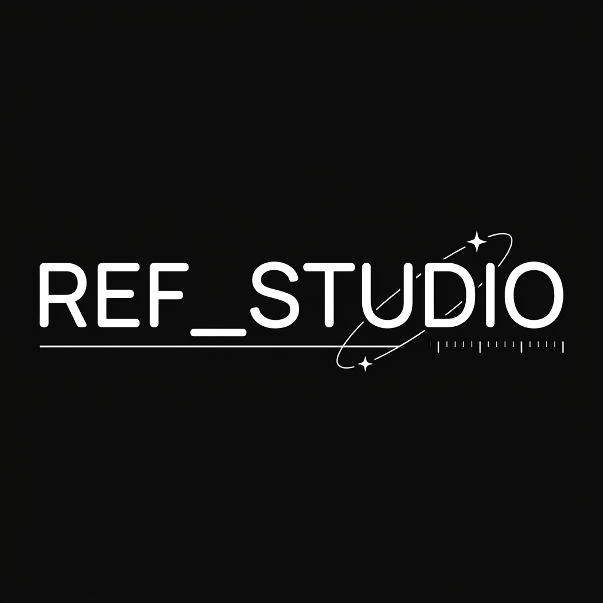
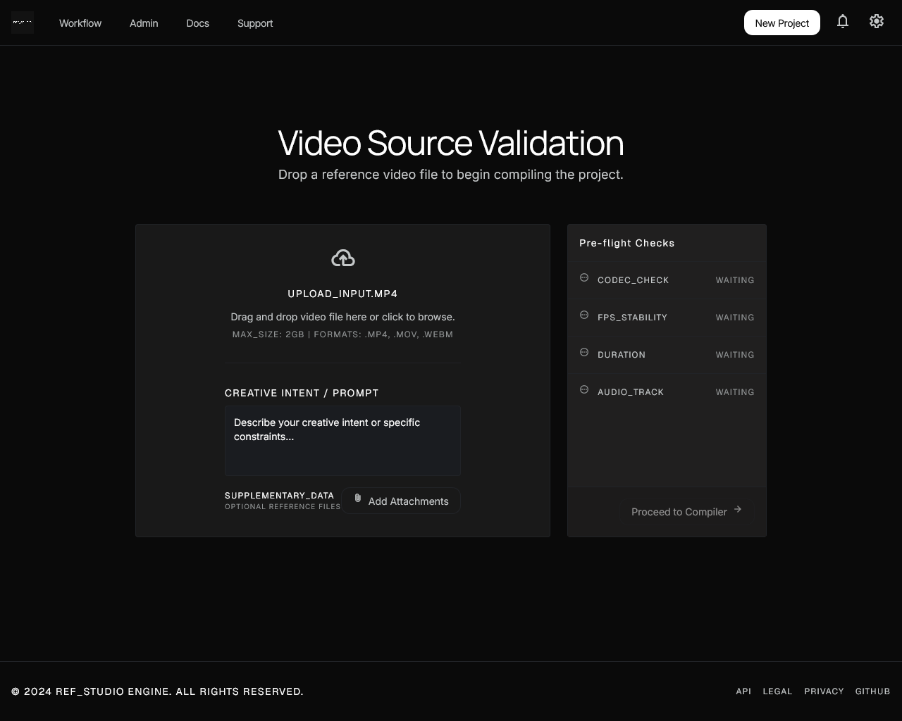
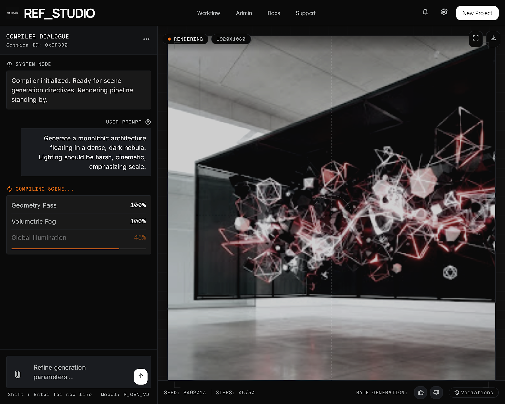
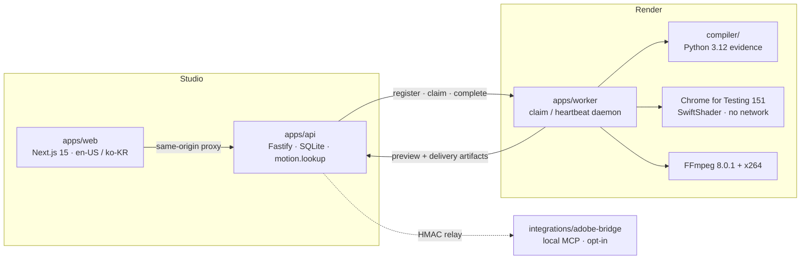

<p align="center">
  
</p>

<p align="center">
  <em>Rebuild any reference video, exactly.</em>
</p>

<p align="center">
  <a href="LICENSE"></a>
  <a href="NOTICE"></a>
  
  
  
  
</p>

<p align="center">
  <a href="#quick-start">Quick start</a> ·
  <a href="docs/MOTION.md">Motion docs</a> ·
  <a href="docs/OPERATIONS.md">Operations</a> ·
  <a href="docs/errors.md">Error catalog</a> ·
  <a href="CONTRIBUTING.md">Contributing</a> ·
  <a href="SECURITY.md">Security</a>
</p>

# Reference Video Studio

Open-source motion authoring studio. Measure a reference clip, author a typed
scene, verify predicates, and deliver a **deterministic MP4** (Native) or an
**Adobe After Effects working copy** (opt-in MCP).

First-party code is Apache-2.0. The worker **runtime image** still ships GPL
FFmpeg/x264 and GPL-3 matting weights. Read [`NOTICE`](NOTICE) and
[`verification/contract/supply-chain.json`](verification/contract/supply-chain.json)
before you redistribute containers.

## Table of contents

- [What it is](#what-it-is)
- [Why this exists](#why-this-exists)
- [Features](#features)
- [Screenshots](#screenshots)
- [How it works](#how-it-works)
- [Architecture](#architecture)
- [Repository layout](#repository-layout)
- [Requirements](#requirements)
- [Quick start](#quick-start)
- [Configuration](#configuration)
- [Motion authoring](#motion-authoring)
- [Worker daemon](#worker-daemon)
- [Adobe After Effects](#adobe-after-effects)
- [Pilot boundary](#pilot-boundary)
- [Documentation](#documentation)
- [Development](#development)
- [Contributing](#contributing)
- [Security](#security)
- [License](#license)

## What it is

Reference Video Studio (RVS) is a self-hosted pipeline for turning a **measured
reference video** into a **typed, verifiable scene** and a **repeatable
delivery**.

It is not a free-form video generator. The compiler only accepts a validated
`SceneSpec`. Predicates fail closed. Two independent Chromium renders of the
same scene must hash to the same frames, or the effect is not admitted.

The creator surface is bilingual (`en-US` / `ko-KR`): upload a clip, talk to
the compiler, scrub the canvas, edit typed properties, then download a Native
MP4. Operators get tenants, jobs, workers, receipts, quarantine, and AI /
material-generator settings.

## Why this exists

Most "recreate this video" tools guess. RVS measures, then compiles.

- **Measurement first.** A pinned Python compiler extracts per-frame evidence
  (mattes, OCR, depth, timing) from a selected interval. The scene is authored
  against that evidence, not against a prompt alone.
- **Typed scene, not a script.** `SceneSpec` is a Zod schema. It is the only
  input the Native renderer accepts. There is no second path from "idea" to
  frames.
- **Same bytes every run.** Native delivery is Chrome for Testing + SwiftShader
  with external networking blocked, then FFmpeg 8.0.1. Effects that are not
  bit-reproducible (Gaussian blur, filter-based glow) are refused.
- **Fail by name.** Unsupported FPS, missing GPU generators, expired model
  canaries, and Adobe hardware gates return a stable error code with one
  remediation. See [`docs/errors.md`](docs/errors.md).

## Features

| Capability | What you get |
| --- | --- |
| **Motion, measured** | Pin a 4-second interval, compile all-frame evidence, and keep source-frame indexes authoritative. |
| **Same result every run** | Native MP4 from a frozen Chromium + FFmpeg toolchain. Frame-hash determinism is a first-class predicate. |
| **Screen elements carried over** | Text, shapes, images, masks, and object-form materials land as typed scene elements, not a baked flatten. |
| **Chat + canvas + inspector** | Creator workspace: compiler chat, frame-accurate canvas, typed property inspector, verification and version history. |
| **Host-owned motion knowledge** | `motion.lookup` is SQLite (exact alias + FTS5). Fifteen bilingual domain cards. No embeddings, no vector index. |
| **Operator console** | Organizations, jobs, workers, verification receipts, quarantine, billing, audit, AI providers, material generators. |
| **Standalone worker** | Clone `apps/worker` onto a GPU box. It registers, heartbeats, claims, and uploads. No parent repo required. |
| **Opt-in After Effects** | Local MCP bridge writes a job-specific working copy. Original AEP bytes stay untouched. UI stays locked until the hardware gate passes. |
| **Optional GPU materials** | Wan-Alpha (video with a real alpha channel) and Hi3DGen (meshes rendered as object-form images), behind Compose profiles. |
| **Contracts as source of truth** | Shared Zod schemas generate OpenAPI. Resource budgets, redaction, and error envelopes are package-owned. |

## Screenshots

<p align="center">
  
  <br>
  <sub>New project: upload a reference clip, attach extras, watch pre-flight checks.</sub>
</p>

<p align="center">
  
  <br>
  <sub>Motion workspace: compiler dialogue on the left, scene preview on the right.</sub>
</p>

## How it works

```text
reference MP4  →  measure  →  SceneSpec  →  verify predicates  →  Native MP4
                     │              │
                     │              └─ opt-in Adobe working copy
                     └─ evidence (mattes, OCR, depth, timing)
```

1. **Upload.** Creator drops an MP4/WebM (ISO-BMFF or EBML). The API probes
   with FFprobe in a sandbox: container, codec, CFR, duration, dimensions,
   metadata. Failures quarantine the upload instead of guessing.
2. **Prepare.** The worker downloads the accepted source, seeks the selected
   four-second interval, and compiles all-frame evidence. It renders a review
   animatic and uploads `preview-artifact`.
3. **Author.** Chat plans a scene against `motion.lookup` cards and the active
   backend capability snapshot. The canvas and inspector edit the same
   `SceneSpec`. Unsupported intent is stored as a failed predicate, not an
   invented operation.
4. **Verify.** Predicates include `scene-spec`, `beat-tiling`,
   `keyframe-timing`, `element-kind-capability`, `asset-resolvable`,
   `no-external-url`, `frame-hash-deterministic`, `audio-duration`,
   `reduced-motion`, and `adobe-readback` when that backend is enrolled.
5. **Deliver.** After approval, the worker captures SceneIR in pinned Chrome
   for Testing (SwiftShader, no egress), muxes H.264/AAC with FFmpeg, and
   uploads the staged artifact. A completed worker run is not itself an
   approval: receipts stay predecessor-bound and immutable.

## Architecture



| Piece | Role |
| --- | --- |
| `apps/web` | Creator and admin UI. Next.js 15, React 19, next-intl. Bound to `RVS_EXPECTED_ORIGIN`. |
| `apps/api` | HTTP API, SQLite (`better-sqlite3`), auth, uploads, jobs, motion plans, worker protocol. |
| `apps/worker` | Standalone render/compile daemon with its own Compose file. |
| `packages/contracts` | Shared Zod schemas, resource budgets, error catalog, OpenAPI source. |
| `compiler/` | CPU evidence compiler (RVM matting, MiDaS depth, EasyOCR). Frozen hashes. |
| `integrations/adobe-bridge` | Local After Effects MCP connector. Not a runtime dependency of Native. |
| `skills/motion-authoring` | Host-owned `motion.lookup` skill for authoring agents. |

Web talks to the API through a same-origin proxy (`RVS_INTERNAL_API_URL`).
Browser mutations reject a missing or different origin. The worker never
shares the web origin: it authenticates with `RVS_WORKER_TOKEN`.

## Repository layout

```text
ref_studio/
├── apps/
│   ├── web/                 Creator + admin workspace
│   ├── api/                 HTTP API, SQLite, motion lookup
│   └── worker/              Standalone render daemon (own Compose)
├── packages/contracts/      Shared Zod + generated OpenAPI
├── compiler/                Python evidence compiler
├── integrations/adobe-bridge/
├── skills/motion-authoring/
├── docs/                    Motion, operations, errors, recovery
├── examples/                HeyGen 4s reference project
├── verification/            Frozen contracts, fixtures, black-box gates
├── runtime/                 Pinned toolchain manifests
├── docker-compose.yml       Web :3100 + API :3200
└── .env.example
```

## Requirements

| | Minimum |
| --- | --- |
| Node | 24 (pinned image is `node:24-bookworm-slim`) |
| pnpm | 11.20.0 (`packageManager` field) |
| Python | 3.12 (compiler) |
| Docker | For the worker image, GPU generators, and Compose stack |
| GPU | Optional. Native CPU path does not need one. Wan-Alpha / Hi3DGen do. |

Adobe bridge extras: Bun, and After Effects 2024 / 2025 / 2026 for the
hardware gate.

## Quick start

### 1. Install

```bash
git clone https://github.com/westernbear/ref_studio.git
cd ref_studio
pnpm install
cp .env.example .env
```

Edit `.env`. At minimum set `RVS_WORKER_TOKEN`,
`RVS_SESSION_INTROSPECT_SECRET`, and `RVS_EXPECTED_ORIGIN` to the exact
browser origin (scheme + host + port). Change the initial admin password.

### 2. Run the studio (Compose)

Root Compose starts **web** on `http://localhost:3100` and **api** on
`http://localhost:3200`. It fails closed if `RVS_WORKER_TOKEN` or
`RVS_SESSION_INTROSPECT_SECRET` is missing.

```bash
pnpm deploy:verify          # frozen execution contract, OpenAPI, isolation
docker compose up -d
```

Sign in at `/sign-in` (creator) or `/admin/sign-in` (operator) with
`RVS_INITIAL_ADMIN_EMAIL` / `RVS_INITIAL_ADMIN_PASSWORD` after
`pnpm --filter @rvs/api db:verify` has applied them.

### 3. Run without Docker (API + web)

```bash
set -a && source .env && set +a
export RVS_EXPECTED_ORIGIN=http://localhost:3100
export RVS_INTERNAL_API_URL=http://127.0.0.1:3200
export RVS_INSECURE_COOKIES=true

pnpm --filter @rvs/contracts build
pnpm --filter @rvs/api db:verify
pnpm --filter @rvs/api build
pnpm --filter @rvs/api start &

pnpm --filter @rvs/web exec next dev --hostname 0.0.0.0 --port 3100
```

This is enough for auth, jobs, and the motion workspace UI. Native compile and
render still need the worker image (pinned Chrome, FFmpeg, compiler models).

### 4. Attach a worker

```bash
cd apps/worker
cp .env.example .env
# RVS_API_BASE_URL=http://host.docker.internal:3200
# RVS_WORKER_TOKEN must match the API
pnpm up:worker
```

Same-host Docker workers must use `host.docker.internal`, not the LAN IP.
Hairpinning `http://192.168.x.x:3200` from inside Compose is the usual
`ECONNREFUSED` / `502 upstream unavailable` on `/v1/workers/register`.

On a **different** machine, set `RVS_API_BASE_URL` to an address that box can
reach, including the published API port, and confirm with
`curl "$RVS_API_BASE_URL/health"` before Compose.

Worker setup, GPU overlays, and generator profiles:
[`apps/worker/README.md`](apps/worker/README.md).

### 5. Run the tests

```bash
pnpm --filter @rvs/contracts test
pnpm --filter @rvs/api test --run
pnpm --filter @rvs/worker test --run
pnpm --filter @rvs/web test --run
```

Or the repo-wide gate:

```bash
pnpm format:check
pnpm typecheck
pnpm contracts:openapi:check
pnpm test
```

## Configuration

Copy [`.env.example`](.env.example). Secrets stay out of git.

| Variable | Purpose |
| --- | --- |
| `RVS_EXPECTED_ORIGIN` | Exact browser-facing origin. Sign-in and mutations reject anything else. Example: `http://192.168.1.10:3100`. |
| `RVS_INTERNAL_API_URL` | Web → API URL. Compose: `http://api:3200`. Host: `http://127.0.0.1:3200`. |
| `RVS_WORKER_TOKEN` | Shared worker credential. Must match API and worker. No development fallback. |
| `RVS_SESSION_INTROSPECT_SECRET` | Session introspection. Required by root Compose. |
| `RVS_INSECURE_COOKIES` | `true` on HTTP so the web proxy can strip `Secure` from Set-Cookie. |
| `RVS_INITIAL_ADMIN_EMAIL` / `PASSWORD` / `NAME` | Seeded on `db:reset` / `db:verify`. |
| `DATABASE_PATH` | API SQLite. Default: `apps/api/data/app.sqlite`. |
| `RVS_API_BASE_URL` | Worker → API. Same-host Docker: `http://host.docker.internal:3200`. |
| `RVS_WAN_ALPHA_BASE_URL` / `RVS_HI3DGEN_BASE_URL` | Material generators. Unset refuses that material kind by name. |
| `RVS_CODEX_CLIENT_VERSION` | Floor for the Codex model registry picker. |

Ports: **web 3100**, **API 3200**. Keep `RVS_EXPECTED_ORIGIN` on 3100 even if
you run `next dev` yourself. Default `next dev` in `apps/web` is port 3000
and will fail origin checks unless you change both the port and the env.

## Motion authoring

Native is the default backend. Open a job with motion authoring enabled, then
use chat / canvas / inspector.

`motion.lookup` is host-owned SQLite (exact alias + FTS5). One card per
domain:

reference · timing/easing · spatial choreography · layering · transitions ·
typography · path/morph · mask/matte · camera/3D · lighting/compositing ·
effects · audio · expressions · interaction · verification/accessibility

Each card carries Korean and English definitions, typed parameters with units
and ranges, required capabilities, scene-operation and verifier references,
and source URLs. A model may receive `motion.lookup` only after its
provider/model pair passes the versioned tool canary.

Do not add embeddings, a vector index, free-form scripts, or a second skill
per domain. Exact aliases are authoritative; FTS5 handles descriptive queries.

Skill: [`skills/motion-authoring/SKILL.md`](skills/motion-authoring/SKILL.md).
Runbook: [`docs/MOTION.md`](docs/MOTION.md).

## Worker daemon

The default Compose service in `apps/worker` is a long-lived daemon. It
registers, heartbeats, and claims through:

- `POST /v1/workers/register`
- `POST /v1/workers/{workerId}/heartbeat`
- `POST /v1/workers/{workerId}/claim`
- `POST /v1/workers/{workerId}/jobs/{jobId}/complete` · `fail` · `cancelled`

Before registration it verifies pinned Chromium, SwiftShader WebGL2, local
fonts, blocked external network, FFmpeg, FFprobe, and compiler model hashes.
A successful boot emits `worker.preflight.passed`.

```bash
docker compose run --rm worker-smoke    # no-network runtime check
```

Optional GPU generators sit on `worker-internal` and have no route off the
host. Weights cannot be downloaded at runtime. Mount them.

```bash
pnpm up:generators                      # both, built and waited on
pnpm up:generators --only model3d       # Hi3DGen alone
pnpm up:generators --host user@gpu-box
```

One card at a time. Wan-Alpha at GGUF Q4_K_M is about 10 GB of VRAM before
the text encoder; Hi3DGen needs 6–8 GB with staged CPU offload. Both want
32 GB of system RAM or more. Details:
[`apps/worker/generators/README.md`](apps/worker/generators/README.md).

## Adobe After Effects

Opt-in. Native stays the default. UI and admin Adobe controls stay locked
until the P4.8 hardware gate (real AE readback, original-AEP invariance,
per-version screenshots) passes.

```bash
cd integrations/adobe-bridge
bun run check && bun test && bun run build
```

The connector exposes versioned `adobe.*_v1` MCP tools over stdio. Cloud
arguments cannot contain local paths, upload URLs, access tokens, tenant/user
ids, arbitrary scripts, raw expressions, or preset paths. The panel only
opens a job-specific working copy. It never opens the original AEP.

Lineage: independently adapted from public behavior of
[Dakkshin/after-effects-mcp](https://github.com/Dakkshin/after-effects-mcp)
(MIT). That repository is not a runtime dependency. See
[`integrations/adobe-bridge/UPSTREAM.md`](integrations/adobe-bridge/UPSTREAM.md).

## Pilot boundary

The supported pilot is a **bounded, deterministic four-second selected
interval**. That is not a five-minute or production-scale claim.

| | Admitted |
| --- | --- |
| Duration | exactly 4 seconds (selected interval) |
| FPS | 24 / 25 / 30 / 50 / 60 (constant frame rate) |
| Frames | 96 / 100 / 120 / 200 / 240 |
| Capacity stop | 60 fps, 3840×2160 dense OCR, 240 frames |
| Upload | ≤ 2 GB, MP4 or WebM, H.264 / HEVC / VP9 / AV1 |
| Source duration | 1–300 seconds (only 4 seconds are compiled) |
| Scene budgets | 256 elements, 64 operations, 512 MiB package |

Worked example with provenance and a frozen interval:
[`examples/heygen-reference-project`](examples/heygen-reference-project).

## Documentation

| Doc | What |
| --- | --- |
| [`docs/MOTION.md`](docs/MOTION.md) | Native authoring, canaries, migrations, offline gates, observability |
| [`docs/OPERATIONS.md`](docs/OPERATIONS.md) | Deploy order, preflight, origins, GPU generators |
| [`docs/errors.md`](docs/errors.md) | Stable error codes and remediations |
| [`docs/RECOVERY.md`](docs/RECOVERY.md) | Isolated restore, never in-place |
| [`docs/HANDOFF.md`](docs/HANDOFF.md) | Clean handoff ZIP (`pnpm handoff:build`) |
| [`DESIGN.md`](DESIGN.md) | Cosmic Engineering tokens, workspace layout |
| [`CONTRIBUTING.md`](CONTRIBUTING.md) | Setup, migration rules, vendoring |
| [`SECURITY.md`](SECURITY.md) | Private vulnerability reporting |
| [`packages/contracts/generated/openapi.json`](packages/contracts/generated/openapi.json) | Generated OpenAPI (`pnpm contracts:openapi`) |

## Development

```bash
pnpm qa                     # format + typecheck + OpenAPI + tests + build
pnpm format                 # Prettier
pnpm lint                   # format:check + typecheck + OpenAPI check
pnpm test:security          # API + worker security subset
pnpm test:concurrency       # tenant / idempotency / auth
pnpm deploy:verify          # execution contract before deploy
```

Rules that save a wasted review:

- Keep `apps/worker` standalone. If you change a vendored contracts file,
  copy the body into `apps/worker/src/contracts/` and keep the vendor
  header. `apps/api/src/worker-contracts-vendoring.test.ts` fails otherwise.
- Do not rewrite applied SQL migrations. Add a new numbered file and
  register it in `apps/api/database/db.mjs`.
- Do not edit `packages/contracts/generated/openapi.json` by hand. Run
  `pnpm contracts:openapi`.
- Do not add embeddings or a second motion skill.

Adobe fixture (Bun, no AE required for the unit gate):

```bash
cd integrations/adobe-bridge
bun run check && bun test
```

## Contributing

See [`CONTRIBUTING.md`](CONTRIBUTING.md). Contributions are accepted under
Apache-2.0.

## Security

Report vulnerabilities privately. Do not open a public issue for an unfixed
secret, auth bypass, or injection. See [`SECURITY.md`](SECURITY.md).

Please do not attach production credentials, tenant data, or uploaded media
to a report.

## License

Apache License 2.0. See [`LICENSE`](LICENSE).

Third-party fonts (Inter, Wanted Sans, Manrope, Geist, Material Symbols),
Adobe-bridge lineage, and **GPL obligations for the worker runtime**
(FFmpeg 8.0.1 linked with x264, Robust Video Matting weights) are listed in
[`NOTICE`](NOTICE). Replacing x264 or RVM for a proprietary distribution is
a separate licensing change and is not covered by that notice.
