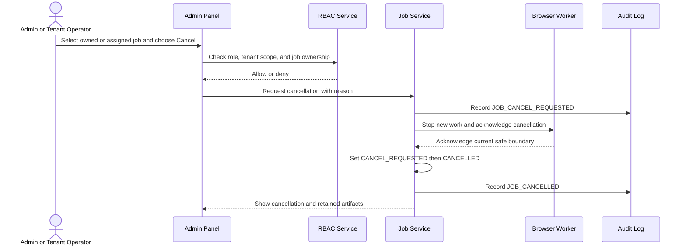
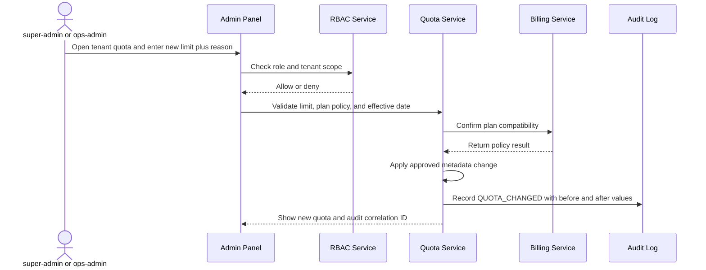
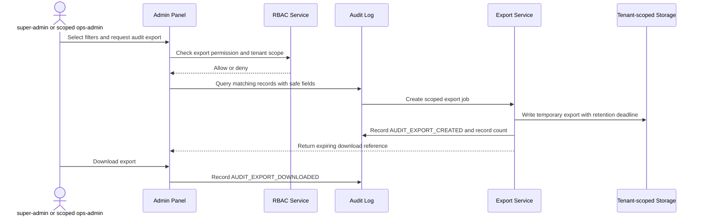

# SaaS Admin Panel Specification
# SaaS 관리자 패널 사양

## 1. Purpose / 목적

The admin panel gives authorized staff a safe operational view of tenants,
jobs, receipts, quotas, plans, quarantine, and audit history. It supports
operations without becoming an approval surface for the reference-video gates.

관리자 패널은 권한이 있는 운영자에게 테넌트, 작업, 영수증, 쿼터, 요금제,
격리 파일, 감사 이력의 안전한 운영 화면을 제공한다. 운영을 지원하지만
레퍼런스 비디오 게이트의 승인 화면이 되어서는 안 된다.

The panel inherits tenant fencing, deletion epochs, safe errors, job ownership,
quarantine, and append-only receipts from the SaaS boundary. Receipt hashes are
provenance for inspection only, not a new hash-gating decision.

패널은 SaaS 경계의 테넌트 격리, 삭제 epoch, 안전한 오류, 작업 소유권,
격리, append-only 영수증 규칙을 따른다. 영수증 해시는 검사 목적의 출처
정보일 뿐이며 새로운 해시 게이트가 아니다.

## 2. Roles / 역할

### super-admin / 슈퍼 관리자

Platform operations role. May read all tenants and platform-wide operational
state. May perform only the actions listed in the RBAC matrix. It cannot approve
T2 through T6, rewrite receipts, or mutate render output.

플랫폼 운영 역할이다. 모든 테넌트와 플랫폼 운영 상태를 읽을 수 있다.
RBAC 표에 명시된 작업만 수행할 수 있으며 T2부터 T6까지 승인하거나 영수증을
수정하거나 렌더 결과를 변경할 수 없다.

### ops-admin / 운영 관리자

Tenant-scoped operations role. May manage quota, billing and plan metadata, and
cancel jobs for assigned tenants. It may inspect queue and receipt state within
its scope, but cannot approve gates or rewrite history.

테넌트 범위 운영 역할이다. 배정된 테넌트의 쿼터, 결제 및 요금제 메타데이터,
작업 취소를 관리할 수 있다. 범위 안의 큐와 영수증 상태를 볼 수 있지만
게이트 승인이나 이력 재작성은 할 수 없다.

### viewer / 조회자

Read-only role. It may view authorized tenants, jobs, receipts, plans, quarantine
status, and audit records. It cannot mutate any resource or export restricted
data without a separately granted export permission.

읽기 전용 역할이다. 허가된 테넌트, 작업, 영수증, 요금제, 격리 상태, 감사
기록을 조회할 수 있다. 리소스를 변경할 수 없으며 별도 export 권한 없이는
제한 데이터도 내보낼 수 없다.

## 3. RBAC matrix / RBAC 권한 표

| Capability / 기능 | super-admin | ops-admin | viewer | Scope / 범위 |
|---|---:|---:|---:|---|
| List tenants and inspect tenant details / 테넌트 목록 및 상세 조회 | Yes | Assigned only | Assigned only | Tenant fencing applies |
| Inspect quota and usage / 쿼터 및 사용량 조회 | Yes | Yes | Yes | Authorized tenant |
| Change quota / 쿼터 변경 | Yes | Yes | No | Recorded audit event |
| View billing and plan / 결제 및 요금제 조회 | Yes | Yes | Yes | Billing fields may be redacted |
| Change plan metadata / 요금제 메타데이터 변경 | Yes | Yes | No | No payment-card data |
| Drain queue / 큐 drain | Yes | No | No | Platform queue only |
| Retry transient job failure / 일시적 작업 오류 retry | Yes | Assigned only | No | Creates a new attempt |
| Cancel owned or assigned job / 소유 또는 배정 작업 취소 | Yes | Yes | No | Allowed states only |
| View receipt chain / 영수증 체인 조회 | Yes | Yes | Yes | Append-only history |
| Rewrite or delete receipt / 영수증 수정 또는 삭제 | No | No | No | Never permitted |
| Manage quarantine / 격리 관리자 | Yes | Assigned only | No | Quarantine or release after checks |
| View audit log / 감사 로그 조회 | Yes | Yes | Yes | Scope-filtered |
| Export audit log / 감사 로그 export | Yes | Yes, assigned scope | No | Export itself is audited |
| Approve T2, T3, T4, T5, T6 / T2부터 T6 승인 | No | No | No | Required designated approver only |
| Mutate render output / 렌더 결과 변경 | No | No | No | Immutable published artifact |

Every request is authorized against the authenticated role and immutable tenant
identifier. Caller-supplied IDs never override tenant ownership. Cross-tenant
access fails closed with a safe product error and a restricted audit record.

모든 요청은 인증된 역할과 변경 불가능한 테넌트 식별자로 권한을 검사한다.
호출자가 제공한 ID는 테넌트 소유권 검사를 덮어쓸 수 없다. 테넌트 간 접근은
안전한 제품 오류와 제한된 감사 기록을 남기고 fail closed 된다.

## 4. Features / 기능

### Tenant list and quota / 테넌트 목록 및 쿼터

- Search and filter tenants by status, plan, usage, and recent operational risk.
- Show current quota, consumed quota, reset date, active jobs, and retention state.
- Change quota only with reason, before and after values, actor, and timestamp.
- Never expose another tenant's raw uploads, private paths, or stack traces.

### Job queue / 작업 큐

- Show `UPLOADING`, `VALIDATING`, `PREPARING`, `READY`, `QUEUED`, `RENDERING`,
  `ASSEMBLING`, `COMPLETED`, `CANCEL_REQUESTED`, `CANCELLED`, `RETRYABLE_ERROR`,
  `STALE_APPROVAL`, and `FAILED` states.
- super-admin may drain the authoritative queue to stop new work.
- Authorized operators may retry transient failures. Retry creates a new attempt
  and preserves the old attempt as history.
- Cancellation follows the worker acknowledgement flow and never deletes source
  or editable checkpoints.

### Receipt chain viewer / 영수증 체인 조회기

Display actor, decision, predecessor, artifact references, tenant, timestamps,
and provenance fields in order. The viewer is inspection-only. Corrections are
new linked records, never edits to an existing receipt.

### Quarantine manager / 격리 관리자

Show declared type, magic-byte result, size, container parse result, quarantine
reason, and next action. Failed intake remains quarantined. Release is allowed
only after the intake checks pass and is recorded as an audit event.

### Billing and plan / 결제 및 요금제

Show plan, billing status, quota allowance, renewal or reset metadata, and account
state. Operators may update plan metadata and quota policy, but may not access
payment-card secrets or silently change a tenant's ownership.

### Audit log / 감사 로그

Search by tenant, actor, event type, job, time range, and outcome. Display the
request correlation ID, authorization result, reason, before and after values
when applicable, and safe error class. Export is scope-filtered and itself
audited.

## 5. Workflows / 운영 워크플로

### 5.1 Job cancellation / 작업 취소

Cancellation is available only in `QUEUED`, `PREPARING`, or `RENDERING`. A
completed or already cancelled attempt is not resumed in place.

### 5.2 Quota change / 쿼터 변경

Quota changes affect future admission and usage accounting. They do not approve
any reference-video gate or alter an existing render artifact.

### 5.3 Audit export / 감사 로그 export

Exports exclude raw bytes, private storage paths, credentials, and other
tenants' records. Temporary exports follow the configured retention deadline.

## 6. Constraints / 제약

1. Admin roles cannot approve **T2 through T6**. T2, T3, T4, T5, and T6 remain
   with the required designated approval actor and the append-only receipt chain.
2. No role can rewrite, delete, reorder, or substitute an existing receipt.
   A correction is a new linked record.
3. No role can mutate a render output, published delivery artifact, source
   artifact, or editable checkpoint in place. Retry creates a new attempt.
4. Platform operations may drain queues, retry transient infrastructure errors,
   quarantine ingest, or pause operational processing, but may not publish a
   tenant decision or transfer ownership.
5. Tenant fencing applies to every read, write, download, export, and worker
   input. Deletion epochs invalidate older work without changing history.
6. The panel must not expose a successful-looking download for a failed or
   partial render.
7. This specification adds no hash gating. CAS digests and receipt hashes remain
   provenance and inspection data only.

## 7. Audit events / 감사 이벤트

The following event types are append-only, timestamped, actor-bound, and include
tenant scope, correlation ID, authorization result, and safe outcome:

| Event | Meaning / 의미 |
|---|---|
| `ADMIN_LOGIN` | Admin session established |
| `ADMIN_ACCESS_DENIED` | RBAC or tenant-fence check failed |
| `TENANT_VIEWED` | Tenant details opened |
| `QUOTA_VIEWED` | Quota and usage inspected |
| `QUOTA_CHANGED` | Quota changed with reason and before/after values |
| `PLAN_VIEWED` | Billing or plan metadata inspected |
| `PLAN_METADATA_CHANGED` | Plan metadata changed |
| `JOB_QUEUE_DRAIN_REQUESTED` | Queue drain requested by super-admin |
| `JOB_RETRY_REQUESTED` | Retry created for a transient failure |
| `JOB_CANCEL_REQUESTED` | Cancellation requested |
| `JOB_CANCELLED` | Worker acknowledged and job became cancelled |
| `RECEIPT_CHAIN_VIEWED` | Receipt chain inspected |
| `QUARANTINE_VIEWED` | Quarantine record inspected |
| `QUARANTINE_RELEASED` | Validated intake released from quarantine |
| `QUARANTINE_RETAINED` | Intake remained quarantined after failed checks |
| `AUDIT_LOG_VIEWED` | Audit records queried |
| `AUDIT_EXPORT_CREATED` | Scoped export created |
| `AUDIT_EXPORT_DOWNLOADED` | Scoped export downloaded |
| `UNAUTHORIZED_GATE_APPROVAL_ATTEMPT` | Admin attempted forbidden T2-T6 approval |
| `RECEIPT_MUTATION_ATTEMPT` | Forbidden receipt rewrite or deletion attempted |
| `RENDER_OUTPUT_MUTATION_ATTEMPT` | Forbidden output mutation attempted |

Audit records must preserve enough operational context to investigate an action,
while safe errors prevent disclosure of raw bytes, private paths, stack traces,
or other tenants' state.
