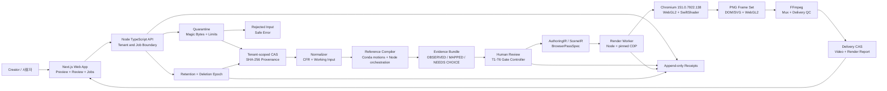
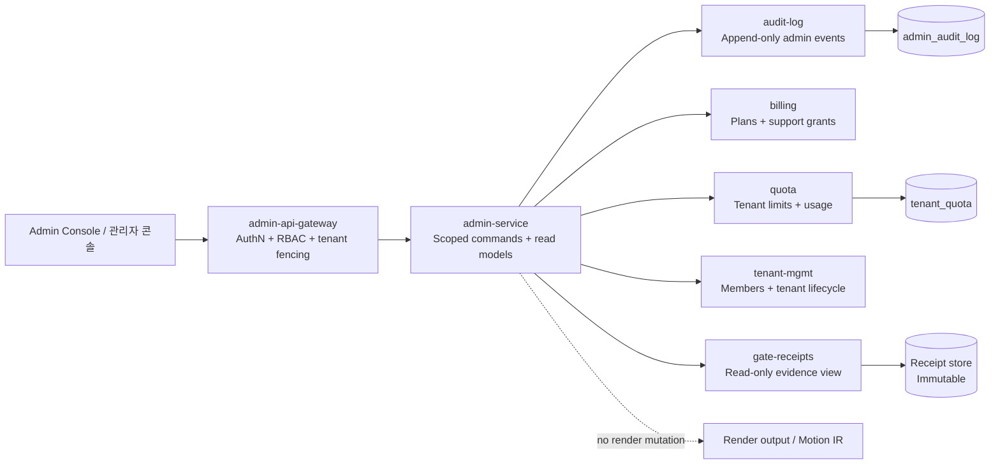

# Reference Video Studio SaaS Architecture
# 레퍼런스 비디오 스튜디오 SaaS 아키텍처

## 1. 문서 목적 / Purpose

이 문서는 일반 사용자가 제공한 평범한 참고 영상을 분석하고, 편집 가능한 장면을 만들고, 승인된 게이트를 통과한 뒤 SaaS 제품 소개 영상을 전달하는 시스템의 구조를 정의한다.

This document defines the system that accepts ordinary user video, measures its temporal and visual evidence, produces an editable scene, renders a reference-similar SaaS explainer, and delivers the completed media only after approval gates pass.

The architecture is evidence-first. A successful encode is not a quality approval. A preview is not a final artifact. A model label is not a measured observation.

## 2. 시스템 개요 / System Overview

### Product boundary

The product is a multi-tenant Reference Video Studio. Each job belongs to exactly one tenant and moves through bounded ingest, evidence compilation, human review, deterministic browser rendering, FFmpeg delivery assembly, and retention cleanup.

제품 경계는 다음과 같다.

1. 사용자는 일반 `.mp4` 참고 영상 하나를 업로드한다.
2. 시스템은 업로드를 quarantine에 격리하고 파일 구조와 magic bytes를 검사한다.
3. 승인된 입력은 tenant-scoped CAS에 보관되고 normalized working input으로 변환된다.
4. compiler는 모든 프레임을 temporal volume으로 측정한다.
5. review 화면은 `OBSERVED`, `MAPPED`, 최대 하나의 `NEEDS CHOICE`를 노출한다.
6. 사용자는 T1부터 T6까지 필요한 승인과 비교를 수행한다.
7. render worker는 승인된 Motion IR만 소비한다.
8. Chromium 151.0.7922.138, ANGLE SwiftShader, WebGL2 브라우저 렌더러가 프레임을 생성한다.
9. Node worker와 FFmpeg가 영상, 오디오, delivery QC를 마무리한다.
10. 완료된 delivery artifact와 사람이 읽을 수 있는 report만 사용자에게 공개한다.

### Goals

- Preserve temporal evidence, owner identity, lifecycle, motion, camera, depth, VFX, and audio anchors.
- Keep product UI and Korean typography editable as DOM/SVG.
- Make interactive preview and PNG capture use the same frame-indexed scene source.
- Keep tenant ownership, deletion epochs, CAS provenance, and append-only receipts explicit.
- Fail closed on missing evidence, stale approval, unready fonts, unconsumed effects, or renderer fallback.

### Non-goals

- This is not a diffusion video generator.
- This is not a captured-screen compositor.
- This is not an Unreal, Fusion, Blender, or Remotion production pipeline.
- This is not a user-supplied project-file or scene-graph product.
- This document does not add hash gating. Provenance is path-based, and hashes remain evidence metadata.

## 3. 컴포넌트 다이어그램 / Component Diagram

### Component responsibilities

| Component | Responsibility | Boundary |
|---|---|---|
| Next.js Web App | Upload, preview, review, job status, delivery download | Never trusts caller-supplied tenant IDs |
| Node TypeScript API | Authenticated commands, job state, ownership checks | Safe errors and correlation IDs |
| Quarantine | Magic bytes, type, size, container parsing | No compiler or renderer access before pass |
| CAS | Immutable source, working input, scene, frames, delivery | Tenant-scoped references |
| Normalizer | CFR conversion, supported fps validation, metadata capture | Produces a working copy only after validation |
| Compiler | Temporal measurement and editable evidence | Must preserve every measured owner and residual layer |
| Review | Human approval, stale approval detection, gate sequence | Approval does not happen from render success |
| Node render worker | Job execution and CDP orchestration | Rechecks tenant and deletion epoch |
| Chromium worker | Pure frame-indexed DOM/SVG and WebGL2 rendering | Explicit backend and font readiness |
| FFmpeg | Frame assembly, audio mux, delivery QC | Browser output alone is insufficient |
| Receipt writer | Append-only decisions and provenance paths | No mutation or rewrite |

## 4. WebGL2와 브라우저를 incumbent로 선택한 이유 / Incumbent Rationale

The incumbent renderer is WebGL2/browser. The bake-off report records the browser adapter as `reference-similar`, deterministic, and editable, with three required owner tracks consumed and two required Motion IR groups consumed. Blender was partial. Other candidates were unavailable or not evaluable. No promotion is inferred from the bake-off; the incumbent remains the approved architecture because the project decision explicitly selected it.

브라우저 incumbent는 다음 요구를 동시에 충족한다.

- Semantic DOM/SVG can retain editable product UI, text, controls, and Korean typography.
- WebGL2 can own bloom, defocus, dynamic non-uniform rim, lower light field, depth compositing, and residual canvas treatment.
- A pinned Chromium/CDP worker can drive interactive review and capture with the same source.
- `renderFrame(frame)` provides a pure frame-indexed entry point without wall-clock animation or draw-time randomness.
- Exact frame identity can be checked between requested and read-back frames.
- The renderer can fail closed when WebGL2, shader linking, fonts, network policy, or owner links are invalid.

WebGL2 is an implementation owner for measured effects, not a license to invent visual behavior. Reference videos remain the source of truth. High-quality UI and motion patterns may inform implementation, but they cannot replace source evidence.

### Runtime contract

| Item | Required value |
|---|---|
| Browser | Chromium 151.0.7922.138 |
| GPU backend | ANGLE SwiftShader |
| Renderer API | WebGL2 |
| Frame size | 1080 x 1920 for vertical pilot delivery |
| Frame model | Pure frame-indexed rendering |
| Randomness | Deterministic seed only, no draw-time randomness |
| Fonts | Wanted Sans and approved local font assets ready before render |
| Network | External network blocked during render |
| Final assembly | FFmpeg |
| Worker control | Node.js through pinned CDP worker |

The renderer must introspect context attributes, extensions, shader compilation and linking, maximum texture and renderbuffer limits, font readiness, ANGLE backend, and screenshot behavior before a full render. A fallback renderer is an error, not a graceful degradation path.

## 5. Trial authority / 시험 권위

The current approved trial compiler authorities are path-based. Trial 1 uses compiler v1.9. Trial 2 uses compiler v1.13. Trial 1 v1.8 remains rejected history and is not a downstream authority.

| Trial | Authority path | Scope | Gate status | Use |
|---|---|---|---|---|
| Trial 1 | `D:\motions\trial-01\01-translation-review\compiler-v1.9-20260815T141534965Z` | First end-to-end validation, lower-light behind/over UI ownership | T1-T6 APPROVED | Sole Trial 1 authority |
| Trial 2 | `D:\motions\trial-02\01-translation-review\compiler-v1.13-20260816T1601Z` | Contrasting high-saturation multi-surface UI and continuous parallax | T1-T6 APPROVED | Sole Trial 2 authority |
| Historical | `D:\motions\trial-01\01-translation-review\compiler-v1.8-20260815T094527Z` | Superseded candidate | REJECTED HISTORY | Preserve, never use downstream |

Trial 1 established the v1.9 contract, including explicit `lower-light-behind-ui` and `lower-light-over-ui` tracks. Trial 2 established that the contract also works for a contrasting reference with dual surfaces, high saturation, and continuous camera or parallax motion.

The authority table is descriptive. It does not create a new verification gate. Path provenance and receipt decisions are checked by the existing gate controller. Hashes may identify artifacts, but this architecture does not add hash gating.

## 6. 데이터 흐름 / Data Flow

### Ingest and quarantine

The input contract accepts one local MP4 per job, up to 2 GB, from 1 second through 5 minutes, with constant frame rates of 24, 25, 30, 50, or 60 fps. Variable frame rate and unsupported formats are rejected before compiler consumption.

업로드는 `UPLOADING`에서 시작한다. API는 tenant identity를 붙이고, quarantine가 끝나기 전에는 compiler와 renderer가 바이트를 읽을 수 없도록 한다. 검사는 선언된 MIME type만 믿지 않고 magic bytes, 크기, 안전한 container parsing을 함께 사용한다.

### CAS and normalization

Accepted bytes enter a tenant-scoped content-addressable store, or CAS. The SHA-256 digest is immutable content identity and provenance for deduplication, receipts, and recovery. It is not an approval gate.

After validation, the normalizer creates a CFR working input and records codec metadata. The original source stays available while the job is active. CAS references, jobs, receipts, quota records, and deletion requests all carry an immutable tenant identifier.

### Reference compilation

The compiler reads the temporal volume, not only a contact sheet. It measures every frame and preserves:

- visible title words and subtitles as independent owners,
- per-frame bounds and lifecycle phases,
- independently measured subtitle geometry,
- OCR regions at native resolution,
- product UI bounds and owner trajectories,
- camera pan, tilt, zoom, rhythm, tempo, and beat anchors,
- owner-bound bloom, defocus, and rim profiles,
- residual or global canvas treatment,
- lower-light field grids with behind-UI and over-UI ownership,
- audio anchors mapped to 48 kHz stereo samples.

The compiler emits `OBSERVED` measurements, `MAPPED` render mappings, and at most one unresolved `NEEDS CHOICE`. Missing, ambiguous, placeholder, deleted, or unbound evidence fails closed. A VLM can suggest labels, but it cannot delete or replace pixel and temporal measurements.

### AuthoringIR to render

The editable path is explicit:

`OBSERVED -> MAPPED -> AuthoringIR -> SceneIR -> BrowserPassSpec -> renderFrame(frame)`

Every scene track resolves its `owner` to an editable AuthoringIR owner. Owner-bound effects stay separate from global residual-canvas treatment. If an effect is declared but not consumed, the worker stops with a visible error.

### Review and approval

The review surface exposes evidence labels, measured values, confidence, lifecycle, effect ownership, and comparison frames. Approval is disabled while a source or scene change is processing. Any source replacement, trim, fps change, or editable scene change makes a previous approval stale.

The job states are:

`UPLOADING -> VALIDATING -> PREPARING -> READY -> QUEUED -> RENDERING -> ASSEMBLING -> COMPLETED`

Alternate states include `INPUT_INVALID`, `STALE_APPROVAL`, `CANCEL_REQUESTED`, `CANCELLED`, `RETRYABLE_ERROR`, and `FAILED`. Retry creates a new attempt and does not mutate history.

### Rendering and delivery

The browser worker renders frames from the approved frame-indexed scene. DOM/SVG renders semantic UI and typography. WebGL2 renders only the approved effect owners and residual layers. The worker records runtime introspection and stops if the requested frame and read-back frame differ.

FFmpeg assembles the frame set, adds the approved audio, and runs delivery QC for frame count, dimensions, playable media, and audio presence. The public delivery consists of the completed video and human-readable render report. Intermediate files remain private to the job.

## 7. Tech stack / 기술 스택

| Layer | Technology | Design use |
|---|---|---|
| Web | Next.js | Upload, preview, review, job details, delivery UI |
| Language | TypeScript | API, orchestration, scene contracts, validators |
| Package manager | pnpm | Workspace scripts and reproducible command routing |
| API and workers | Node.js | Job lifecycle, compiler orchestration, CDP render control |
| Vision and measurement | `motions` Conda environment with PyTorch | Native-resolution crops, temporal measurements, OCR and evidence extraction |
| Editable scene | DOM/SVG | Semantic UI, Korean text, editable geometry and typography |
| Effects renderer | WebGL2 | Owner-bound bloom, defocus, rim, light fields, compositing |
| Browser runtime | Chromium 151.0.7922.138 | Pinned screenshot and CDP execution context |
| GPU backend | ANGLE SwiftShader | Approved deterministic software backend |
| Media finishing | FFmpeg | Frame assembly, audio mux, delivery and spec QC |
| Storage | Tenant-scoped CAS | Immutable source, checkpoint, frames, delivery, provenance |
| Approval record | Append-only receipt store | T1-T6 decisions, predecessor paths, actor and artifact references |

The resident AI control plane may interpret user intent and propose two or three variants using allowlisted knobs. It cannot write OBSERVED measurements, Motion IR, `uiBounds`, or VFX samples, and it cannot skip an unapproved gate. With `XAI_API_KEY`, the configured model is `grok-4.6`; without it, the planner is heuristic. Both paths feed the same compiler and renderer.

## 8. Security boundary / 보안 경계

### Tenant fencing

Tenant fencing is mandatory at API, CAS, receipt, queue, worker, and delivery boundaries. IDs supplied by callers never override the authenticated tenant. Cross-tenant lookup or mutation fails closed as `TENANT_BOUNDARY_BYPASS` in QA and as a stable generic error at the product boundary.

### CAS provenance

CAS stores accepted content under tenant-scoped references and immutable digest identity. A CAS reference is never a permission grant. The API rechecks tenant ownership before reads, writes, downloads, and cleanup.

### Deletion epoch

Each tenant owns a monotonic deletion epoch. Deleting an asset advances the epoch and invalidates queued or running work created under older epochs. Workers recheck tenant ownership and deletion epoch before reading inputs, writing outputs, or publishing receipts. CAS garbage collection may remove unreferenced bytes, but historical receipts remain unchanged.

### Append-only receipts

Receipts contain actor, decision, predecessor path, artifact references, gate, tenant, and CAS provenance. Existing receipts cannot be edited, deleted, or rewritten by application or platform roles. Corrections are new linked records. Receipt hashes support provenance and chain inspection only.

### Role restrictions

Organization `OWNER` and `ADMIN` can manage members, quota, and cancellation for their organization. They cannot approve T2-T6. Platform staff can drain queues, retry transient failures, quarantine ingest, pause AI, issue short support grants, and propose a pending runtime pin. They cannot approve T2-T6, rewrite receipts or Motion IR, transfer ownership, publish a tenant decision, silently swap Chromium or fonts, or run arbitrary worker code.

### Safe errors and job ownership

External errors expose only a stable class and correlation ID. They do not expose tenant IDs, storage paths, raw bytes, stack traces, or another tenant's state. A job belongs to exactly one tenant and records creator, input CAS references, deletion epoch, and lifecycle state.

## 9. Gate flow T1-T6 / 승인 게이트

| Gate | English | 한국어 | Required evidence |
|---|---|---|---|
| T1 | Freeze inputs and pass runtime preflight | 입력과 런타임 고정 | Interval, codec, fonts, Chromium, WebGL2, SwiftShader, blocked network |
| T2 | Approve reference translation | 레퍼런스 번역 승인 | OBSERVED, MAPPED, one optional NEEDS CHOICE, measured evidence |
| T3 | Approve one 9:16 styleframe | 9:16 스타일프레임 승인 | Editable semantic UI, safe area, comparison frame |
| T4 | Approve normal-speed animatic | 정상 속도 애니매틱 승인 | Motion, lifecycle, VFX, mute and sound-on SFX checks |
| T5 | Judge exact 4-second final shot | 정확한 4초 최종 샷 판정 | 120 frames at 30 fps where applicable, fixed context, would-use decision |
| T6 | Prove recovery | 복구 증명 | Restored editable project in another path and fixed-frame comparison |

The gate controller locks downstream work until the predecessor is approved by the required actor. Progress is reported by approved gates, not rendered-frame count. Exploratory work after an unapproved gate contributes zero to pipeline completion.

## 10. Must-not-have constraints / 반드시 없어야 할 것

The following are hard constraints, not style preferences.

- Must not have diffusion or a second video model as the rendering authority.
- Must not have a captured final UI screenshot in place of semantic editable UI.
- Must not have flattened product UI that removes DOM/SVG ownership or text editability.
- Must not have a generic cube or card layout substituted for measured reference structure.
- Must not have camera-only motion presented as reference similarity.
- Must not have synthetic fixed trajectories such as the rejected v1.5 motion table.
- Must not have prose claims without numerical temporal or pixel evidence.
- Must not have a contact sheet treated as sufficient compiler authority.
- Must not have a VLM delete a measured layer or hide an ambiguity.
- Must not have subtitle geometry rigidly derived from the title box.
- Must not have bloom and defocus combined into one unmeasured effect.
- Must not have owner-bound VFX without an owner link and consumed render pass.
- Must not have residual global treatment baked into product UI.
- Must not have external network access during a pinned render.
- Must not have silent font, Chromium, ANGLE, shader, or renderer fallback.
- Must not have wall-clock animation or draw-time randomness in frame capture.
- Must not have stale approval reused after source or scene changes.
- Must not have cross-tenant CAS, job, receipt, quota, or delivery access.
- Must not have mutable or rewritten append-only receipts.
- Must not have platform staff approve T2-T6.
- Must not have hash gating added to this architecture contract.
- Must not have a successful encode treated as a human quality decision.

## 11. Operations and recovery / 운영과 복구

Automatic retry is limited to three transient attempts. Validation errors and stale approvals are not retryable until the relevant input or approval changes. Cancellation is available in `QUEUED`, `PREPARING`, and `RENDERING`, and completes only after the worker acknowledges it.

Source, latest editable checkpoint, preview, delivery, and report are retained for 30 days after terminal state. Failed-attempt diagnostics and temporary frames are retained for 7 days or 24 hours respectively where specified by the workflow. Cleanup is idempotent and never resurrects a job.

T6 recovery restores the self-contained HTML, JavaScript, WebGL scene specification, runtime manifest, and portable bundle in a different path. Recovery compares fixed frames against the approved authority. A restored bundle is editable evidence, not a new approval.

Scale-out is deliberately deferred. One authoritative queue, one receipt writer, and explicit checks at every storage and worker boundary are sufficient for the initial SaaS boundary. Horizontal workers, sharded queues, multi-region CAS, and automated garbage collection may be added only if tenant fencing, deletion epochs, append-only receipts, safe errors, and job ownership remain intact.

## 12. Decision summary / 결정 요약

The system is a bounded, multi-tenant, evidence-first pipeline. Quarantine protects the input boundary. CAS preserves immutable content identity and path provenance. The compiler measures the temporal volume and emits editable evidence. Human review controls T1-T6. Chromium 151.0.7922.138 with SwiftShader and WebGL2 is the sole active editable renderer. DOM/SVG preserves semantic UI. WebGL2 owns measured effects. FFmpeg proves delivery. Append-only receipts preserve decisions. No diffusion, no flattened UI, no silent fallback, and no new hash gates.

이 구조의 핵심은 빠른 렌더가 아니라 검증 가능한 편집성과 복구성이다. 레퍼런스가 제공하는 측정 가능한 사실은 반드시 보존하고, 확인되지 않은 시각적 추측은 승인된 결과로 승격하지 않는다.

## 8. Admin Panel System / 관리자 패널 시스템

관리자 패널은 운영 제어면이지 렌더링 권위면이 아니다. 관리자 기능은 tenant fencing, deletion epoch, append-only receipt, safe error 원칙을 그대로 따른다. 해시 게이팅은 추가하지 않는다.

### Admin component placement / 관리자 컴포넌트 배치

`admin-api-gateway` is the only public admin entry point. It authenticates the operator, derives the operator scope from server-side claims, fences every tenant resource, and forwards only allowlisted commands to `admin-service`. The service may issue scoped operational writes, but the `gate-receipts` adapter is read-only. No admin path reaches the render worker, `renderFrame`, Motion IR, or delivery bytes as a mutation path.

### Tenant scope / 관리자 tenant 범위

| Scope | Read access | Write access | Constraint |
|---|---|---|---|
| Cross-tenant platform view | `super-admin` and approved `ops-admin` may read operational summaries, queue state, quota status, and receipt metadata across tenants | None by default | Cross-tenant reads are masked, audited, and never imply ownership |
| Scoped tenant operations | `ops-admin` may read and write only assigned tenant members, quota, billing support state, cancellation, and quarantine actions | `ops-admin` within assigned tenant scope | Authenticated tenant scope and deletion epoch are rechecked at every command |
| Tenant self-service | Organization `OWNER` and `ADMIN` may manage their own members, quota, and cancellation | Own organization only | They cannot approve T2-T6 or alter receipt history |
| Read-only inspection | `viewer` may read the scopes explicitly granted by the platform or tenant | None | No mutation, approval, export of another tenant's private media, or scope escalation |

Cross-tenant access means read-only operational visibility. Any write command must carry an explicit scoped tenant context that matches the operator's assigned scope. Caller-supplied tenant IDs never widen that scope. A mismatch fails closed as `TENANT_BOUNDARY_BYPASS`.

### Admin roles and RBAC / 관리자 역할과 RBAC

| Role | Allowed actions | Forbidden actions |
|---|---|---|
| `super-admin` | Cross-tenant read-only operations, tenant assignment, policy configuration, platform-level audit review, bounded support grants | Tenant render mutation, Motion IR mutation, receipt rewrite, T2-T6 approval, arbitrary worker execution |
| `ops-admin` | Scoped tenant operations, queue drain or retry, quarantine actions, quota and billing support within assigned scope | Cross-tenant writes, render output mutation, receipt rewrite, T2-T6 approval, ownership transfer |
| `viewer` | Read-only dashboards, audit-log inspection, quota and receipt metadata within granted scope | All writes, approvals, downloads outside scope, scope changes |

RBAC is enforced at the gateway and repeated in `admin-service`; UI hiding is not authorization. The existing organization roles `OWNER` and `ADMIN` remain tenant roles, not gate approvers. **Admin cannot approve T2-T6 or rewrite receipts.** T2, T3, T4, T5, and T6 remain controlled by the required designated approval actor and the existing append-only receipt chain.

### Admin data stores / 관리자 데이터 저장소

- `admin_audit_log` records actor, role, tenant scope, action, target type, target identifier, decision, correlation ID, and timestamp. Entries are append-only. Corrections are new linked events.
- `tenant_quota` stores tenant-scoped plan limits, current usage counters, support-grant expiry, and enforcement state. Every read and write carries the immutable tenant identifier and is checked against the deletion epoch where applicable.
- Gate receipts remain in the existing immutable receipt store. The admin panel exposes receipt metadata and predecessor paths through a read-only adapter. It does not copy, rewrite, approve, or substitute receipt artifacts.

### Isolation and non-interference / 격리와 비간섭

Admin cancellation, quota changes, billing support, queue operations, or quarantine actions can affect job availability and scheduling only through existing bounded service commands. They cannot change rendered pixels, audio, Motion IR, scene ownership, compiler measurements, or delivery output. Admin cannot mutate render output or rewrite receipts. Platform operators may propose a pending runtime pin, which forces the existing T1 re-preflight; it does not silently change an approved render.

The panel also cannot approve T2-T6, transfer tenant ownership, bypass stale approval, disable deletion-epoch checks, or use a receipt path as a permission grant. All admin commands produce an `admin_audit_log` entry, and failed authorization is logged without exposing raw media, storage paths, or another tenant's private state.
