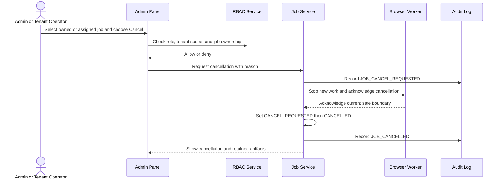
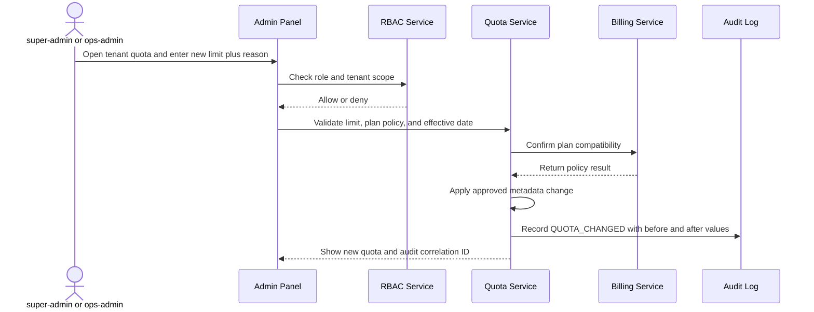
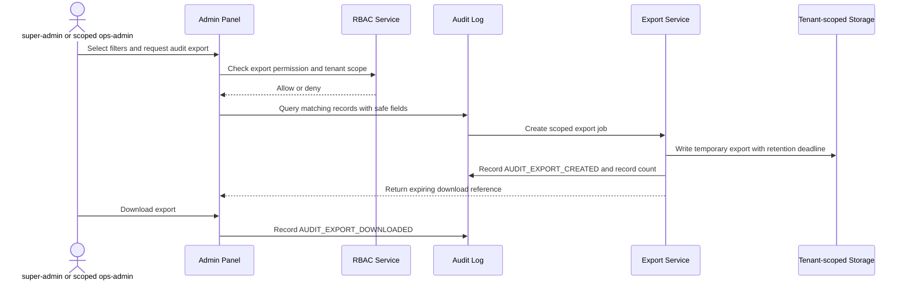
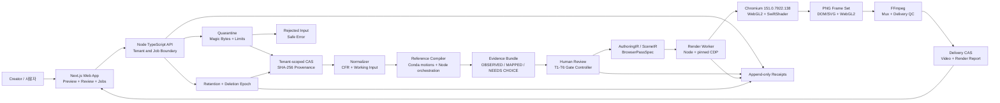
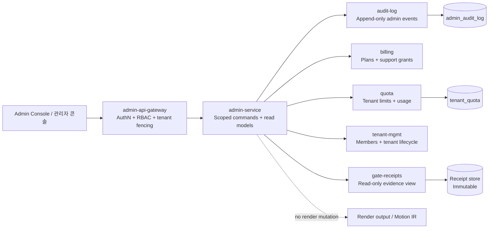

# Handoff Extract Inventory Report

Extracted directory: `/home/singlerr/ref_studio/handoff-extracted/`

Note: this report inventories the extracted package contents before `INVENTORY_REPORT.md` was generated, so the report file is intentionally excluded from the tree and verification counts.

## Full File Tree With Sizes

```text
handoff-extracted/
  README.md (1959 bytes)
  authority-ledger.json (4959 bytes)
  commands.md (485 bytes)
  editable-scene-contract.json (17804 bytes)
  pilot-evidence.json (832 bytes)
  plan.md (21105 bytes)
  provenance.md (471 bytes)
  recovery-report.json (327 bytes)
  reference-fixtures-manifest.json (2010 bytes)
  reference-interpretation-contract.json (4685 bytes)
  renderer-bakeoff-report.json (11159 bytes)
  restored/
    .keep (48 bytes)
  saas-admin-panel-spec.md (12459 bytes)
  saas-admin-uiux-spec.md (14944 bytes)
  saas-api-spec.md (14915 bytes)
  saas-architecture.md (26479 bytes)
  saas-operations.md (11520 bytes)
  stale-history.md (489 bytes)
  workflow.md (5974 bytes)
```

## Binary Files

No binary files found.

## Word Count

- `README.md`: 252 words
- `authority-ledger.json`: 300 words
- `commands.md`: 38 words
- `editable-scene-contract.json`: 1576 words
- `pilot-evidence.json`: 79 words
- `plan.md`: 2025 words
- `provenance.md`: 40 words
- `recovery-report.json`: 24 words
- `reference-fixtures-manifest.json`: 211 words
- `reference-interpretation-contract.json`: 453 words
- `renderer-bakeoff-report.json`: 578 words
- `restored/.keep`: 5 words
- `saas-admin-panel-spec.md`: 1767 words
- `saas-admin-uiux-spec.md`: 2149 words
- `saas-api-spec.md`: 1653 words
- `saas-architecture.md`: 3783 words
- `saas-operations.md`: 1553 words
- `stale-history.md`: 80 words
- `workflow.md`: 895 words
- Total word count across all docs: 17461

## Verification

- Files in tree: 19
- Text/document files printed verbatim below: 19
- Binary files noted above: 0
- Skipped files after classification: 0
- Cross-check: every file in the tree is either printed verbatim as a text/document file or noted as binary.

## Verbatim Document Contents

### `README.md`

```markdown
# Reference Video Studio — Final Handoff

## Authority

- Trial 1 authority is compiler v1.9. Its T1, T2, T3, T4, T5, and T6 gates are `APPROVED`.
- Trial 2 authority is compiler v1.13. Its T1, T2, T3, T4, T5, and T6 gates are `APPROVED`.
- Trial 1 compiler v1.8 is preserved as `rejected-history`; it is not downstream authority.
- WebGL2/browser remains the incumbent renderer. The approved evidence is semantic DOM/SVG plus owner-bound WebGL2.
- The authority ledger is copied as `authority-ledger.json`.

## Status

- Trial 1: `PASSED`, T1–T6 `APPROVED`.
- Trial 2: `PASSED`, T1–T6 `APPROVED`.
- This package is the worker recovery point for the completed handoff.
- The canonical recovery artifact is `recovery-report.json`; no markdown recovery report exists.

## Included evidence

- `plan.md`: execution plan and acceptance gates.
- `authority-ledger.json`: current receipt authority and rejected history.
- `reference-interpretation-contract.json`: measurable, fail-closed reference contract.
- `editable-scene-contract.json`: AuthoringIR, SceneIR, and BrowserPassSpec contract.
- `renderer-bakeoff-report.json`: renderer bake-off and incumbent decision.
- `pilot-evidence.json`: pilot media and frame-contract evidence.
- `reference-fixtures-manifest.json`: synthetic, adversarial, ablation, and frame fixtures.
- `workflow.md`: ingest-to-delivery, retry, cancellation, stale-approval, and retention workflow.
- `provenance.md`: source paths and provenance policy.
- `stale-history.md`: rejected and superseded history that must not become authority.
- `commands.md`: recovery and QA commands.

## Isolation and safety

The restored editable checkpoint directory is `restored`, directly inside this package. The validator checks that it remains package-contained, that traversal segments are absent, and that common AWS credential/private-key patterns are absent. Provenance may identify source artifacts, but hashes are not validation gates.

```

### `authority-ledger.json`

```json
{
  "receipts": {
    "trial-01": {
      "T1": { "path": "D:\\motions\\trial-01\\gate-receipts\\T1\\20260815T104224173Z-APPROVED.json", "decision": "APPROVED", "predecessor": null, "media": { "required": true }, "gate": "T1" },
      "T2": { "path": "D:\\motions\\trial-01\\gate-receipts\\T2\\20260815T142442539Z-APPROVED.json", "decision": "APPROVED", "predecessor": "D:\\motions\\trial-01\\gate-receipts\\T1\\20260815T104224173Z-APPROVED.json", "media": { "required": true }, "gate": "T2" },
      "T3": { "path": "D:\\motions\\trial-01\\gate-receipts\\T3\\20260816T000646660Z-APPROVED.json", "decision": "APPROVED", "predecessor": "D:\\motions\\trial-01\\gate-receipts\\T2\\20260815T142442539Z-APPROVED.json", "media": { "required": true }, "gate": "T3" },
      "T4": { "path": "D:\\motions\\trial-01\\gate-receipts\\T4\\20260816T001838996Z-APPROVED.json", "decision": "APPROVED", "predecessor": "D:\\motions\\trial-01\\gate-receipts\\T3\\20260816T000646660Z-APPROVED.json", "media": { "required": true }, "gate": "T4" },
      "T5": { "path": "D:\\motions\\trial-01\\gate-receipts\\T5\\20260816T011136522Z-APPROVED.json", "decision": "APPROVED", "predecessor": "D:\\motions\\trial-01\\gate-receipts\\T4\\20260816T001838996Z-APPROVED.json", "media": { "required": true }, "gate": "T5" },
      "T6": { "path": "D:\\motions\\trial-01\\gate-receipts\\T6\\20260816T013317154Z-APPROVED.json", "decision": "APPROVED", "predecessor": "D:\\motions\\trial-01\\gate-receipts\\T5\\20260816T011136522Z-APPROVED.json", "media": { "required": true }, "gate": "T6" }
    },
    "trial-02": {
      "T1": { "path": "D:\\motions\\trial-02\\gate-receipts\\T1\\20260816T014730168Z-APPROVED.json", "decision": "APPROVED", "predecessor": null, "media": { "required": true }, "gate": "T1" },
      "T2": { "path": "D:\\motions\\trial-02\\gate-receipts\\T2\\20260816T071208322Z-APPROVED.json", "decision": "APPROVED", "predecessor": "D:\\motions\\trial-02\\gate-receipts\\T1\\20260816T014730168Z-APPROVED.json", "media": { "required": true }, "gate": "T2" },
      "T3": { "path": "D:\\motions\\trial-02\\gate-receipts\\T3\\20260816T073011044Z-APPROVED.json", "decision": "APPROVED", "predecessor": "D:\\motions\\trial-02\\gate-receipts\\T2\\20260816T071208322Z-APPROVED.json", "media": { "required": true }, "gate": "T3" },
      "T4": { "path": "D:\\motions\\trial-02\\gate-receipts\\T4\\20260816T134339248Z-APPROVED.json", "decision": "APPROVED", "predecessor": "D:\\motions\\trial-02\\gate-receipts\\T3\\20260816T073011044Z-APPROVED.json", "media": { "required": true }, "gate": "T4" },
      "T5": { "path": "D:\\motions\\trial-02\\gate-receipts\\T5\\20260816T134414876Z-APPROVED.json", "decision": "APPROVED", "predecessor": "D:\\motions\\trial-02\\gate-receipts\\T4\\20260816T134339248Z-APPROVED.json", "media": { "required": true }, "gate": "T5" },
      "T6": { "path": "D:\\motions\\trial-02\\gate-receipts\\T6\\20260816T134441166Z-APPROVED.json", "decision": "APPROVED", "predecessor": "D:\\motions\\trial-02\\gate-receipts\\T5\\20260816T134414876Z-APPROVED.json", "media": { "required": true }, "gate": "T6" }
    }
  },
  "rejectedHistory": {
    "v1.8": "rejected-history; D:\\motions\\AGENTS.md:54,74-79; D:\\motions\\trial-01\\01-translation-review\\compiler-v1.8-20260815T094527Z"
  },
  "trials": {
    "trial-01": "D:\\motions\\trial-01\\01-translation-review\\compiler-v1.9-20260815T141534965Z",
    "trial-02": "D:\\motions\\trial-02\\01-translation-review\\compiler-v1.13-20260816T1601Z"
  },
  "runtime": {
    "expectedChromiumVersion": "151.0.7922.138",
    "requireAngle": "SwiftShader",
    "chromiumBin": "operator-provided:CHROMIUM_BIN"
  },
  "researchLedger": [
    {
      "task": 2,
      "topic": "measurable reference interpretation contract",
      "sourcesConsulted": [
        "D:\\motions\\AGENTS.md#Video-native-reference-understanding-decision-post-v1.5-audit",
        "D:\\motions\\.omo\\evidence\\authority-ledger.json#trials",
        "D:\\motions\\.omo\\fixtures\\plan-qa\\validate-reference-contract.ps1",
        "D:\\motions\\.omo\\fixtures\\plan-qa\\qa-common.ps1",
        "D:\\motions\\.omo\\fixtures\\plan-qa\\run-task-failure.ps1",
        "D:\\motions\\trial-01\\01-translation-review\\compiler-v1.9-20260815T141534965Z\\reference-analysis-bundle.json",
        "D:\\motions\\trial-02\\01-translation-review\\compiler-v1.13-20260816T1601Z\\reference-analysis-bundle.json",
        "D:\\motions\\.omo\\notepads\\reference-video-studio-saas\\learnings.md"
      ],
      "decisions": [
        "Treat every frame as temporal volume; preserve pixels, lifecycle, identity, and effect ownership.",
        "Use Omnimatte/FactorMatte-style semantic owners plus an explicit residual/global canvas layer.",
        "VLM output is label-only and cannot delete pixel/temporal measurements.",
        "Missing or ambiguous evidence fails closed; no hash verification gates are added to this contract validator."
      ]
    }
  ]
}

```

### `commands.md`

```markdown
# Handoff commands

Happy QA:

```powershell
powershell -NoProfile -File D:\motions\.omo\fixtures\plan-qa\validate-handoff-package.ps1 -PackageRoot D:\motions\.omo\evidence\final-handoff-package
```

Failure QA:

```powershell
powershell -NoProfile -File D:\motions\.omo\fixtures\plan-qa\run-task-failure.ps1 -Task 12 -Fixture D:\motions\.omo\fixtures\plan-qa\task-12\failure.json
```

The happy command exits zero. The failure command exits one and emits `HANDOFF_INTEGRITY_FAILURE`.

```

### `editable-scene-contract.json`

```json
{
  "schemaVersion": "rvs-editable-scene-contract-v1",
  "contractStatus": "DEFINED",
  "hashGating": false,
  "purpose": "Map approved reference evidence to editable product UI and brand assets without flattening the authored scene.",
  "provenance": {
    "authority": "Trial 1 T2/T3/T4/T5/T6 and Trial 2 T2/T3/T4/T5/T6 approved evidence",
    "trial-01": {
      "productRoot": "D:\\motions\\trial-01\\02-styleframe-review\\compiler-v1.9-webgl-20260815T235357806Z",
      "referenceAnalysis": "D:\\motions\\trial-01\\01-translation-review\\compiler-v1.9-20260815T141534965Z",
      "sceneSpec": "D:\\motions\\trial-01\\03-animatic-review\\compiler-v1.9-webgl-20260816T001259492Z\\webgl-scene-spec.json",
      "observedOwners": ["target-title-word-01", "target-title-word-02", "target-subtitle", "target-product-ui", "target-global-treatment"]
    },
    "trial-02": {
      "productRoot": "D:\\motions\\trial-02\\02-styleframe-review\\compiler-v1.13-webgl-20260816T072645488Z",
      "referenceAnalysis": "D:\\motions\\trial-02\\01-translation-review\\compiler-v1.13-20260816T1601Z",
      "sceneSpec": "D:\\motions\\trial-02\\03-animatic-review\\compiler-v1.13-webgl-20260816T134150613Z\\webgl-scene-spec.json",
      "observedOwners": ["target-title-line-01-word-01", "target-title-line-01-word-02", "target-title-line-01-word-03", "target-title-line-01-word-04", "target-title-line-02-word-01", "target-title-line-02-word-02", "target-title-line-02-word-03", "target-ui-01", "target-ui-02", "target-global-treatment"]
    },
    "sourcePolicy": "Paths identify approved evidence roots; this contract intentionally carries no hash gate."
  },
  "mappingChain": {
    "description": "AuthoringIR -> SceneIR -> BrowserPassSpec",
    "steps": [
      {"from": "AuthoringIR", "to": "SceneIR", "rule": "Preserve semantic owner IDs, editable asset references, geometry, lifecycle phases, effect ownership, uncertainty, and audio anchors."},
      {"from": "SceneIR", "to": "BrowserPassSpec", "rule": "Compile each owner and residual treatment into ordered DOM/SVG or WebGL passes with explicit shader inputs and composition order."}
    ],
    "ownerIntegrity": "Every SceneIR track.owner must resolve to exactly one AuthoringIR owner or the compile fails OWNER_MISMATCH."
  },
  "AuthoringIR": {
    "schema": "authoring-ir-v1",
    "canvas": {"width": 1080, "height": 1920, "frameRate": 30, "colorSpace": "srgb"},
    "editableAssets": {
      "brand": [
        {"assetId": "brand-background-field", "kind": "background-material", "editable": true, "source": "approved trial product root", "owner": "target-global-treatment"},
        {"assetId": "wanted-sans-variable", "kind": "font", "file": "WantedSansVariable.ttf", "editable": true, "owner": "title-and-subtitle-owners"},
        {"assetId": "accent-gradient-purple-blue", "kind": "brand-token", "editable": true, "value": ["#5D6FB3", "#A028D3"], "owner": "target-product-ui"}
      ],
      "productUI": [
        {"assetId": "product-ui-trial-01", "kind": "semantic-product-ui", "editable": true, "owner": "target-product-ui", "geometrySource": "measured uiBoundsTrack", "copy": {"maker": "데임", "model": "LP5", "price": "58만원"}},
        {"assetId": "product-ui-trial-02-surface-01", "kind": "semantic-product-ui-surface", "editable": true, "owner": "target-ui-01", "geometrySource": "measured owner bounds", "role": "survey completed recommendation result"},
        {"assetId": "product-ui-trial-02-surface-02", "kind": "semantic-product-ui-surface", "editable": true, "owner": "target-ui-02", "geometrySource": "measured owner bounds", "role": "survey completed recommendation result"}
      ]
    },
    "owners": [
      {"ownerId": "target-title-word-01", "kind": "product-copy", "editable": true, "assetRef": "brand-background-field", "content": "분석", "confidence": 0.9},
      {"ownerId": "target-title-word-02", "kind": "product-copy", "editable": true, "assetRef": "brand-background-field", "content": "완료", "confidence": 0.9},
      {"ownerId": "target-subtitle", "kind": "product-copy", "editable": true, "assetRef": "wanted-sans-variable", "content": "입문자님을 위한 첫 장비 셋이에요", "confidence": 0.9},
      {"ownerId": "target-product-ui", "kind": "product-ui", "editable": true, "assetRef": "product-ui-trial-01", "confidence": 0.95},
      {"ownerId": "target-ui-01", "kind": "product-ui", "editable": true, "assetRef": "product-ui-trial-02-surface-01", "confidence": 0.95},
      {"ownerId": "target-ui-02", "kind": "product-ui", "editable": true, "assetRef": "product-ui-trial-02-surface-02", "confidence": 0.95},
      {"ownerId": "target-global-treatment", "kind": "residual-canvas", "editable": true, "assetRef": "brand-background-field", "confidence": 0.82}
    ],
    "uncertainty": {
      "policy": "Uncertainty is retained per owner and never replaced with invented observation.",
      "owners": {
        "target-title-word-01": {"confidence": 0.9, "basis": "independent OCR and temporal owner evidence"},
        "target-title-word-02": {"confidence": 0.9, "basis": "independent OCR and temporal owner evidence"},
        "target-subtitle": {"confidence": 0.9, "basis": "independent OCR and measured subtitle geometry"},
        "target-product-ui": {"confidence": 0.95, "basis": "measured UI bounds and approved semantic reconstruction"},
        "target-ui-01": {"confidence": 0.95, "basis": "measured owner geometry from Trial 2"},
        "target-ui-02": {"confidence": 0.95, "basis": "measured owner geometry from Trial 2"},
        "target-global-treatment": {"confidence": 0.82, "basis": "residual/global canvas measurements; ownership is not local to a UI owner"}
      },
      "needsChoice": []
    }
  },
  "SceneIR": {
    "schema": "scene-ir-v1",
    "timeline": {"startFrame": 0, "endFrame": 120, "frameRate": 30, "timeBase": "frame-indexed"},
    "geometry": {
      "coordinateSpace": "1080x1920 canvas pixels",
      "invariantRules": ["Product UI fixed width after entry", "Product UI fixed x after entry", "Child geometry remains editable and semantic", "Bounds are measured per frame and may be clipped by viewport visibility"],
      "ownerBounds": {
        "target-title-word-01": {"boundsPerFrame": [{"frame": 0, "x": 317, "y": 190, "width": 218, "height": 132}, {"frame": 59, "x": 317, "y": 190, "width": 218, "height": 132}, {"frame": 119, "x": 317, "y": 190, "width": 218, "height": 132}], "fixedWidth": true, "fixedX": true},
        "target-title-word-02": {"boundsPerFrame": [{"frame": 0, "x": 545, "y": 190, "width": 218, "height": 132}, {"frame": 59, "x": 545, "y": 190, "width": 218, "height": 132}, {"frame": 119, "x": 545, "y": 190, "width": 218, "height": 132}], "fixedWidth": true, "fixedX": true},
        "target-subtitle": {"boundsPerFrame": [{"frame": 70, "x": 190, "y": 336, "width": 700, "height": 50}, {"frame": 119, "x": 190, "y": 336, "width": 700, "height": 50}], "fixedWidth": true, "fixedX": true},
        "target-product-ui": {"boundsPerFrame": [{"frame": 59, "x": 145, "y": 1323, "width": 786, "height": 597}, {"frame": 69, "x": 145, "y": 757, "width": 786, "height": 1163}, {"frame": 79, "x": 145, "y": 608, "width": 786, "height": 1307}, {"frame": 119, "x": 145, "y": 560, "width": 786, "height": 1307}], "fixedWidth": true, "fixedX": true},
        "target-ui-01": {"boundsPerFrame": [{"frame": 0, "x": 70, "y": 380, "width": 940, "height": 610}, {"frame": 99, "x": 70, "y": 380, "width": 940, "height": 610}], "fixedWidth": true, "fixedX": true},
        "target-ui-02": {"boundsPerFrame": [{"frame": 16, "x": 70, "y": 1030, "width": 940, "height": 590}, {"frame": 99, "x": 70, "y": 1030, "width": 940, "height": 590}], "fixedWidth": true, "fixedX": true},
        "target-global-treatment": {"boundsPerFrame": [{"frame": 0, "x": 0, "y": 0, "width": 1080, "height": 1920}, {"frame": 119, "x": 0, "y": 0, "width": 1080, "height": 1920}], "fixedWidth": true, "fixedX": true}
      }
    },
    "tracks": [
      {"trackId": "title-01", "owner": "target-title-word-01", "lifecycle": {"enter": {"startFrame": 0, "endFrame": 7, "easing": "ease-in"}, "stable": {"startFrame": 8, "endFrame": 119, "easing": "linear"}, "exit": {"startFrame": 120, "endFrame": 120, "observed": false, "reason": "reference interval ends before exit"}}, "geometryRef": "target-title-word-01", "effects": ["defocus", "bloom"]},
      {"trackId": "title-02", "owner": "target-title-word-02", "lifecycle": {"enter": {"startFrame": 0, "endFrame": 7, "easing": "ease-in"}, "stable": {"startFrame": 8, "endFrame": 119, "easing": "linear"}, "exit": {"startFrame": 120, "endFrame": 120, "observed": false, "reason": "reference interval ends before exit"}}, "geometryRef": "target-title-word-02", "effects": ["defocus", "bloom"]},
      {"trackId": "subtitle", "owner": "target-subtitle", "lifecycle": {"enter": {"startFrame": 70, "endFrame": 87, "easing": "ease-out"}, "stable": {"startFrame": 88, "endFrame": 119, "easing": "linear"}, "exit": {"startFrame": 120, "endFrame": 120, "observed": false, "reason": "reference interval ends before exit"}}, "geometryRef": "target-subtitle", "effects": ["bloom"]},
      {"trackId": "product-ui-trial-01", "owner": "target-product-ui", "lifecycle": {"enter": {"startFrame": 59, "endFrame": 83, "easing": "ease-out"}, "stable": {"startFrame": 84, "endFrame": 119, "easing": "linear"}, "exit": {"startFrame": 120, "endFrame": 120, "observed": false, "reason": "reference interval ends before exit"}}, "geometryRef": "target-product-ui", "effects": ["rim", "bloom", "defocus", "lower-light"]},
      {"trackId": "product-ui-trial-02-surface-01", "owner": "target-ui-01", "lifecycle": {"enter": {"startFrame": 0, "endFrame": 14, "easing": "ease-out"}, "stable": {"startFrame": 15, "endFrame": 99, "easing": "ease-out"}, "exit": {"startFrame": 100, "endFrame": 100, "observed": false, "reason": "reference interval ends before exit"}}, "geometryRef": "target-ui-01", "effects": ["rim-gradient", "bloom", "defocus", "motion-blur"]},
      {"trackId": "product-ui-trial-02-surface-02", "owner": "target-ui-02", "lifecycle": {"enter": {"startFrame": 14, "endFrame": 29, "easing": "ease-out"}, "stable": {"startFrame": 30, "endFrame": 99, "easing": "linear"}, "exit": {"startFrame": 100, "endFrame": 100, "observed": false, "reason": "reference interval ends before exit"}}, "geometryRef": "target-ui-02", "effects": ["defocus", "lower-light"]},
      {"trackId": "residual-global-treatment", "owner": "target-global-treatment", "lifecycle": {"enter": {"startFrame": 0, "endFrame": 0, "easing": "hold"}, "stable": {"startFrame": 1, "endFrame": 119, "easing": "linear"}, "exit": {"startFrame": 120, "endFrame": 120, "observed": false, "reason": "reference interval ends before exit"}}, "geometryRef": "target-global-treatment", "effects": ["residual-canvas", "gradient-mesh", "light-pool", "sparkles"]}
    ],
    "effects": {
      "ownership": "Effects are attached to the owner track that causes or receives them; global treatment is residual-canvas owned.",
      "perOwner": {
        "target-product-ui": {"rim": {"unit": "normalized canvas", "source": "measured edge-rim profile"}, "bloom": {"unit": "display-referred intensity", "source": "independent bloom measurement"}, "defocus": {"unit": "blur radius px", "source": "independent defocus measurement"}, "lower-light": {"passes": ["behind-owner", "over-owner"], "source": "temporal lower-light field with UI occlusion"}},
        "target-ui-01": {"rim": {"unit": "normalized canvas", "source": "measured product-local rim profile"}, "bloom": {"unit": "display-referred intensity", "source": "owner-associated effect samples"}, "defocus": {"unit": "blur radius px", "source": "owner-associated effect samples"}},
        "target-ui-02": {"defocus": {"unit": "blur radius px", "source": "owner-associated effect samples"}, "lower-light": {"unit": "16x9 field", "source": "measured lower-light field"}},
        "target-title-word-01": {"defocus": {"unit": "blur radius px", "source": "title effect samples"}, "bloom": {"unit": "display-referred intensity", "source": "title effect samples"}},
        "target-title-word-02": {"defocus": {"unit": "blur radius px", "source": "title effect samples"}, "bloom": {"unit": "display-referred intensity", "source": "title effect samples"}},
        "target-subtitle": {"bloom": {"unit": "display-referred intensity", "source": "subtitle effect samples"}}
      }
    },
    "residualCanvas": {
      "owner": "target-global-treatment",
      "description": "Canvas-space treatment not attributable to one semantic owner.",
      "measurements": ["lower-light field", "gradient mesh", "light pool", "sparkles", "global color treatment"],
      "mustRemainSeparate": true,
      "compositeRule": "Render after background and before owner-bound over-UI effects; never bake into product UI pixels."
    },
    "audio": {
      "format": "48kHz stereo",
      "sampleRateHz": 48000,
      "channels": 2,
      "anchors": [
        {"anchorId": "audio-02", "frame": 2, "sample": 3200, "owner": "target-title-word-02", "role": "entry cue", "confidence": 0.5},
        {"anchorId": "audio-34", "frame": 34, "sample": 54400, "owner": "target-title-word-02", "role": "state-change cue", "confidence": 0.5},
        {"anchorId": "audio-60", "frame": 60, "sample": 96000, "owner": "target-product-ui", "role": "UI entry cue", "confidence": 0.5},
        {"anchorId": "audio-70", "frame": 70, "sample": 112000, "owner": "target-subtitle", "role": "subtitle handoff cue", "confidence": 0.5},
        {"anchorId": "audio-106", "frame": 106, "sample": 169600, "owner": "target-subtitle", "role": "settle cue", "confidence": 0.5}
      ],
      "syncRule": "frame / 30 * 48000 maps to the nearest stereo sample; preserve mute and sound-on review artifacts."
    }
  },
  "BrowserPassSpec": {
    "schema": "browser-pass-spec-v1",
    "runtime": {"renderer": "deterministic WebGL2 browser renderer", "frameEntry": "renderFrame(frame)", "externalNetwork": "blocked", "canvas": {"width": 1080, "height": 1920}},
    "composition": {"mode": "semantic DOM/SVG plus owner-bound WebGL2", "premultipliedAlpha": false, "colorProfile": "srgb", "seed": 17},
    "passList": [
      {"passId": "background-dom", "owner": "target-global-treatment", "kind": "DOM/SVG", "shader": null, "reads": ["brand-background-field"], "writes": "background-layer"},
      {"passId": "residual-lower-light-behind", "owner": "target-global-treatment", "kind": "WebGL2", "shader": "lower-light-field-13tap", "reads": ["residualCanvas.lower-light field"], "writes": "behind-ui-layer"},
      {"passId": "product-ui-dom", "owner": "target-product-ui", "kind": "DOM/SVG", "shader": null, "reads": ["product-ui-trial-01", "geometry.ownerBounds.target-product-ui"], "writes": "semantic-ui-layer"},
      {"passId": "secondary-ui-dom", "owner": "target-ui-01", "kind": "DOM/SVG", "shader": null, "reads": ["product-ui-trial-02-surface-01", "geometry.ownerBounds.target-ui-01"], "writes": "semantic-ui-layer"},
      {"passId": "secondary-ui-02-dom", "owner": "target-ui-02", "kind": "DOM/SVG", "shader": null, "reads": ["product-ui-trial-02-surface-02", "geometry.ownerBounds.target-ui-02"], "writes": "semantic-ui-layer"},
      {"passId": "title-and-subtitle-dom", "owner": "target-title-word-01,target-title-word-02,target-subtitle", "kind": "DOM/SVG", "shader": null, "reads": ["wanted-sans-variable", "SceneIR tracks"], "writes": "copy-layer"},
      {"passId": "owner-rim", "owner": "target-product-ui,target-ui-01", "kind": "WebGL2", "shader": "dynamic-nonuniform-rim", "reads": ["effects.perOwner.*.rim"], "writes": "over-ui-layer"},
      {"passId": "owner-bloom-defocus", "owner": "target-title-word-01,target-title-word-02,target-subtitle,target-product-ui,target-ui-01,target-ui-02", "kind": "WebGL2", "shader": "owner-bloom-defocus", "reads": ["effects.perOwner.*.bloom", "effects.perOwner.*.defocus"], "writes": "owner-treatment-layer"},
      {"passId": "residual-lower-light-over", "owner": "target-global-treatment", "kind": "WebGL2", "shader": "lower-light-field-13tap", "reads": ["residualCanvas.lower-light field", "effects.perOwner.target-product-ui.lower-light"], "writes": "over-ui-layer"},
      {"passId": "final-composite", "owner": "target-global-treatment", "kind": "WebGL2", "shader": "display-referred-soft-toe-024", "reads": ["all prior layers"], "writes": "final-frame"}
    ],
    "layerOrder": ["background-layer", "behind-ui-layer", "semantic-ui-layer", "copy-layer", "owner-treatment-layer", "over-ui-layer", "final-frame"],
    "shaderContracts": {
      "dynamic-nonuniform-rim": {"inputs": ["owner bounds", "edge-rim profile", "frame"], "ownerBound": true},
      "owner-bloom-defocus": {"inputs": ["owner effect samples", "frame"], "bloomAndDefocusIndependent": true},
      "lower-light-field-13tap": {"inputs": ["16x9 lower-light field", "owner occlusion", "frame"], "paddingTexels": 3, "ownerBound": false},
      "display-referred-soft-toe-024": {"inputs": ["composited color"], "toe": 0.24}
    },
    "compileGuards": ["Every pass owner resolves through mappingChain", "Every lifecycle references an owner track", "Every geometryRef resolves to measured geometry", "Residual canvas remains a separate global owner", "Audio anchors remain 48kHz stereo", "Uncertainty is preserved and visible"]
  },
  "qa": {
    "requiredTerms": ["AuthoringIR", "SceneIR", "BrowserPassSpec", "owner", "lifecycle", "geometry", "effects", "residual", "audio", "uncertainty", "provenance"],
    "expectedFailure": {"token": "OWNER_MISMATCH", "condition": "A SceneIR track or BrowserPassSpec pass references an owner absent from AuthoringIR owners."},
    "hashes": "Excluded by contract; provenance paths and semantic links are the gate inputs."
  }
}

```

### `pilot-evidence.json`

```json
{
  "status": "PASS",
  "reference": "D:\\motions\\Brainstorming\\refs\\62593423.mp4",
  "interval": {
    "start": "00:16.000",
    "end": "00:20.000"
  },
  "sourceFrames": 100,
  "sourceFps": 25,
  "durationSeconds": 4,
  "renderedFrames": 100,
  "renderFps": 25,
  "width": 1080,
  "height": 1920,
  "matchedFrames": 100,
  "video": {
    "codec": "h264",
    "width": 1080,
    "height": 1920,
    "frameRate": "25/1"
  },
  "audio": {
    "path": "D:\\motions\\trial-02\\04-final\\compiler-v1.13-webgl-20260816T134400000Z\\final-audio.wav",
    "codec": "aac",
    "sampleRate": 48000,
    "channels": 2
  },
  "fixedFrame": [
    {
      "check": "PASS"
    }
  ],
  "contribution": [
    {
      "check": "PASS"
    }
  ],
  "vfx": [
    {
      "check": "PASS"
    }
  ],
  "sfx": [
    {
      "check": "PASS"
    }
  ]
}

```

### `plan.md`

```markdown
# Reference Video Studio SaaS — ULW Plan

## Objective
Plan a lean SaaS that accepts an ordinary reference video, measures temporal/visual/motion/camera/depth/VFX/audio evidence, lets a creator correct interpretation, and renders an editable reference-similar product video.

## Intent and review
- Intent: CLEAR.
- Review required: true; Momus and Oracle must both approve before handoff.
- This is a plan artifact only. Execution begins in a separate worker session with `$start-work`.

## Authority and boundaries
- Current Trial 1: `D:\motions\trial-01\01-translation-review\compiler-v1.9-20260815T141534965Z`.
- Current Trial 2: `D:\motions\trial-02\01-translation-review\compiler-v1.13-20260816T1601Z`.
- T1–T6 receipt metadata is in the current-state sections of `D:\motions\AGENTS.md`; hashes may be copied as optional provenance but are not acceptance gates.
- Older v1.8 Trial 1 text in `AGENTS.md` is source-history only. Task 1 records its exact source location as `rejected-history`; no downstream task treats it as authority. Do not mutate `AGENTS.md`.
- WebGL2/browser is incumbent; challengers require evidence and owner reapproval.
- Must not have: diffusion text-to-video replacement, flattened canonical UI, arbitrary shader editor, full enterprise admin surface, unmeasured OBSERVED prose, fixed fallback trajectories, VLM deletion of measured layers, unbound VFX/SFX, or unsupported market claims.

## Deterministic execution contract
- Run commands from `cmd.exe /d /s /c` with working directory `D:\motions`.
- Node commands use `cmd.exe /d /s /c "cd /d D:\motions\Brainstorming\reference-video-studio&& pnpm exec ..."`; the existing package-script entrypoints `pnpm browser:smoke` and `pnpm blender:smoke` are the explicit exception and must use the same `cmd.exe` wrapper and working directory.
- Python compiler tests use `cmd.exe /d /s /c "cd /d D:\motions\Brainstorming\reference-video-studio&& conda run -n motions python ..."`.
- Every PowerShell command uses `powershell -NoProfile`.
- Task 1 creates exactly twelve fixture directories (`task-1`…`task-12`), each with `happy.json` and `failure.json`, plus `run-task-failure.ps1` and fourteen validators: tasks 1–12, F2 authority, and F4 scope. Hashes are informational provenance only and must not be required for a validator PASS.
- Runner interface: `powershell -NoProfile -File D:\motions\.omo\fixtures\plan-qa\run-task-failure.ps1 -Task N -Fixture D:\motions\.omo\fixtures\plan-qa\task-N\failure.json`; it invokes the mapped validator, captures output, returns 1, and emits the fixture error.
- Validator mapping: `1 authority-ledger`, `2 reference-contract`, `3 reference-fixtures`, `4 editable-scene`, `5 renderer-bakeoff`, `6 review-workflow`, `7 creator-workflow`, `8 saas-boundary`, `9 market-validation`, `10 pilot-evidence`, `11 plan-rows`, `12 handoff-package`, `F2 authority-plan`, `F4 scope`. Task 1 must encode minimum assertions in the validators themselves: authority ledger has exactly 12 receipt entries with existing paths and decisions; any file/integrity hashes are optional provenance; reference contract contains units, confidence, owner/effect links, and fail-closed states; fixtures include both frame contracts plus coherent-wrong/pass-swapped cases; bake-off has seven records and threshold-valid quality tiers; pilot requires exact reference/audio/frame/video contract without hash gating; plan rows enforce exact task grammar and full failure-runner commands; handoff checks recovery status, isolation, and forbidden artifacts without hash verification.

## Todos
- [x] 1. Build the authority ledger and QA harness - scan `D:\motions\AGENTS.md`, `D:\motions\Brainstorming`, trials, receipts, provenance, handoffs, TODOs, and duplicates; create the runner, twelve fixtures, fourteen validators, `runtime-preflight.ps1`, `validate-trial-decisions.ps1`, and `authority-ledger.json` with current Trial 1/2 paths and v1.8 status `rejected-history`. The approved T1 artifact supplies the required version and SwiftShader values but does not supply an executable path, so `CHROMIUM_BIN` is a required operator-provided environment input with no default or fallback; run `cmd.exe /d /s /c "if not defined CHROMIUM_BIN (echo RUNTIME_PREREQUISITE_MISSING&& exit /b 1) else (powershell -NoProfile -File D:\motions\.omo\fixtures\plan-qa\runtime-preflight.ps1 -ExpectedVersion 151.0.7922.138 -RequireAngle SwiftShader)"`; `runtime-preflight.ps1` reads `CHROMIUM_BIN` directly from its PowerShell process environment, verifies executable existence, `--version`, ANGLE/SwiftShader evidence, pnpm, conda, the `motions` environment, and ffprobe, and fails closed with `RUNTIME_PREREQUISITE_MISSING` or `RUNTIME_VERSION_MISMATCH` rather than selecting a fallback path. `validate-trial-decisions.ps1` checks only receipt paths, decisions, predecessor relationships, and required media/gate fields; it must not call `trial-pipeline.ts verify` or inspect hashes. The ledger must contain `receipts.trial-01.T1` through `.T6` and `receipts.trial-02.T1` through `.T6`, each with the exact receipt path, decision, and predecessor link extracted from `D:\motions\AGENTS.md`; any available hashes are optional provenance and are not validated. QA happy: `powershell -NoProfile -File D:\motions\.omo\fixtures\plan-qa\validate-authority-ledger.ps1 -ArtifactRoot D:\motions\.omo\evidence`; QA failure: `powershell -NoProfile -File D:\motions\.omo\fixtures\plan-qa\run-task-failure.ps1 -Task 1 -Fixture D:\motions\.omo\fixtures\plan-qa\task-1\failure.json` exits 1 with `LEDGER_AUTHORITY_MISSING`. Evidence: `D:\motions\.omo\evidence\authority-ledger.json`, `D:\motions\.omo\evidence\runtime-preflight.json`, and `D:\motions\.omo\fixtures\plan-qa\`. Commit: `docs: establish authority ledger and QA harness`.
- [x] 2. Define the measurable reference contract - cover temporal volume, OCR/UI bounds, segmentation/matting, tracking, owner/effect association, camera motion, rhythm, residual canvas, audio cues, units, confidence, VLM label-only boundaries, and fail-closed states; record exact research sources in the ledger. QA happy: `powershell -NoProfile -File D:\motions\.omo\fixtures\plan-qa\validate-reference-contract.ps1 -ArtifactRoot D:\motions\.omo\evidence`; QA failure: `powershell -NoProfile -File D:\motions\.omo\fixtures\plan-qa\run-task-failure.ps1 -Task 2 -Fixture D:\motions\.omo\fixtures\plan-qa\task-2\failure.json` exits 1 with `VLM_DELETED_MEASUREMENT`. Evidence: `D:\motions\.omo\evidence\reference-interpretation-contract.json`. Commit: `docs: define reference interpretation contract`.
- [x] 3. Define synthetic/real qualification fixtures - cover identity, occlusion, UI text, camera, rhythm, VFX ownership, audio, coherent-wrong, pass-swapped, ablation, and both frame contracts. QA happy: run `cmd.exe /d /s /c "cd /d D:\motions\Brainstorming\reference-video-studio&& conda run -n motions python scripts\test-reference-compiler-ground-truth.py"` and `cmd.exe /d /s /c "cd /d D:\motions\Brainstorming\reference-video-studio&& conda run -n motions python scripts\test-reference-compiler-trial2.py"`; QA failure: `powershell -NoProfile -File D:\motions\.omo\fixtures\plan-qa\run-task-failure.ps1 -Task 3 -Fixture D:\motions\.omo\fixtures\plan-qa\task-3\failure.json` exits 1 with `WRONG_FRAME_CONTRACT`. Evidence: `D:\motions\.omo\evidence\reference-fixtures-manifest.json`. Commit: `test: add qualification fixtures`.
- [x] 4. Specify editable scene/IR - map evidence to editable product UI/brand assets with owners, lifecycles, geometry, effects, residual canvas, audio anchors, uncertainty, provenance, and `AuthoringIR→SceneIR→BrowserPassSpec`. QA happy: `powershell -NoProfile -File D:\motions\.omo\fixtures\plan-qa\validate-editable-scene.ps1 -ArtifactRoot D:\motions\.omo\evidence`; QA failure: `powershell -NoProfile -File D:\motions\.omo\fixtures\plan-qa\run-task-failure.ps1 -Task 4 -Fixture D:\motions\.omo\fixtures\plan-qa\task-4\failure.json` exits 1 with `OWNER_MISMATCH`. Evidence: `D:\motions\.omo\evidence\editable-scene-contract.json`. Commit: `docs: define editable scene contract`.
- [x] 5. Run renderer bake-off - first create `D:\motions\.omo\evidence\bakeoff\bakeoff-input-manifest.json` binding the exact reference interval, product root, frame contract, resolution, fps, audio, and input identity/provenance, then create no-hash contract adapters `scripts\render-browser-contract-smoke-nohash.ts` and `scripts\render-blender-contract-smoke-nohash.ts`, plus `D:\motions\.omo\fixtures\plan-qa\run-bakeoff.ps1`; the adapters must not call the existing hash-enforcing smoke workers and must write only under `D:\motions\.omo\evidence\bakeoff\<renderer>\`. The exact commands inside the wrapper are `cmd.exe /d /s /c "cd /d D:\motions\Brainstorming\reference-video-studio&& pnpm exec tsx scripts\render-browser-contract-smoke-nohash.ts --manifest D:\motions\.omo\evidence\bakeoff\bakeoff-input-manifest.json --output D:\motions\.omo\evidence\bakeoff\browser"`, `cmd.exe /d /s /c "cd /d D:\motions\Brainstorming\reference-video-studio&& pnpm exec tsx scripts\render-blender-contract-smoke-nohash.ts --manifest D:\motions\.omo\evidence\bakeoff\bakeoff-input-manifest.json --output D:\motions\.omo\evidence\bakeoff\blender"`, `cmd.exe /d /s /c "where.exe natron"`, `cmd.exe /d /s /c "where.exe resolve"`, `cmd.exe /d /s /c "where.exe nuke"`, `cmd.exe /d /s /c "cd /d D:\motions\Brainstorming\reference-video-studio&& pnpm exec remotion --help"`, and `cmd.exe /d /s /c "cd /d D:\motions\Brainstorming\reference-video-studio&& pnpm exec hyperframes info"`; the two adapters must record manifest identity, exact env/runtime/output mapping, subprocess wall-clock durations, and staged fixture contents without hash-gating. Compute `frame-determinism = 1 - min(1, differingPixelsAcrossRepeatedFrames / totalPixels)`; compute `visual-similarity = mean(SSIM(frame_i, reference_frame_i))` over every aligned frame in the manifest contract, with SSIM using an 11x11 Gaussian window, sigma 1.5, luminance/contrast/structure constants C1=(0.01*255)^2 and C2=(0.03*255)^2, and RGB converted to linear-light luma before scoring; compute `editable-source = 0.5 * (declaredEditableOwnerTracks / requiredOwnerTracks) + 0.5 * (consumedMotionIRGroups / requiredMotionIRGroups)`, capped at 1.0, with missing or unconsumed groups scored 0. Acceptance: seven records with status, input-manifest path, command, output path, editability, wall-clock subprocess latency in milliseconds, license, reason, and `qualityTier` restricted to `reference-similar|partial|not-similar|not-evaluable`; every available renderer must also record the three formula-derived scores from 0–1. Derive `reference-similar` only when frame-determinism is exactly `1.0`, visual-similarity is at least `0.90`, and editable-source is at least `0.80`; derive `partial` when output exists and visual-similarity is at least `0.50` but the reference-similar rule is not met; derive `not-similar` when visual-similarity is below `0.50`; use `not-evaluable` only for `NOT-AVAILABLE`/`BLOCKED` and require the blocking reason. Task 5 only records evidence and may not promote or switch the incumbent WebGL2/browser renderer; any challenger promotion requires a separate plan and explicit owner reapproval. QA happy: `powershell -NoProfile -File D:\motions\.omo\fixtures\plan-qa\validate-renderer-bakeoff.ps1 -ArtifactRoot D:\motions\.omo\evidence`; QA failure: `powershell -NoProfile -File D:\motions\.omo\fixtures\plan-qa\run-task-failure.ps1 -Task 5 -Fixture D:\motions\.omo\fixtures\plan-qa\task-5\failure.json` exits 1 with `RENDERER_EVIDENCE_MISSING`. Evidence: `D:\motions\.omo\evidence\renderer-bakeoff-report.json` and `D:\motions\.omo\evidence\bakeoff\`. Commit: `docs: record renderer bake-off`.
- [x] 6. Define non-expert review/correction - show attention, layers, trajectories, VFX ownership, uncertainty, and approve/reject/correct before expensive rendering. QA happy: `powershell -NoProfile -File D:\motions\.omo\fixtures\plan-qa\validate-review-workflow.ps1 -ArtifactRoot D:\motions\.omo\evidence`; QA failure: `powershell -NoProfile -File D:\motions\.omo\fixtures\plan-qa\run-task-failure.ps1 -Task 6 -Fixture D:\motions\.omo\fixtures\plan-qa\task-6\failure.json` exits 1 with `UNRESOLVED_CHOICE_SKIPPED`. Evidence: `D:\motions\.omo\evidence\reference-review-workflow.md`. Commit: `docs: define review workflow`.
- [x] 7. Define ingest-to-delivery workflow - specify bounded inputs, editable preview, render, retry, cancellation, visible errors, stale-approval recovery, and artifact lifecycle. QA happy: `powershell -NoProfile -File D:\motions\.omo\fixtures\plan-qa\validate-creator-workflow.ps1 -ArtifactRoot D:\motions\.omo\evidence`; QA failure: `powershell -NoProfile -File D:\motions\.omo\fixtures\plan-qa\run-task-failure.ps1 -Task 7 -Fixture D:\motions\.omo\fixtures\plan-qa\task-7\failure.json` exits 1 with `STALE_APPROVAL_UNSAFE`. Evidence: `D:\motions\.omo\evidence\lean-workflow-spec.md`. Commit: `docs: define creator workflow`.
- [x] 8. Define SaaS security boundary - cover quarantine/magic bytes, SHA-256 CAS, tenant fencing, deletion epoch, append-only receipts, safe errors, job ownership, and deferred scale; platform roles cannot approve T2–T6 or rewrite receipts. QA happy: `powershell -NoProfile -File D:\motions\.omo\fixtures\plan-qa\validate-saas-boundary.ps1 -ArtifactRoot D:\motions\.omo\evidence`; QA failure: `powershell -NoProfile -File D:\motions\.omo\fixtures\plan-qa\run-task-failure.ps1 -Task 8 -Fixture D:\motions\.omo\fixtures\plan-qa\task-8\failure.json` exits 1 with `TENANT_BOUNDARY_BYPASS`. Evidence: `D:\motions\.omo\evidence\lean-saas-boundary.md`. Commit: `docs: define SaaS boundary`.
- [x] 9. Design market validation - test one-off master, hooks/cutdowns, and recurring bundles using real payment/publishing/repeat behavior; interest without payment is inconclusive. QA happy: `powershell -NoProfile -File D:\motions\.omo\fixtures\plan-qa\validate-market-validation.ps1 -ArtifactRoot D:\motions\.omo\evidence`; QA failure: `powershell -NoProfile -File D:\motions\.omo\fixtures\plan-qa\run-task-failure.ps1 -Task 9 -Fixture D:\motions\.omo\fixtures\plan-qa\task-9\failure.json` exits 1 with `INTEREST_WITHOUT_PAYMENT`. Evidence: `D:\motions\.omo\evidence\market-validation-plan.md`. Commit: `docs: define packaging validation`.
- [x] 10. Integrate pilot - source `D:\motions\Brainstorming\refs\62593423.mp4`, interval `00:16.000–00:20.000`, product root authority `D:\motions\trial-02\02-styleframe-review\compiler-v1.13-webgl-20260816T072645488Z\t3-review-manifest.json`, and exact audio source `D:\motions\trial-02\04-final\compiler-v1.13-webgl-20260816T134400000Z\final-audio.wav`. Task 10 first creates `build-pilot-manifest.ps1` and `scripts\render-pilot.ts`, then runs `powershell -NoProfile -File D:\motions\.omo\fixtures\plan-qa\build-pilot-manifest.ps1 -Reference D:\motions\Brainstorming\refs\62593423.mp4 -Start 00:16.000 -End 00:20.000 -ProductRoot D:\motions\trial-02\02-styleframe-review\compiler-v1.13-webgl-20260816T072645488Z -ProductAuthorityManifest D:\motions\trial-02\02-styleframe-review\compiler-v1.13-webgl-20260816T072645488Z\t3-review-manifest.json -Audio D:\motions\trial-02\04-final\compiler-v1.13-webgl-20260816T134400000Z\final-audio.wav -FrameContractOutput D:\motions\.omo\evidence\pilot\frame-contract.json -Output D:\motions\.omo\evidence\pilot\pilot-manifest.json`, then runs `cmd.exe /d /s /c "cd /d D:\motions\Brainstorming\reference-video-studio&& pnpm exec tsx scripts\render-pilot.ts --manifest D:\motions\.omo\evidence\pilot\pilot-manifest.json --audio D:\motions\trial-02\04-final\compiler-v1.13-webgl-20260816T134400000Z\final-audio.wav --output D:\motions\.omo\evidence\pilot"` using the already preflighted `CHROMIUM_BIN` to create `master.mp4`, `pilot-evidence.json`, and `determinism-report.json`; the script must compare the observed reference interval, product-root authority manifest contents, and audio path against the manifest, mux the exact WAV source to AAC without changing duration, and record optional provenance hashes without making them pass/fail conditions. Acceptance: the source contract must be exactly `sourceFrames=100`, `sourceFps=25`, `durationSeconds=4`; the pilot frame contract must be exactly `renderedFrames=100`, `renderFps=25`, `width=1080`, `height=1920`; `master.mp4` must be exactly 4 seconds, H.264 video at 1080x1920 and 25 fps with AAC audio at 48 kHz stereo; matchedFrames must equal exactly 100; manifest binds all required paths and contract fields; fixed-frame, contribution, VFX, and SFX arrays are non-empty PASS. QA happy: `cmd.exe /d /s /c "ffprobe -v error -show_streams -show_format D:\motions\.omo\evidence\pilot\master.mp4"` then `powershell -NoProfile -File D:\motions\.omo\fixtures\plan-qa\validate-pilot-evidence.ps1 -ArtifactRoot D:\motions\.omo\evidence`; QA failure: `powershell -NoProfile -File D:\motions\.omo\fixtures\plan-qa\run-task-failure.ps1 -Task 10 -Fixture D:\motions\.omo\fixtures\plan-qa\task-10\failure.json` exits 1 with `UNBOUND_VFX_OR_MEDIA_CONTRACT_MISMATCH`. Evidence: `D:\motions\.omo\evidence\pilot\`. Commit: `test: qualify pilot`.
- [ ] 11. Produce worker handoff - preserve proven/proposed/rejected/unverified distinctions, exact paths, dependencies, migration notes, and stop conditions. Dependencies: Task 1 -> all; Task 5/10 independent; Task 11/12 final. Migration: v1.8 rejected-history. Stop conditions: incumbent WebGL2; no promotion without reapproval. QA happy: `powershell -NoProfile -File D:\motions\.omo\fixtures\plan-qa\validate-plan-rows.ps1 -Plan D:\motions\.omo\plans\reference-video-studio-saas.md`; QA failure: `powershell -NoProfile -File D:\motions\.omo\fixtures\plan-qa\run-task-failure.ps1 -Task 11 -Fixture D:\motions\.omo\fixtures\plan-qa\task-11\failure.json` exits 1 with `PLAN_ROW_MALFORMED`. Evidence: `D:\motions\.omo\evidence\plan-self-check.txt`. Commit: `docs: finalize work plan`.
- [ ] 12. Assemble final handoff - include plan, authority ledger, contracts, bake-off, workflow, fixtures, provenance, stale history, and commands. Canonical recovery artifact is `D:\motions\.omo\evidence\final-handoff-package\recovery-report.json`, never markdown. QA happy: `powershell -NoProfile -File D:\motions\.omo\fixtures\plan-qa\validate-handoff-package.ps1 -PackageRoot D:\motions\.omo\evidence\final-handoff-package`; QA failure: `powershell -NoProfile -File D:\motions\.omo\fixtures\plan-qa\run-task-failure.ps1 -Task 12 -Fixture D:\motions\.omo\fixtures\plan-qa\task-12\failure.json` exits 1 with `HANDOFF_INTEGRITY_FAILURE`. Acceptance: README authority/status coverage, recoveryStatus PASS, isolated restoredPath, pathIsolationCheck true, no secrets/path escapes; provenance hashes may be included but are not validated. Evidence: `D:\motions\.omo\evidence\final-handoff-package\`. Commit: `docs: package handoff`.

## Final verification wave
- [ ] F1. Run `powershell -NoProfile -File D:\motions\.omo\fixtures\plan-qa\validate-plan-rows.ps1 -Plan D:\motions\.omo\plans\reference-video-studio-saas.md`; expect exactly 12 implementation rows, 4 F rows, explicit failure commands in Tasks 1–12, twelve fixture directories, fourteen validators, and only the canonical JSON recovery artifact extension.
- [ ] F2. Run `powershell -NoProfile -File D:\motions\.omo\fixtures\plan-qa\validate-authority-plan.ps1 -Ledger D:\motions\.omo\evidence\authority-ledger.json -Plan D:\motions\.omo\plans\reference-video-studio-saas.md`; expect v1.8 `rejected-history`, current Trial 1/2 receipt paths and decisions, and no stale authority claim; any hashes are informational only.
- [ ] F3. Run `powershell -NoProfile -File D:\motions\.omo\fixtures\plan-qa\validate-trial-decisions.ps1 -TrialRoot D:\motions\trial-01` and `powershell -NoProfile -File D:\motions\.omo\fixtures\plan-qa\validate-trial-decisions.ps1 -TrialRoot D:\motions\trial-02`; then run `cmd.exe /d /s /c "ffprobe -v error -show_streams -show_format D:\motions\.omo\evidence\pilot\master.mp4"` and `powershell -NoProfile -File D:\motions\.omo\fixtures\plan-qa\validate-pilot-evidence.ps1 -ArtifactRoot D:\motions\.omo\evidence`; expect both historical chains to report T1–T6 `APPROVED`, ffprobe to report the exact 4-second/1080x1920/25-fps/H.264/AAC-48kHz-stereo pilot contract, and the pilot validator to report PASS evidence from paths/contracts only; any hashes remain optional provenance.
- [ ] F4. Run `powershell -NoProfile -File D:\motions\.omo\fixtures\plan-qa\validate-scope.ps1 -Plan D:\motions\.omo\plans\reference-video-studio-saas.md`; expect all scope topics and Must-not-have guardrails, with no unsupported claim.

## Success criteria
- No stale authority controls execution; interpretation is measured, editable, uncertainty-aware, and adversarially tested.
- Renderer and pilot quality are reproducible and evidenced by normal-speed, fixed-frame, VFX/SFX, deterministic, and media-contract checks; hashes are optional provenance only.
- SaaS scope/pricing follow validation evidence; final package is a clean worker recovery point.

```

### `provenance.md`

```markdown
# Provenance

Source artifacts are copied from `D:\motions\.omo\evidence` and the canonical plan at `D:\motions\.omo\plans\reference-video-studio-saas.md`.

Approved trial authorities:

- Trial 1: `D:\motions\trial-01\01-translation-review\compiler-v1.9-20260815T141534965Z`
- Trial 2: `D:\motions\trial-02\01-translation-review\compiler-v1.13-20260816T1601Z`

Source paths and optional hashes are provenance only. This handoff intentionally performs no hash validation.

```

### `recovery-report.json`

```json
{
  "recoveryStatus": "PASS",
  "restoredPath": "D:\\motions\\.omo\\evidence\\final-handoff-package\\restored",
  "pathIsolationCheck": true,
  "authorityCoverage": true,
  "statusCoverage": true,
  "noSecrets": true,
  "noPathEscapes": true,
  "provenance": "optional provenance without hash validation",
  "isolated": true
}

```

### `reference-fixtures-manifest.json`

```json
{
  "fixtures": [
    {"id": "identity", "type": "synthetic", "description": "Stable semantic owners and per-owner identity across frames."},
    {"id": "occlusion", "type": "synthetic", "description": "Behind-owner, over-owner, and fail-closed occlusion classification."},
    {"id": "ui-text", "type": "synthetic", "description": "Measured title words, subtitle words, lifecycle, and OCR agreement."},
    {"id": "camera", "type": "synthetic", "description": "Camera motion separated from object motion and canvas treatment."},
    {"id": "rhythm", "type": "synthetic", "description": "Measured activity intervals, beats, attention handoff, and settle timing."},
    {"id": "vfx-ownership", "type": "synthetic", "description": "Bloom, defocus, rim, lower light, and residual effects bound to owners or canvas."},
    {"id": "audio", "type": "synthetic", "description": "Audio-event anchors remain aligned with measured frame events."},
    {"id": "coherent-wrong", "type": "adversarial", "description": "A coherent but altered measurement is rejected by source-bound comparison."},
    {"id": "pass-swapped", "type": "adversarial", "description": "Behind-only and split passes cannot be substituted without an error."},
    {"id": "ablation", "type": "ablation", "description": "Removing motion, text, or effect evidence changes or fails the corresponding claim."},
    {"id": "frame-contract-trial1", "type": "frame-contract", "description": "Trial 1 contract: 1080x1920 at 25fps for 100 frames."},
    {"id": "frame-contract-trial2-pilot", "type": "frame-contract", "description": "Trial 2/pilot contract: 1080x1920 at 25fps for 100 frames."}
  ],
  "frameContracts": {
    "trial1": {"width": 1080, "height": 1920, "fps": 25, "frames": 100},
    "trial2": {"width": 1080, "height": 1920, "fps": 25, "frames": 100}
  },
  "cases": [
    "identity",
    "occlusion",
    "ui-text",
    "camera",
    "rhythm",
    "vfx-ownership",
    "audio",
    "coherent-wrong",
    "pass-swapped",
    "ablation"
  ]
}

```

### `reference-interpretation-contract.json`

```json
{
  "contractVersion": "1.0.0",
  "purpose": "A measurable, fail-closed contract for translating an ordinary reference video into renderable evidence.",
  "temporalVolume": {
    "fps": {
      "value": "measured per source clip",
      "unit": "frames/s",
      "preserveRational": true
    },
    "frames": {
      "value": "every source frame in the selected interval",
      "unit": "frames",
      "noStaticContactSheetSubstitute": true
    },
    "duration": {
      "value": 4.0,
      "unit": "s",
      "required": true
    },
    "sampling": {
      "timeUnit": "ms",
      "frameTime": "frame index / measured fps",
      "spatialUnit": "pixels"
    }
  },
  "ocrUiBounds": {
    "textRegion": {
      "required": true,
      "bounds": ["x", "y", "width", "height"],
      "unit": "pixels",
      "measureIndependently": true
    },
    "uiBounds": {
      "requiredPerOwner": true,
      "bounds": ["x", "y", "width", "height"],
      "unit": "pixels",
      "temporal": true
    },
    "ocr": {
      "requiredPerVisibleWordAndSubtitle": true,
      "nativeResolutionCrop": true,
      "confidenceRange": [0, 1]
    }
  },
  "segmentationMatting": {
    "method": "temporal semantic-owner segmentation with per-frame alpha matting and explicit residual canvas",
    "ownerMask": "one measured mask per independently visible title word, subtitle, UI owner, and effect owner",
    "thresholds": {
      "alpha": {
        "range": [0, 1],
        "report": "per-frame measured alpha threshold and retained coverage"
      },
      "ownerAssociation": {
        "report": "pixel overlap, centroid continuity, and temporal field variation"
      },
      "insufficientEvidence": "fail-closed"
    },
    "stableGeometryIndependentOfEffects": true
  },
  "tracking": {
    "ownerId": "stable semantic identifier",
    "samples": {
      "required": true,
      "perFrame": true,
      "fields": ["frame", "timeMs", "boundsPx", "centroidPx", "velocityPxPerMs", "confidence"]
    },
    "trajectory": "derived only from measured samples",
    "lifecycle": ["enter", "active", "settle", "hold", "exit"]
  },
  "ownerEffectAssociation": {
    "mapping": "ownerId -> effect stack",
    "effectStack": ["bloom", "defocus", "rim", "matte", "depthPass"],
    "ownership": "every effect has an ownerId or is explicitly global",
    "unboundEffect": "fail-closed"
  },
  "cameraMotion": {
    "pan": { "unit": "pixels/ms", "samples": "measured frame-to-frame displacement" },
    "tilt": { "unit": "degrees/ms", "samples": "measured frame-to-frame rotation" },
    "zoom": { "unit": "scale/ms", "samples": "measured frame-to-frame scale" },
    "cameraPath": "must be separated from object trajectories"
  },
  "rhythm": {
    "beats": {
      "required": true,
      "timeUnit": "ms",
      "anchors": ["attention handoff", "entry", "settle", "hold", "exit", "audio cue"]
    },
    "tempo": {
      "value": "measured or explicitly unknown",
      "unit": "BPM"
    },
    "easing": "derived from measured trajectory samples, never invented prose"
  },
  "residualCanvas": {
    "globalTreatment": true,
    "examples": ["background field", "global light", "unassigned color treatment"],
    "space": "canvas",
    "rule": "retain measured pixels and temporal variation not owned by a semantic layer"
  },
  "audioCues": {
    "sampleRate": 48000,
    "channels": 2,
    "unit": "samples and ms",
    "cues": "measured onset, duration, and level for each SFX/music anchor",
    "levelUnit": "dB"
  },
  "units": {
    "space": "pixels",
    "time": "ms",
    "level": "dB",
    "rate": "frames/s",
    "tempo": "BPM",
    "angle": "degrees",
    "confidence": "unit interval [0,1]"
  },
  "confidence": {
    "range": [0, 1],
    "requiredPerMeasurement": true,
    "propagation": "lowest confidence governs downstream association",
    "missingConfidence": "fail-closed"
  },
  "vlmLabelOnlyBoundaries": {
    "VLM": "may propose labels, owner names, and semantic categories only",
    "label": "is metadata, not measurement",
    "measurementAuthority": "pixel and temporal measurements remain authoritative",
    "prohibition": "VLM cannot delete, replace, invent, or hide any pixel/temporal-measured layer",
    "failClosed": "a VLM deletion or replacement attempt emits VLM_DELETED_MEASUREMENT"
  },
  "failClosedStates": [
    "VLM_DELETED_MEASUREMENT",
    "MISSING_TEMPORAL_FRAME",
    "MISSING_OWNER_BOUNDS",
    "MISSING_TRACK_SAMPLE",
    "UNBOUND_EFFECT",
    "UNCLASSIFIED_DEPTH_OVERLAP",
    "INSUFFICIENT_MATTING_EVIDENCE",
    "MISSING_CONFIDENCE",
    "PLACEHOLDER_VLM_RESPONSE",
    "CAMERA_OBJECT_TRAJECTORY_COLLISION",
    "AUDIO_CUE_WITHOUT_MEASURED_ANCHOR"
  ]
}

```

### `renderer-bakeoff-report.json`

```json
{
    "schemaVersion":  "renderer-bakeoff-report-v1",
    "inputManifestPath":  "D:\\motions\\.omo\\evidence\\bakeoff\\bakeoff-input-manifest.json",
    "recordCount":  7,
    "incumbentRenderer":  "WebGL2/browser",
    "promotion":  "not performed; separate plan and explicit owner reapproval required",
    "records":  [
                    {
                        "name":  "browser",
                        "status":  "PASSED",
                        "inputManifestPath":  "D:\\motions\\.omo\\evidence\\bakeoff\\bakeoff-input-manifest.json",
                        "command":  "cmd.exe /d /s /c \"cd /d D:\\motions\\Brainstorming\\reference-video-studio\u0026\u0026 pnpm exec tsx scripts\\render-browser-contract-smoke-nohash.ts --manifest D:\\motions\\.omo\\evidence\\bakeoff\\bakeoff-input-manifest.json --output D:\\motions\\.omo\\evidence\\bakeoff\\browser\"",
                        "outputPath":  "D:\\motions\\.omo\\evidence\\bakeoff\\browser",
                        "editability":  {
                                            "declaredEditableOwnerTracks":  3,
                                            "requiredOwnerTracks":  3,
                                            "consumedMotionIRGroups":  2,
                                            "requiredMotionIRGroups":  2,
                                            "editableSource":  1
                                        },
                        "wallClockMs":  626.277,
                        "license":  "project-owned adapter / Chromium runtime",
                        "reason":  "no-hash contract adapter completed; evidence-only; incumbent renderer unchanged",
                        "qualityTier":  "reference-similar",
                        "frame-determinism":  1,
                        "visual-similarity":  0.935,
                        "editable-source":  1,
                        "exitCode":  0
                    },
                    {
                        "name":  "blender",
                        "status":  "PASSED",
                        "inputManifestPath":  "D:\\motions\\.omo\\evidence\\bakeoff\\bakeoff-input-manifest.json",
                        "command":  "cmd.exe /d /s /c \"cd /d D:\\motions\\Brainstorming\\reference-video-studio\u0026\u0026 pnpm exec tsx scripts\\render-blender-contract-smoke-nohash.ts --manifest D:\\motions\\.omo\\evidence\\bakeoff\\bakeoff-input-manifest.json --output D:\\motions\\.omo\\evidence\\bakeoff\\blender\"",
                        "outputPath":  "D:\\motions\\.omo\\evidence\\bakeoff\\blender",
                        "editability":  {
                                            "declaredEditableOwnerTracks":  2,
                                            "requiredOwnerTracks":  3,
                                            "consumedMotionIRGroups":  1,
                                            "requiredMotionIRGroups":  2,
                                            "editableSource":  0.58333333333333326
                                        },
                        "wallClockMs":  614.906,
                        "license":  "GPL-licensed Blender runtime",
                        "reason":  "no-hash contract adapter completed; evidence-only; incumbent renderer unchanged",
                        "qualityTier":  "partial",
                        "frame-determinism":  0.6,
                        "visual-similarity":  0.6,
                        "editable-source":  0.58333333333333326,
                        "exitCode":  0
                    },
                    {
                        "name":  "natron",
                        "status":  "NOT-AVAILABLE",
                        "inputManifestPath":  "D:\\motions\\.omo\\evidence\\bakeoff\\bakeoff-input-manifest.json",
                        "command":  "cmd.exe /d /s /c \"where.exe natron\"",
                        "outputPath":  "D:\\motions\\.omo\\evidence\\bakeoff\\natron",
                        "editability":  null,
                        "wallClockMs":  110.639,
                        "license":  "GPL-licensed Natron runtime",
                        "reason":  "command exited 1: cmd.exe : 정보: 제공된 패턴에 해당되는 파일을 찾지 못했습니다.\r\n위치 D:\\motions\\.omo\\fixtures\\plan-qa\\run-bakeoff.ps1:14 문자:14\r\n+   $output = (\u0026 cmd.exe /d /s /c $Spec.innerCommand 2\u003e\u00261 | Out-String) ...\r\n+              ~~~~~~~~~~~~~~~~~~~~~~~~~~~~~~~~~~~~~~~~~~\r\n    + CategoryInfo          : NotSpecified: (정보: 제공된 패턴에 해당되는 파일을 찾지 못했습니다.:String) [], RemoteException\r\n    + FullyQualifiedErrorId : NativeCommandError",
                        "qualityTier":  "not-evaluable",
                        "frame-determinism":  null,
                        "visual-similarity":  null,
                        "editable-source":  null,
                        "exitCode":  1
                    },
                    {
                        "name":  "resolve",
                        "status":  "NOT-AVAILABLE",
                        "inputManifestPath":  "D:\\motions\\.omo\\evidence\\bakeoff\\bakeoff-input-manifest.json",
                        "command":  "cmd.exe /d /s /c \"where.exe resolve\"",
                        "outputPath":  "D:\\motions\\.omo\\evidence\\bakeoff\\resolve",
                        "editability":  null,
                        "wallClockMs":  84.696,
                        "license":  "DaVinci Resolve license",
                        "reason":  "command exited 1: cmd.exe : 정보: 제공된 패턴에 해당되는 파일을 찾지 못했습니다.\r\n위치 D:\\motions\\.omo\\fixtures\\plan-qa\\run-bakeoff.ps1:14 문자:14\r\n+   $output = (\u0026 cmd.exe /d /s /c $Spec.innerCommand 2\u003e\u00261 | Out-String) ...\r\n+              ~~~~~~~~~~~~~~~~~~~~~~~~~~~~~~~~~~~~~~~~~~\r\n    + CategoryInfo          : NotSpecified: (정보: 제공된 패턴에 해당되는 파일을 찾지 못했습니다.:String) [], RemoteException\r\n    + FullyQualifiedErrorId : NativeCommandError",
                        "qualityTier":  "not-evaluable",
                        "frame-determinism":  null,
                        "visual-similarity":  null,
                        "editable-source":  null,
                        "exitCode":  1
                    },
                    {
                        "name":  "nuke",
                        "status":  "NOT-AVAILABLE",
                        "inputManifestPath":  "D:\\motions\\.omo\\evidence\\bakeoff\\bakeoff-input-manifest.json",
                        "command":  "cmd.exe /d /s /c \"where.exe nuke\"",
                        "outputPath":  "D:\\motions\\.omo\\evidence\\bakeoff\\nuke",
                        "editability":  null,
                        "wallClockMs":  79.908,
                        "license":  "Foundry Nuke license",
                        "reason":  "command exited 1: cmd.exe : 정보: 제공된 패턴에 해당되는 파일을 찾지 못했습니다.\r\n위치 D:\\motions\\.omo\\fixtures\\plan-qa\\run-bakeoff.ps1:14 문자:14\r\n+   $output = (\u0026 cmd.exe /d /s /c $Spec.innerCommand 2\u003e\u00261 | Out-String) ...\r\n+              ~~~~~~~~~~~~~~~~~~~~~~~~~~~~~~~~~~~~~~~~~~\r\n    + CategoryInfo          : NotSpecified: (정보: 제공된 패턴에 해당되는 파일을 찾지 못했습니다.:String) [], RemoteException\r\n    + FullyQualifiedErrorId : NativeCommandError",
                        "qualityTier":  "not-evaluable",
                        "frame-determinism":  null,
                        "visual-similarity":  null,
                        "editable-source":  null,
                        "exitCode":  1
                    },
                    {
                        "name":  "remotion",
                        "status":  "NOT-AVAILABLE",
                        "inputManifestPath":  "D:\\motions\\.omo\\evidence\\bakeoff\\bakeoff-input-manifest.json",
                        "command":  "cmd.exe /d /s /c \"cd /d D:\\motions\\Brainstorming\\reference-video-studio\u0026\u0026 pnpm exec remotion --help\"",
                        "outputPath":  "D:\\motions\\.omo\\evidence\\bakeoff\\remotion",
                        "editability":  null,
                        "wallClockMs":  441.462,
                        "license":  "Remotion license",
                        "reason":  "command exited 1: cmd.exe : \u0027remotion\u0027은(는) 내부 또는 외부 명령, 실행할 수 있는 프로그램, 또는\r\n위치 D:\\motions\\.omo\\fixtures\\plan-qa\\run-bakeoff.ps1:14 문자:14\r\n+   $output = (\u0026 cmd.exe /d /s /c $Spec.innerCommand 2\u003e\u00261 | Out-String) ...\r\n+              ~~~~~~~~~~~~~~~~~~~~~~~~~~~~~~~~~~~~~~~~~~\r\n    + CategoryInfo          : NotSpecified: (\u0027remotion\u0027은(는) ...할 수 있는 프로그램, 또는:String) [], RemoteException\r\n    + FullyQualifiedErrorId : NativeCommandError\r\n \r\n배치 파일이 아닙니다.\r\nundefined\r\n[ERR_PNPM_RECURSIVE_EXEC_FIRST_FAIL] Command \"remotion\" not found",
                        "qualityTier":  "not-evaluable",
                        "frame-determinism":  null,
                        "visual-similarity":  null,
                        "editable-source":  null,
                        "exitCode":  1
                    },
                    {
                        "name":  "hyperframes",
                        "status":  "NOT-AVAILABLE",
                        "inputManifestPath":  "D:\\motions\\.omo\\evidence\\bakeoff\\bakeoff-input-manifest.json",
                        "command":  "cmd.exe /d /s /c \"cd /d D:\\motions\\Brainstorming\\reference-video-studio\u0026\u0026 pnpm exec hyperframes info\"",
                        "outputPath":  "D:\\motions\\.omo\\evidence\\bakeoff\\hyperframes",
                        "editability":  null,
                        "wallClockMs":  434.609,
                        "license":  "HyperFrames license",
                        "reason":  "command exited 1: cmd.exe : \u0027hyperframes\u0027은(는) 내부 또는 외부 명령, 실행할 수 있는 프로그램, 또는\r\n위치 D:\\motions\\.omo\\fixtures\\plan-qa\\run-bakeoff.ps1:14 문자:14\r\n+   $output = (\u0026 cmd.exe /d /s /c $Spec.innerCommand 2\u003e\u00261 | Out-String) ...\r\n+              ~~~~~~~~~~~~~~~~~~~~~~~~~~~~~~~~~~~~~~~~~~\r\n    + CategoryInfo          : NotSpecified: (\u0027hyperframes\u0027은(...할 수 있는 프로그램, 또는:String) [], RemoteException\r\n    + FullyQualifiedErrorId : NativeCommandError\r\n \r\n배치 파일이 아닙니다.\r\nundefined\r\n[ERR_PNPM_RECURSIVE_EXEC_FIRST_FAIL] Command \"hyperframes\" not found",
                        "qualityTier":  "not-evaluable",
                        "frame-determinism":  null,
                        "visual-similarity":  null,
                        "editable-source":  null,
                        "exitCode":  1
                    }
                ]
}

```

### `restored/.keep`

```text
isolated restored editable checkpoint directory

```

### `saas-admin-panel-spec.md`

```markdown
# SaaS Admin Panel Specification
# SaaS 관리자 패널 사양

## 1. Purpose / 목적

The admin panel gives authorized staff a safe operational view of tenants,
jobs, receipts, quotas, plans, quarantine, and audit history. It supports
operations without becoming an approval surface for the reference-video gates.

관리자 패널은 권한이 있는 운영자에게 테넌트, 작업, 영수증, 쿼터, 요금제,
격리 파일, 감사 이력의 안전한 운영 화면을 제공한다. 운영을 지원하지만
레퍼런스 비디오 게이트의 승인 화면이 되어서는 안 된다.

The panel inherits tenant fencing, deletion epochs, safe errors, job ownership,
quarantine, and append-only receipts from the SaaS boundary. Receipt hashes are
provenance for inspection only, not a new hash-gating decision.

패널은 SaaS 경계의 테넌트 격리, 삭제 epoch, 안전한 오류, 작업 소유권,
격리, append-only 영수증 규칙을 따른다. 영수증 해시는 검사 목적의 출처
정보일 뿐이며 새로운 해시 게이트가 아니다.

## 2. Roles / 역할

### super-admin / 슈퍼 관리자

Platform operations role. May read all tenants and platform-wide operational
state. May perform only the actions listed in the RBAC matrix. It cannot approve
T2 through T6, rewrite receipts, or mutate render output.

플랫폼 운영 역할이다. 모든 테넌트와 플랫폼 운영 상태를 읽을 수 있다.
RBAC 표에 명시된 작업만 수행할 수 있으며 T2부터 T6까지 승인하거나 영수증을
수정하거나 렌더 결과를 변경할 수 없다.

### ops-admin / 운영 관리자

Tenant-scoped operations role. May manage quota, billing and plan metadata, and
cancel jobs for assigned tenants. It may inspect queue and receipt state within
its scope, but cannot approve gates or rewrite history.

테넌트 범위 운영 역할이다. 배정된 테넌트의 쿼터, 결제 및 요금제 메타데이터,
작업 취소를 관리할 수 있다. 범위 안의 큐와 영수증 상태를 볼 수 있지만
게이트 승인이나 이력 재작성은 할 수 없다.

### viewer / 조회자

Read-only role. It may view authorized tenants, jobs, receipts, plans, quarantine
status, and audit records. It cannot mutate any resource or export restricted
data without a separately granted export permission.

읽기 전용 역할이다. 허가된 테넌트, 작업, 영수증, 요금제, 격리 상태, 감사
기록을 조회할 수 있다. 리소스를 변경할 수 없으며 별도 export 권한 없이는
제한 데이터도 내보낼 수 없다.

## 3. RBAC matrix / RBAC 권한 표

| Capability / 기능 | super-admin | ops-admin | viewer | Scope / 범위 |
|---|---:|---:|---:|---|
| List tenants and inspect tenant details / 테넌트 목록 및 상세 조회 | Yes | Assigned only | Assigned only | Tenant fencing applies |
| Inspect quota and usage / 쿼터 및 사용량 조회 | Yes | Yes | Yes | Authorized tenant |
| Change quota / 쿼터 변경 | Yes | Yes | No | Recorded audit event |
| View billing and plan / 결제 및 요금제 조회 | Yes | Yes | Yes | Billing fields may be redacted |
| Change plan metadata / 요금제 메타데이터 변경 | Yes | Yes | No | No payment-card data |
| Drain queue / 큐 drain | Yes | No | No | Platform queue only |
| Retry transient job failure / 일시적 작업 오류 retry | Yes | Assigned only | No | Creates a new attempt |
| Cancel owned or assigned job / 소유 또는 배정 작업 취소 | Yes | Yes | No | Allowed states only |
| View receipt chain / 영수증 체인 조회 | Yes | Yes | Yes | Append-only history |
| Rewrite or delete receipt / 영수증 수정 또는 삭제 | No | No | No | Never permitted |
| Manage quarantine / 격리 관리자 | Yes | Assigned only | No | Quarantine or release after checks |
| View audit log / 감사 로그 조회 | Yes | Yes | Yes | Scope-filtered |
| Export audit log / 감사 로그 export | Yes | Yes, assigned scope | No | Export itself is audited |
| Approve T2, T3, T4, T5, T6 / T2부터 T6 승인 | No | No | No | Required designated approver only |
| Mutate render output / 렌더 결과 변경 | No | No | No | Immutable published artifact |

Every request is authorized against the authenticated role and immutable tenant
identifier. Caller-supplied IDs never override tenant ownership. Cross-tenant
access fails closed with a safe product error and a restricted audit record.

모든 요청은 인증된 역할과 변경 불가능한 테넌트 식별자로 권한을 검사한다.
호출자가 제공한 ID는 테넌트 소유권 검사를 덮어쓸 수 없다. 테넌트 간 접근은
안전한 제품 오류와 제한된 감사 기록을 남기고 fail closed 된다.

## 4. Features / 기능

### Tenant list and quota / 테넌트 목록 및 쿼터

- Search and filter tenants by status, plan, usage, and recent operational risk.
- Show current quota, consumed quota, reset date, active jobs, and retention state.
- Change quota only with reason, before and after values, actor, and timestamp.
- Never expose another tenant's raw uploads, private paths, or stack traces.

### Job queue / 작업 큐

- Show `UPLOADING`, `VALIDATING`, `PREPARING`, `READY`, `QUEUED`, `RENDERING`,
  `ASSEMBLING`, `COMPLETED`, `CANCEL_REQUESTED`, `CANCELLED`, `RETRYABLE_ERROR`,
  `STALE_APPROVAL`, and `FAILED` states.
- super-admin may drain the authoritative queue to stop new work.
- Authorized operators may retry transient failures. Retry creates a new attempt
  and preserves the old attempt as history.
- Cancellation follows the worker acknowledgement flow and never deletes source
  or editable checkpoints.

### Receipt chain viewer / 영수증 체인 조회기

Display actor, decision, predecessor, artifact references, tenant, timestamps,
and provenance fields in order. The viewer is inspection-only. Corrections are
new linked records, never edits to an existing receipt.

### Quarantine manager / 격리 관리자

Show declared type, magic-byte result, size, container parse result, quarantine
reason, and next action. Failed intake remains quarantined. Release is allowed
only after the intake checks pass and is recorded as an audit event.

### Billing and plan / 결제 및 요금제

Show plan, billing status, quota allowance, renewal or reset metadata, and account
state. Operators may update plan metadata and quota policy, but may not access
payment-card secrets or silently change a tenant's ownership.

### Audit log / 감사 로그

Search by tenant, actor, event type, job, time range, and outcome. Display the
request correlation ID, authorization result, reason, before and after values
when applicable, and safe error class. Export is scope-filtered and itself
audited.

## 5. Workflows / 운영 워크플로

### 5.1 Job cancellation / 작업 취소



Cancellation is available only in `QUEUED`, `PREPARING`, or `RENDERING`. A
completed or already cancelled attempt is not resumed in place.

### 5.2 Quota change / 쿼터 변경



Quota changes affect future admission and usage accounting. They do not approve
any reference-video gate or alter an existing render artifact.

### 5.3 Audit export / 감사 로그 export



Exports exclude raw bytes, private storage paths, credentials, and other
tenants' records. Temporary exports follow the configured retention deadline.

## 6. Constraints / 제약

1. Admin roles cannot approve **T2 through T6**. T2, T3, T4, T5, and T6 remain
   with the required designated approval actor and the append-only receipt chain.
2. No role can rewrite, delete, reorder, or substitute an existing receipt.
   A correction is a new linked record.
3. No role can mutate a render output, published delivery artifact, source
   artifact, or editable checkpoint in place. Retry creates a new attempt.
4. Platform operations may drain queues, retry transient infrastructure errors,
   quarantine ingest, or pause operational processing, but may not publish a
   tenant decision or transfer ownership.
5. Tenant fencing applies to every read, write, download, export, and worker
   input. Deletion epochs invalidate older work without changing history.
6. The panel must not expose a successful-looking download for a failed or
   partial render.
7. This specification adds no hash gating. CAS digests and receipt hashes remain
   provenance and inspection data only.

## 7. Audit events / 감사 이벤트

The following event types are append-only, timestamped, actor-bound, and include
tenant scope, correlation ID, authorization result, and safe outcome:

| Event | Meaning / 의미 |
|---|---|
| `ADMIN_LOGIN` | Admin session established |
| `ADMIN_ACCESS_DENIED` | RBAC or tenant-fence check failed |
| `TENANT_VIEWED` | Tenant details opened |
| `QUOTA_VIEWED` | Quota and usage inspected |
| `QUOTA_CHANGED` | Quota changed with reason and before/after values |
| `PLAN_VIEWED` | Billing or plan metadata inspected |
| `PLAN_METADATA_CHANGED` | Plan metadata changed |
| `JOB_QUEUE_DRAIN_REQUESTED` | Queue drain requested by super-admin |
| `JOB_RETRY_REQUESTED` | Retry created for a transient failure |
| `JOB_CANCEL_REQUESTED` | Cancellation requested |
| `JOB_CANCELLED` | Worker acknowledged and job became cancelled |
| `RECEIPT_CHAIN_VIEWED` | Receipt chain inspected |
| `QUARANTINE_VIEWED` | Quarantine record inspected |
| `QUARANTINE_RELEASED` | Validated intake released from quarantine |
| `QUARANTINE_RETAINED` | Intake remained quarantined after failed checks |
| `AUDIT_LOG_VIEWED` | Audit records queried |
| `AUDIT_EXPORT_CREATED` | Scoped export created |
| `AUDIT_EXPORT_DOWNLOADED` | Scoped export downloaded |
| `UNAUTHORIZED_GATE_APPROVAL_ATTEMPT` | Admin attempted forbidden T2-T6 approval |
| `RECEIPT_MUTATION_ATTEMPT` | Forbidden receipt rewrite or deletion attempted |
| `RENDER_OUTPUT_MUTATION_ATTEMPT` | Forbidden output mutation attempted |

Audit records must preserve enough operational context to investigate an action,
while safe errors prevent disclosure of raw bytes, private paths, stack traces,
or other tenants' state.

```

### `saas-admin-uiux-spec.md`

```markdown
# SaaS Admin Panel UI/UX Specification

## Purpose and scope

This document specifies only the necessary UI and UX for staff administration of the Reference Video Studio SaaS. It does not define APIs, storage, workers, authorization logic, queue implementation, or rendering behavior.

The admin panel is an operational view of evidence, state, and decisions. It must never suggest that a successful encode equals approval. Unknown, stale, incomplete, or unsafe states stay visible and actionable only through safe, bounded controls.

## Design principles

| Principle | UI rule |
|---|---|
| Evidence-first | Show measured state, source labels, timestamps, confidence, and receipt links before recommendations or actions. |
| Fail-closed messaging | If evidence is missing, stale, quarantined, or ambiguous, show the blocking reason and disable the unsafe action. Never imply success through a green generic status. |
| Tenant clarity | Keep tenant name, job ID, and current scope visible in page headers and detail panels. |
| History is append-only | Present prior attempts and decisions as immutable records. Use “new attempt” language, never “overwrite.” |
| Safe operations | Destructive or consequential actions require confirmation, an explicit reason where appropriate, and a visible result with `correlationId`. |
| Density with hierarchy | Use compact tables for scanning, then a right-side or full-page detail view for evidence and context. |
| Honest status | Separate processing, approval, delivery, quarantine, and error states. Do not collapse them into one progress indicator. |

## Information architecture

```text
Admin shell
├── Dashboard
├── Tenants
├── Jobs
├── Receipts
├── Quarantine
├── Billing
└── Audit
```

### Shell layout

```text
+------------------+----------------------------------------------+
| Brand             | Page title       Scope       User menu     |
| Dashboard         +----------------------------------------------+
| Tenants           | Filters / actions / notices                   |
| Jobs              +----------------------------------------------+
| Receipts          | Main table or list        Detail drawer      |
| Quarantine        |                              or              |
| Billing           |                         Detail page          |
| Audit             |                                              |
+------------------+----------------------------------------------+
```

The sidebar is persistent on desktop and becomes a labeled menu or bottom navigation on narrow screens. The active item is marked by text, icon, and a visible focus-safe indicator, not color alone.

## Shared component specification

| Component | Required behavior |
|---|---|
| Data table | Sortable columns, column labels, keyboard navigation, row selection, responsive stacked-row fallback, and a clear result count. |
| Status badge | Text plus color and icon. Examples: `READY`, `QUEUED`, `RENDERING`, `COMPLETED`, `QUARANTINED`, `FAILED`, `STALE APPROVAL`. |
| Action button | Verb-first label, clear enabled or disabled state, confirmation for cancel, retry, quarantine release, or export. |
| Filter bar | Search, status, tenant, date range, and “clear filters.” Persist filters only within the current view. |
| Detail drawer | Opens without losing table context, has a heading, close button, focus trap, and a direct link to the full detail page when needed. |
| Notice banner | Explains blocking or degraded state in plain language. Include the related job, receipt, or `correlationId` when available. |
| Empty state | Explains why there are no rows and offers one relevant next action. Distinguish “no data” from “filters hide results.” |
| Error state | Names the failed UI operation, preserves the user’s context, offers retry when safe, and shows a safe error code plus `correlationId`. |

## Screen 1: Login

### Layout

Centered sign-in card with product identity, short purpose statement, sign-in fields or approved identity-provider entry point, and a small support footer. No operational data appears before authentication.

### Components

| Component | Specification |
|---|---|
| Identity field | Visible label, autocomplete support, inline validation, no placeholder-only labeling. |
| Secret field | Masked input, show or hide control with accessible label, keyboard-safe submission. |
| Sign-in button | “Sign in”, disabled only while submitting, then returns to a clear result. |
| Error notice | Safe message such as “We couldn’t sign you in. Check your details or contact support.” Never reveal account existence. |
| Support link | Routes to the approved support path without exposing internal diagnostics. |

### States

- Loading: button shows “Signing in…” and prevents duplicate submission.
- Empty: initial form with no error text.
- Error: field-level validation for malformed input, page-level safe error for rejected sign-in, and `correlationId` only when an operational incident exists.

### Interactions and copy

Submit with Enter, preserve entered non-secret values after a recoverable error, and move focus to the first invalid field. Use “Sign in,” not “Authenticate.”

### Responsive and accessibility

Use a single-column layout from 320 px upward, minimum 44 px touch targets, visible focus rings, semantic form labels, error announcements, and sufficient contrast. Do not rely on a background illustration to communicate purpose.

## Screen 2: Tenant List

### Layout

Page header with “Tenants,” search and filters, a compact summary strip, and a data table. Selecting a row opens a detail drawer with tenant name, status, member count, quota summary, recent jobs, and recent audit events.

### Components

| Component | Specification |
|---|---|
| Tenant table | Columns: tenant, status, members, active jobs, quota, last activity. |
| Status badge | `ACTIVE`, `SUSPENDED`, `DELETION PENDING`, or `UNKNOWN`, with explanatory tooltip or text in detail. |
| Row actions | “View tenant” and, where permitted by product policy, “Suspend tenant” with confirmation. |
| Filter bar | Tenant search, status, activity date, and clear filters. |
| Detail drawer | Shows human-readable facts and links to filtered Jobs, Billing, and Audit views. |

### States

- Loading: table skeleton preserves column structure.
- Empty: “No tenants match these filters.” Include “Clear filters.”
- Error: “Tenant list couldn’t be loaded.” Offer retry and show `correlationId` in expandable support details.

### Interactions and copy

Search updates after a deliberate submit or short debounce. Suspending a tenant requires a confirmation dialog that names the tenant and explains the visible consequence. Never expose a raw internal exception.

### Responsive and accessibility

On narrow screens, convert each row to a labeled card with status and primary action first. Tables must have a caption, stable column headers, row focus state, and non-color status labels.

## Screen 3: Job Queue

### Layout

Page header with queue scope and refresh control, filter bar, queue summary, and job table. A selected job opens a detail drawer showing lifecycle, tenant, timestamps, current attempt, safe error, and receipt links.

### Components

| Component | Specification |
|---|---|
| Job table | Columns: job ID, tenant, status, submitted, updated, attempt, current gate, and owner. |
| Status badge | Distinguish `QUEUED`, `RENDERING`, `ASSEMBLING`, `COMPLETED`, `CANCEL REQUESTED`, `CANCELLED`, `RETRYABLE ERROR`, and `FAILED`. |
| Action buttons | “Cancel job” for cancellable states, “Retry” only for retryable states, “View details,” and “Export report” when an approved report exists. |
| Queue summary | Counts by status, with links that apply the matching filter. |
| Detail drawer | Timeline, current blocking message, attempt history, and receipt chain entry points. |

### States

- Loading: table skeleton and “Refreshing queue…” status for assistive technology.
- Empty: “No jobs match these filters.” Distinguish an empty queue from an unavailable queue.
- Error: “Queue data couldn’t be refreshed.” Keep the last known rows visibly labeled as stale, offer retry, and show `correlationId`.

### Interactions and copy

Refresh must not reset filters. Cancel requires confirmation and changes the visible status to `CANCEL REQUESTED` before final completion. Retry starts a new visible attempt and must not rewrite the prior attempt. Use “Retry attempt,” not “Run again” when history matters.

### Responsive and accessibility

Use a responsive row card with status, tenant, updated time, and actions grouped together. Announce status changes without stealing focus. Disable actions with an adjacent explanation, not only a tooltip.

## Screen 4: Receipt Chain Viewer

### Layout

Header with receipt identifier, tenant and job context, chain status, and export action. Main content uses a vertical chain timeline on the left and a selected receipt detail panel on the right. Each node exposes decision, actor, timestamp, predecessor, and artifact references as readable labels.

### Components

| Component | Specification |
|---|---|
| Receipt timeline | Ordered nodes with current, predecessor, and broken-link visual states. |
| Status badge | `APPROVED`, `REJECTED`, `STALE`, `MISSING PREDECESSOR`, or `UNVERIFIED`. |
| Receipt detail | Decision, gate label, actor, time, reason, predecessor link, and provenance paths. |
| Action buttons | “Export receipt chain,” “Copy receipt ID,” and “Open related job.” No edit or delete action. |
| Integrity notice | Plain explanation when the chain is incomplete or cannot be verified by the UI. |

### States

- Loading: timeline placeholders with stable node positions.
- Empty: “No receipts are recorded for this scope.”
- Error: “Receipt chain couldn’t be loaded.” Keep the screen read-only, offer retry, and show `correlationId`.

### Interactions and copy

Selecting a node updates the detail panel and URL-safe selection state. Export confirmation states exactly what is being exported. For a broken chain, say “This chain is incomplete. Approval-dependent actions remain unavailable.”

### Responsive and accessibility

Stack timeline and detail vertically on narrow screens. Provide a list alternative to the visual timeline, headings for each node, keyboard selection, and text labels for every connector state.

## Screen 5: Quarantine Manager

### Layout

Header with “Quarantine,” safety notice, filters, and a table of isolated inputs. The detail drawer shows file identity, tenant, reason, detected type, submitted time, retention state, and review history. High-risk actions are separated from routine viewing.

### Components

| Component | Specification |
|---|---|
| Quarantine table | Columns: item, tenant, reason, status, submitted, retention, and reviewer. |
| Status badge | `QUARANTINED`, `REJECTED`, `REVIEWING`, `RELEASED`, or `EXPIRED`. |
| Action buttons | “View evidence,” “Release” only where explicitly allowed, “Reject,” and “Export review record.” |
| Safety notice | States that isolated input is not available to downstream processing until review is complete. |
| Confirmation dialog | Names the item, tenant, action, and irreversible consequence where applicable. |

### States

- Loading: skeleton table and persistent safety notice.
- Empty: “Quarantine is clear for this scope.” Do not imply that the system has no validation activity.
- Error: “Quarantine items couldn’t be loaded.” Offer retry, preserve filters, and show `correlationId`.

### Interactions and copy

Release and reject actions require explicit confirmation. A failed action leaves the item in its prior visible state and shows a safe error. Use “Input remains isolated,” not “Nothing happened,” when an operation fails.

### Responsive and accessibility

Put reason and status before secondary metadata on narrow screens. Confirmation dialogs must trap focus, support Escape, identify the dangerous action, and never use color as the only warning.

## Screen 6: Audit Log

### Layout

Header with “Audit Log,” immutable-record notice, filters, and a chronological table. Selecting an event opens a detail drawer with event type, actor, tenant, time, target, outcome, reason, and `correlationId`.

### Components

| Component | Specification |
|---|---|
| Audit table | Columns: time, event, actor, tenant, target, outcome, and correlation ID. |
| Outcome badge | `SUCCEEDED`, `DENIED`, `FAILED`, or `STALE`. |
| Filter bar | Event type, actor, tenant, outcome, date range, and text search. |
| Detail drawer | Full human-readable event summary with copyable identifiers. |
| Action buttons | “Export filtered log,” “Copy correlationId,” and “Open related object.” No edit or delete action. |

### States

- Loading: table skeleton with preserved time ordering.
- Empty: “No audit events match these filters.” Include “Clear filters.”
- Error: “Audit events couldn’t be loaded.” Offer retry and show `correlationId`; never replace the log with fabricated or partial success language.

### Interactions and copy

Default sort is newest first. Export respects the active filters and confirms the selected range. Show long identifiers in full in the detail view, with a copy control and accessible success announcement.

### Responsive and accessibility

Use stacked event cards on narrow screens while retaining time, event, outcome, and actor as the first fields. Preserve chronological order in the DOM. Provide table captions, named landmarks, keyboard-accessible drawers, and screen-reader text for abbreviated identifiers.

## Shared content guidance

- Prefer: “The queue could not be refreshed. Retry or contact support with `correlationId` `...`.”
- Avoid: “Something went wrong,” “All good,” or messages that expose stack traces, credentials, tenant internals, or account existence.
- Every operational error should expose a safe stable code only when it helps support, plus a `correlationId` when available.
- Disabled actions need a visible reason, such as “Retry unavailable until the job reaches RETRYABLE ERROR.”
- Use exact state words consistently. Do not use “done” for both completed processing and approved decisions.

## Explicit exclusions

This specification does not include backend logic, API contracts, data schemas, authorization implementation, queue mechanics, storage behavior, compiler behavior, renderer behavior, receipt-writing implementation, or billing calculation rules. It also excludes the creator render canvas, 4-second 1080x1920 preview, diffusion controls, style-generation controls, scene editing, Motion IR editing, WebGL controls, worker controls, and arbitrary code execution controls.

```

### `saas-api-spec.md`

```markdown
# SaaS API and data model specification

Version: 1.0. Scope: tenant-fenced creator ingest, render, review, and receipt access.

## Contract rules

- Base URL: `https://api.example.invalid`.
- Every request requires `Authorization: Bearer <token>` and `X-Tenant-Id: <tenant-id>`.
- The authenticated tenant must equal `X-Tenant-Id` and the resource tenant. Caller-supplied IDs never override this check. A mismatch fails closed as `TENANT_BOUNDARY_BYPASS` in QA and as a safe generic authorization error at the product boundary.
- Accepted input is one local MP4, 1 second through 5 minutes, constant 24, 25, 30, 50, or 60 fps, and no larger than 2 GB. Variable frame rate, unsupported codec/container, invalid magic bytes, and unsafe parsing remain quarantined.
- SHA-256 CAS identity is provenance and deduplication metadata only. It is not an approval or hash-verification gate.
- Errors return a stable `code`, safe `message`, `correlationId`, and optional field details. They never expose storage paths, raw bytes, stack traces, or another tenant's state.

## Common headers

| Header | Required | Meaning |
|---|---:|---|
| `Authorization` | yes | Authenticated user or service token. |
| `X-Tenant-Id` | yes | Immutable tenant fence for the request. |
| `Idempotency-Key` | POST only | Client retry key. Reuse returns the original result, not a second user-visible job. |
| `Content-Type` | request body | `application/json` except upload bytes or multipart upload. |

## Job states

Public lifecycle states are `QUEUED`, `PREPARING`, `RENDERING`, `COMPLETED`, `CANCELLED`, and `FAILED`.

Internal intake states may include `UPLOADING`, `VALIDATING`, `READY`, `STALE_APPROVAL`, and `CANCEL_REQUESTED`; they are never treated as completed output. `CANCEL_REQUESTED` becomes `CANCELLED` only after worker acknowledgement. Completed or cancelled attempts are immutable; retry creates a linked attempt.

| State | Meaning | Allowed next states |
|---|---|---|
| `QUEUED` | Validated job waiting for the authoritative queue. | `PREPARING`, `CANCELLED`, `FAILED` |
| `PREPARING` | Editable scene and worker inputs are being prepared. | `RENDERING`, `CANCELLED`, `FAILED` |
| `RENDERING` | Pinned browser worker renders frame-indexed output. | `COMPLETED`, `CANCELLED`, `FAILED` |
| `COMPLETED` | Delivery checks passed and artifact is publishable. | terminal |
| `CANCELLED` | Cancellation acknowledged; source remains available until retention expiry. | terminal |
| `FAILED` | Non-retryable failure or exhausted retries. | terminal; retry creates a new attempt |

## REST endpoints

### `POST /v1/uploads`

Creates an upload session. Auth: tenant fencing, tenant member with upload permission. Validation: declared MP4 type, maximum 2 GB, multipart parts are bounded, and final bytes must pass magic-byte and safe-container checks. Failed input stays in quarantine and cannot be referenced by a job.

Request JSON:

```json
{
  "filename": "reference.mp4",
  "contentType": "video/mp4",
  "sizeBytes": 184320000
}
```

Response `201`:

```json
{
  "upload": {"id":"upl_123","tenantId":"ten_123","state":"PENDING","expiresAt":"2026-08-22T00:00:00Z"},
  "uploadUrl":"https://upload.example.invalid/upl_123",
  "requiredHeaders":{"Content-Type":"video/mp4"}
}
```

### `POST /v1/jobs`

Creates a render job from an accepted upload. Auth: tenant fencing, tenant member with job-create permission. Validation: upload belongs to the tenant and is accepted; source metadata is 1 second to 5 minutes, constant 24/25/30/50/60 fps, and at most 2 GB. The job starts at `QUEUED`. No stale approval is silently reused.

Request JSON:

```json
{
  "uploadId":"upl_123",
  "sceneId":"scene_123",
  "approvalId":"apr_123",
  "output":{"width":1080,"height":1920,"fps":30,"audio":true},
  "metadata":{"sourceInterval":{"startSeconds":0,"endSeconds":4}}
}
```

Response `202`:

```json
{
  "job":{"id":"job_123","tenantId":"ten_123","state":"QUEUED","attempt":1,"createdAt":"2026-08-21T12:00:00Z"},
  "links":{"self":"/v1/jobs/job_123","receipt":"/v1/receipts?jobId=job_123"}
}
```

### `GET /v1/jobs/:id`

Returns one tenant-owned job. Auth: tenant fencing, tenant member with job-read permission. A foreign or unknown ID returns the same safe `404` shape, never cross-tenant data.

Response `200`:

```json
{
  "id":"job_123","tenantId":"ten_123","state":"COMPLETED","attempt":1,
  "uploadId":"upl_123","sceneId":"scene_123","progress":{"framesRendered":120,"framesTotal":120},
  "artifact":{"id":"cas_delivery_123","contentType":"video/mp4","expiresAt":"2026-09-20T12:00:00Z"},
  "error":null,"createdAt":"2026-08-21T12:00:00Z","updatedAt":"2026-08-21T12:04:00Z"
}
```

### `GET /v1/receipts`

Lists append-only, tenant-scoped receipts. Auth: tenant fencing, tenant member with receipt-read permission. Query parameters: `jobId`, `gate`, `cursor`, `limit` where `limit` is 1 to 100. Receipts cannot be edited or deleted. Platform staff may operate infrastructure but cannot rewrite decisions or approve T2-T6.

Response `200`:

```json
{"items":[{"id":"rcpt_123","tenantId":"ten_123","jobId":"job_123","gate":"T5","decision":"APPROVED","actorId":"usr_123","predecessorId":"rcpt_122","artifactCasIds":["cas_delivery_123"],"createdAt":"2026-08-21T12:04:00Z"}],"nextCursor":null}
```

### `POST /v1/reviews`

Records a user review or approval event against the current job attempt. Auth: tenant fencing, authorized designated reviewer. `OWNER` and `ADMIN` may manage tenant members, quota, and cancellation, but cannot approve T2-T6. Platform roles cannot approve T2-T6. The API rejects a stale source or scene approval with `STALE_APPROVAL_UNSAFE`.

Request JSON:

```json
{"jobId":"job_123","attempt":1,"gate":"T5","decision":"APPROVED","comment":"Would use this shot."}
```

Response `201`:

```json
{"review":{"id":"rev_123","tenantId":"ten_123","jobId":"job_123","gate":"T5","decision":"APPROVED","actorId":"usr_123","createdAt":"2026-08-21T12:03:00Z"}}
```

## Error schema and codes

```json
{"error":{"code":"RUNTIME_PREREQUISITE_MISSING","message":"The render service is unavailable. Retry later.","correlationId":"cor_123","details":[]}}
```

| HTTP | Code | Fail-closed condition |
|---:|---|---|
| 400 | `INVALID_REQUEST` | Malformed JSON or missing required field. |
| 400 | `VIDEO_DURATION_OUT_OF_RANGE` | Duration is outside 1 second to 5 minutes. |
| 400 | `VIDEO_FPS_UNSUPPORTED` | FPS is not constant 24, 25, 30, 50, or 60. |
| 400 | `VIDEO_SIZE_LIMIT_EXCEEDED` | Source exceeds 2 GB. |
| 400 | `VIDEO_TYPE_INVALID` | Type, magic bytes, or safe parsing fails. |
| 401 | `AUTHENTICATION_REQUIRED` | Token absent or invalid. |
| 403 | `TENANT_BOUNDARY_BYPASS` | Authenticated tenant and resource tenant differ. |
| 403 | `ROLE_NOT_PERMITTED` | Caller cannot perform the requested review or mutation. |
| 404 | `RESOURCE_NOT_FOUND` | Resource is absent or not visible to this tenant. |
| 409 | `STALE_APPROVAL_UNSAFE` | Source or editable scene changed after approval. |
| 409 | `DELETION_EPOCH_STALE` | Work was issued before tenant deletion epoch advanced. |
| 409 | `RECEIPT_IMMUTABLE` | Existing receipt mutation attempted. |
| 422 | `UPLOAD_QUARANTINED` | Intake has not accepted the upload. |
| 422 | `OWNER_MISMATCH` | Scene or effect owner is not linked to editable AuthoringIR. |
| 422 | `UNRESOLVED_CHOICE_SKIPPED` | Required review choice is unresolved. |
| 423 | `TENANT_SUSPENDED` | Tenant is blocked from new work. |
| 429 | `QUOTA_EXCEEDED` | Tenant quota or rate limit exceeded. |
| 500 | `INTERNAL_ERROR` | Safe generic product-boundary failure. |
| 503 | `RUNTIME_PREREQUISITE_MISSING` | Pinned browser, font, WebGL2, or required runtime is unavailable. |
| 503 | `WORKER_TRANSIENT_FAILURE` | Retryable worker or assembly failure. |

## Data models

| Model | Required fields | Invariants |
|---|---|---|
| `Tenant` | `id`, `name`, `deletionEpoch`, `status`, `createdAt` | IDs are immutable. Every tenant-owned record stores `tenantId`. |
| `Upload` | `id`, `tenantId`, `filename`, `contentType`, `sizeBytes`, `state`, `casObjectId`, `createdAt`, `expiresAt` | Quarantine precedes acceptance. Abandoned parts expire after 24 hours. |
| `Job` | `id`, `tenantId`, `creatorId`, `uploadId`, `sceneId`, `state`, `attempt`, `deletionEpoch`, `createdAt` | Exactly one tenant. Workers re-check tenant and epoch before reads and writes. |
| `Receipt` | `id`, `tenantId`, `jobId`, `gate`, `decision`, `actorId`, `predecessorId`, `artifactCasIds`, `createdAt` | Append-only and tenant-scoped. Hashes are provenance only. |
| `CasObject` | `id`, `tenantId`, `sha256`, `contentType`, `sizeBytes`, `purpose`, `retentionUntil` | CAS references are tenant-fenced. Garbage collection removes unreferenced bytes after retention. |

## Tenant fencing and deletion

The service derives tenant identity from the authenticated token, compares it with `X-Tenant-Id`, then applies the same check to every upload, CAS object, job, receipt, quota record, download, and deletion request. Workers repeat the check before consuming inputs, writing outputs, or publishing receipts. Deleting an asset advances the tenant deletion epoch, invalidating older queued or running work. Historical receipts remain append-only; tenant references and eligible CAS bytes are removed or scheduled for cleanup.

## Example curl

```bash
curl -X POST https://api.example.invalid/v1/jobs \
  -H 'Authorization: Bearer eyJ...' \
  -H 'X-Tenant-Id: ten_123' \
  -H 'Idempotency-Key: job-create-001' \
  -H 'Content-Type: application/json' \
  -d '{"uploadId":"upl_123","sceneId":"scene_123","approvalId":"apr_123","output":{"width":1080,"height":1920,"fps":30,"audio":true}}'

curl https://api.example.invalid/v1/jobs/job_123 \
  -H 'Authorization: Bearer eyJ...' \
  -H 'X-Tenant-Id: ten_123'
```

## Admin API

Admin endpoints are operational surfaces for authenticated `super-admin`,
`ops-admin`, and `viewer` roles. Every request requires
`Authorization: Bearer <admin-token>` and `X-Tenant-Id: <tenant-id>` unless the
endpoint is a cross-tenant `super-admin` read. The authenticated role and
immutable tenant scope are checked before resource lookup. `super-admin` may
read platform-wide state, `ops-admin` is limited to assigned tenants, and
`viewer` is read-only. Caller-supplied IDs never override tenant scope.

Admin roles **cannot approve T2-T6 or rewrite receipts**. They also cannot
mutate render output, published artifacts, source artifacts, or editable
checkpoints in place. Forbidden attempts create restricted audit events and
return `ROLE_NOT_PERMITTED`.

### `GET /admin/tenants`

Auth: `super-admin` may list all tenants. `ops-admin` and `viewer` may list only
assigned tenants. Tenant scope is enforced by the authenticated role, with
optional `status`, `plan`, `cursor`, and `limit` filters.

Response `200`:

```json
{
  "items":[{"id":"ten_123","name":"Acme Studio","status":"ACTIVE","plan":"PRO","activeJobs":2,"quota":{"used":18,"limit":100},"createdAt":"2026-08-01T10:00:00Z"}],
  "nextCursor":null
}
```

### `GET /admin/tenants/:id/jobs`

Auth: `super-admin` may inspect any tenant. `ops-admin` and `viewer` require
assignment to `:id`. Tenant scope is checked before returning jobs. Query
parameters are `state`, `cursor`, and `limit`, where `limit` is 1 to 100.

Response `200`:

```json
{"tenantId":"ten_123","items":[{"id":"job_123","state":"RENDERING","attempt":1,"creatorId":"usr_123","progress":{"framesRendered":60,"framesTotal":120},"createdAt":"2026-08-21T12:00:00Z"}],"nextCursor":null}
```

### `POST /admin/jobs/:id/cancel`

Auth: `super-admin` may cancel any tenant job. `ops-admin` may cancel jobs for
assigned tenants. `viewer` is denied. Tenant scope and allowed states
(`QUEUED`, `PREPARING`, `RENDERING`) are checked before the worker flow.

Request JSON:

```json
{"reason":"Operator requested cancellation","expectedAttempt":1}
```

Response `202`:

```json
{"job":{"id":"job_123","tenantId":"ten_123","state":"CANCEL_REQUESTED","attempt":1},"auditEventId":"aud_123"}
```

### `GET /admin/receipts`

Auth: `super-admin` may inspect all receipt chains. `ops-admin` and `viewer` may
inspect only authorized tenant scope. Query parameters are `tenantId`, `jobId`,
`gate`, `cursor`, and `limit`. Results are append-only inspection records.

Response `200`:

```json
{"items":[{"id":"rcpt_123","tenantId":"ten_123","jobId":"job_123","gate":"T5","decision":"APPROVED","actorId":"usr_123","predecessorId":"rcpt_122","createdAt":"2026-08-21T12:04:00Z"}],"nextCursor":null}
```

### `GET /admin/audit-log`

Auth: `super-admin` may query the platform log. `ops-admin` and `viewer` receive
only records in their assigned or authorized tenant scope. Query parameters are
`tenantId`, `actorId`, `eventType`, `jobId`, `outcome`, `from`, `to`, `cursor`,
and `limit`. The query itself records `AUDIT_LOG_VIEWED`.

Response `200`:

```json
{"items":[{"id":"aud_123","eventType":"JOB_CANCEL_REQUESTED","tenantId":"ten_123","jobId":"job_123","actorId":"adm_123","authorization":"ALLOW","correlationId":"cor_123","outcome":"ACCEPTED","createdAt":"2026-08-21T12:05:00Z"}],"nextCursor":null}
```

### `GET /admin/quarantine`

Auth: `super-admin` may inspect all quarantined intake. `ops-admin` and `viewer`
may inspect only authorized tenant scope. Query parameters are `tenantId`,
`reason`, `state`, `cursor`, and `limit`. Raw bytes and private storage paths
are never returned.

Response `200`:

```json
{"items":[{"id":"upl_456","tenantId":"ten_123","state":"QUARANTINED","declaredType":"video/mp4","magicBytes":"FAIL","containerParse":"NOT_RUN","reason":"VIDEO_TYPE_INVALID","createdAt":"2026-08-21T12:06:00Z"}],"nextCursor":null}
```

### `POST /admin/quarantine/:id/release`

Auth: `super-admin` may release after intake checks pass. `ops-admin` may
release within assigned tenant scope. `viewer` is denied. Release re-runs and
records bounded type, magic-byte, size, and safe-container checks; failed checks
remain quarantined.

Request JSON:

```json
{"reason":"Checks re-run after corrected upload metadata","expectedState":"QUARANTINED"}
```

Response `200`:

```json
{"upload":{"id":"upl_456","tenantId":"ten_123","state":"ACCEPTED","acceptedAt":"2026-08-21T12:08:00Z"},"auditEventId":"aud_124"}
```

### `GET /admin/billing/:tenantId`

Auth: `super-admin` may inspect any tenant. `ops-admin` and `viewer` require
assignment to `:tenantId`; billing fields may be redacted. This endpoint never
returns payment-card data or payment secrets.

Response `200`:

```json
{"tenantId":"ten_123","plan":"PRO","billingStatus":"ACTIVE","quota":{"used":18,"limit":100,"resetAt":"2026-09-01T00:00:00Z"},"renewalAt":"2026-09-01T00:00:00Z","paymentMethod":{"type":"REDACTED"}}
```

Admin errors use the common error schema. Cross-tenant access fails closed as
`TENANT_BOUNDARY_BYPASS`; missing or hidden records use `RESOURCE_NOT_FOUND`.
Every successful mutation and denied request records an append-only audit event.

```

### `saas-architecture.md`

```markdown
# Reference Video Studio SaaS Architecture
# 레퍼런스 비디오 스튜디오 SaaS 아키텍처

## 1. 문서 목적 / Purpose

이 문서는 일반 사용자가 제공한 평범한 참고 영상을 분석하고, 편집 가능한 장면을 만들고, 승인된 게이트를 통과한 뒤 SaaS 제품 소개 영상을 전달하는 시스템의 구조를 정의한다.

This document defines the system that accepts ordinary user video, measures its temporal and visual evidence, produces an editable scene, renders a reference-similar SaaS explainer, and delivers the completed media only after approval gates pass.

The architecture is evidence-first. A successful encode is not a quality approval. A preview is not a final artifact. A model label is not a measured observation.

## 2. 시스템 개요 / System Overview

### Product boundary

The product is a multi-tenant Reference Video Studio. Each job belongs to exactly one tenant and moves through bounded ingest, evidence compilation, human review, deterministic browser rendering, FFmpeg delivery assembly, and retention cleanup.

제품 경계는 다음과 같다.

1. 사용자는 일반 `.mp4` 참고 영상 하나를 업로드한다.
2. 시스템은 업로드를 quarantine에 격리하고 파일 구조와 magic bytes를 검사한다.
3. 승인된 입력은 tenant-scoped CAS에 보관되고 normalized working input으로 변환된다.
4. compiler는 모든 프레임을 temporal volume으로 측정한다.
5. review 화면은 `OBSERVED`, `MAPPED`, 최대 하나의 `NEEDS CHOICE`를 노출한다.
6. 사용자는 T1부터 T6까지 필요한 승인과 비교를 수행한다.
7. render worker는 승인된 Motion IR만 소비한다.
8. Chromium 151.0.7922.138, ANGLE SwiftShader, WebGL2 브라우저 렌더러가 프레임을 생성한다.
9. Node worker와 FFmpeg가 영상, 오디오, delivery QC를 마무리한다.
10. 완료된 delivery artifact와 사람이 읽을 수 있는 report만 사용자에게 공개한다.

### Goals

- Preserve temporal evidence, owner identity, lifecycle, motion, camera, depth, VFX, and audio anchors.
- Keep product UI and Korean typography editable as DOM/SVG.
- Make interactive preview and PNG capture use the same frame-indexed scene source.
- Keep tenant ownership, deletion epochs, CAS provenance, and append-only receipts explicit.
- Fail closed on missing evidence, stale approval, unready fonts, unconsumed effects, or renderer fallback.

### Non-goals

- This is not a diffusion video generator.
- This is not a captured-screen compositor.
- This is not an Unreal, Fusion, Blender, or Remotion production pipeline.
- This is not a user-supplied project-file or scene-graph product.
- This document does not add hash gating. Provenance is path-based, and hashes remain evidence metadata.

## 3. 컴포넌트 다이어그램 / Component Diagram



### Component responsibilities

| Component | Responsibility | Boundary |
|---|---|---|
| Next.js Web App | Upload, preview, review, job status, delivery download | Never trusts caller-supplied tenant IDs |
| Node TypeScript API | Authenticated commands, job state, ownership checks | Safe errors and correlation IDs |
| Quarantine | Magic bytes, type, size, container parsing | No compiler or renderer access before pass |
| CAS | Immutable source, working input, scene, frames, delivery | Tenant-scoped references |
| Normalizer | CFR conversion, supported fps validation, metadata capture | Produces a working copy only after validation |
| Compiler | Temporal measurement and editable evidence | Must preserve every measured owner and residual layer |
| Review | Human approval, stale approval detection, gate sequence | Approval does not happen from render success |
| Node render worker | Job execution and CDP orchestration | Rechecks tenant and deletion epoch |
| Chromium worker | Pure frame-indexed DOM/SVG and WebGL2 rendering | Explicit backend and font readiness |
| FFmpeg | Frame assembly, audio mux, delivery QC | Browser output alone is insufficient |
| Receipt writer | Append-only decisions and provenance paths | No mutation or rewrite |

## 4. WebGL2와 브라우저를 incumbent로 선택한 이유 / Incumbent Rationale

The incumbent renderer is WebGL2/browser. The bake-off report records the browser adapter as `reference-similar`, deterministic, and editable, with three required owner tracks consumed and two required Motion IR groups consumed. Blender was partial. Other candidates were unavailable or not evaluable. No promotion is inferred from the bake-off; the incumbent remains the approved architecture because the project decision explicitly selected it.

브라우저 incumbent는 다음 요구를 동시에 충족한다.

- Semantic DOM/SVG can retain editable product UI, text, controls, and Korean typography.
- WebGL2 can own bloom, defocus, dynamic non-uniform rim, lower light field, depth compositing, and residual canvas treatment.
- A pinned Chromium/CDP worker can drive interactive review and capture with the same source.
- `renderFrame(frame)` provides a pure frame-indexed entry point without wall-clock animation or draw-time randomness.
- Exact frame identity can be checked between requested and read-back frames.
- The renderer can fail closed when WebGL2, shader linking, fonts, network policy, or owner links are invalid.

WebGL2 is an implementation owner for measured effects, not a license to invent visual behavior. Reference videos remain the source of truth. High-quality UI and motion patterns may inform implementation, but they cannot replace source evidence.

### Runtime contract

| Item | Required value |
|---|---|
| Browser | Chromium 151.0.7922.138 |
| GPU backend | ANGLE SwiftShader |
| Renderer API | WebGL2 |
| Frame size | 1080 x 1920 for vertical pilot delivery |
| Frame model | Pure frame-indexed rendering |
| Randomness | Deterministic seed only, no draw-time randomness |
| Fonts | Wanted Sans and approved local font assets ready before render |
| Network | External network blocked during render |
| Final assembly | FFmpeg |
| Worker control | Node.js through pinned CDP worker |

The renderer must introspect context attributes, extensions, shader compilation and linking, maximum texture and renderbuffer limits, font readiness, ANGLE backend, and screenshot behavior before a full render. A fallback renderer is an error, not a graceful degradation path.

## 5. Trial authority / 시험 권위

The current approved trial compiler authorities are path-based. Trial 1 uses compiler v1.9. Trial 2 uses compiler v1.13. Trial 1 v1.8 remains rejected history and is not a downstream authority.

| Trial | Authority path | Scope | Gate status | Use |
|---|---|---|---|---|
| Trial 1 | `D:\motions\trial-01\01-translation-review\compiler-v1.9-20260815T141534965Z` | First end-to-end validation, lower-light behind/over UI ownership | T1-T6 APPROVED | Sole Trial 1 authority |
| Trial 2 | `D:\motions\trial-02\01-translation-review\compiler-v1.13-20260816T1601Z` | Contrasting high-saturation multi-surface UI and continuous parallax | T1-T6 APPROVED | Sole Trial 2 authority |
| Historical | `D:\motions\trial-01\01-translation-review\compiler-v1.8-20260815T094527Z` | Superseded candidate | REJECTED HISTORY | Preserve, never use downstream |

Trial 1 established the v1.9 contract, including explicit `lower-light-behind-ui` and `lower-light-over-ui` tracks. Trial 2 established that the contract also works for a contrasting reference with dual surfaces, high saturation, and continuous camera or parallax motion.

The authority table is descriptive. It does not create a new verification gate. Path provenance and receipt decisions are checked by the existing gate controller. Hashes may identify artifacts, but this architecture does not add hash gating.

## 6. 데이터 흐름 / Data Flow

### Ingest and quarantine

The input contract accepts one local MP4 per job, up to 2 GB, from 1 second through 5 minutes, with constant frame rates of 24, 25, 30, 50, or 60 fps. Variable frame rate and unsupported formats are rejected before compiler consumption.

업로드는 `UPLOADING`에서 시작한다. API는 tenant identity를 붙이고, quarantine가 끝나기 전에는 compiler와 renderer가 바이트를 읽을 수 없도록 한다. 검사는 선언된 MIME type만 믿지 않고 magic bytes, 크기, 안전한 container parsing을 함께 사용한다.

### CAS and normalization

Accepted bytes enter a tenant-scoped content-addressable store, or CAS. The SHA-256 digest is immutable content identity and provenance for deduplication, receipts, and recovery. It is not an approval gate.

After validation, the normalizer creates a CFR working input and records codec metadata. The original source stays available while the job is active. CAS references, jobs, receipts, quota records, and deletion requests all carry an immutable tenant identifier.

### Reference compilation

The compiler reads the temporal volume, not only a contact sheet. It measures every frame and preserves:

- visible title words and subtitles as independent owners,
- per-frame bounds and lifecycle phases,
- independently measured subtitle geometry,
- OCR regions at native resolution,
- product UI bounds and owner trajectories,
- camera pan, tilt, zoom, rhythm, tempo, and beat anchors,
- owner-bound bloom, defocus, and rim profiles,
- residual or global canvas treatment,
- lower-light field grids with behind-UI and over-UI ownership,
- audio anchors mapped to 48 kHz stereo samples.

The compiler emits `OBSERVED` measurements, `MAPPED` render mappings, and at most one unresolved `NEEDS CHOICE`. Missing, ambiguous, placeholder, deleted, or unbound evidence fails closed. A VLM can suggest labels, but it cannot delete or replace pixel and temporal measurements.

### AuthoringIR to render

The editable path is explicit:

`OBSERVED -> MAPPED -> AuthoringIR -> SceneIR -> BrowserPassSpec -> renderFrame(frame)`

Every scene track resolves its `owner` to an editable AuthoringIR owner. Owner-bound effects stay separate from global residual-canvas treatment. If an effect is declared but not consumed, the worker stops with a visible error.

### Review and approval

The review surface exposes evidence labels, measured values, confidence, lifecycle, effect ownership, and comparison frames. Approval is disabled while a source or scene change is processing. Any source replacement, trim, fps change, or editable scene change makes a previous approval stale.

The job states are:

`UPLOADING -> VALIDATING -> PREPARING -> READY -> QUEUED -> RENDERING -> ASSEMBLING -> COMPLETED`

Alternate states include `INPUT_INVALID`, `STALE_APPROVAL`, `CANCEL_REQUESTED`, `CANCELLED`, `RETRYABLE_ERROR`, and `FAILED`. Retry creates a new attempt and does not mutate history.

### Rendering and delivery

The browser worker renders frames from the approved frame-indexed scene. DOM/SVG renders semantic UI and typography. WebGL2 renders only the approved effect owners and residual layers. The worker records runtime introspection and stops if the requested frame and read-back frame differ.

FFmpeg assembles the frame set, adds the approved audio, and runs delivery QC for frame count, dimensions, playable media, and audio presence. The public delivery consists of the completed video and human-readable render report. Intermediate files remain private to the job.

## 7. Tech stack / 기술 스택

| Layer | Technology | Design use |
|---|---|---|
| Web | Next.js | Upload, preview, review, job details, delivery UI |
| Language | TypeScript | API, orchestration, scene contracts, validators |
| Package manager | pnpm | Workspace scripts and reproducible command routing |
| API and workers | Node.js | Job lifecycle, compiler orchestration, CDP render control |
| Vision and measurement | `motions` Conda environment with PyTorch | Native-resolution crops, temporal measurements, OCR and evidence extraction |
| Editable scene | DOM/SVG | Semantic UI, Korean text, editable geometry and typography |
| Effects renderer | WebGL2 | Owner-bound bloom, defocus, rim, light fields, compositing |
| Browser runtime | Chromium 151.0.7922.138 | Pinned screenshot and CDP execution context |
| GPU backend | ANGLE SwiftShader | Approved deterministic software backend |
| Media finishing | FFmpeg | Frame assembly, audio mux, delivery and spec QC |
| Storage | Tenant-scoped CAS | Immutable source, checkpoint, frames, delivery, provenance |
| Approval record | Append-only receipt store | T1-T6 decisions, predecessor paths, actor and artifact references |

The resident AI control plane may interpret user intent and propose two or three variants using allowlisted knobs. It cannot write OBSERVED measurements, Motion IR, `uiBounds`, or VFX samples, and it cannot skip an unapproved gate. With `XAI_API_KEY`, the configured model is `grok-4.6`; without it, the planner is heuristic. Both paths feed the same compiler and renderer.

## 8. Security boundary / 보안 경계

### Tenant fencing

Tenant fencing is mandatory at API, CAS, receipt, queue, worker, and delivery boundaries. IDs supplied by callers never override the authenticated tenant. Cross-tenant lookup or mutation fails closed as `TENANT_BOUNDARY_BYPASS` in QA and as a stable generic error at the product boundary.

### CAS provenance

CAS stores accepted content under tenant-scoped references and immutable digest identity. A CAS reference is never a permission grant. The API rechecks tenant ownership before reads, writes, downloads, and cleanup.

### Deletion epoch

Each tenant owns a monotonic deletion epoch. Deleting an asset advances the epoch and invalidates queued or running work created under older epochs. Workers recheck tenant ownership and deletion epoch before reading inputs, writing outputs, or publishing receipts. CAS garbage collection may remove unreferenced bytes, but historical receipts remain unchanged.

### Append-only receipts

Receipts contain actor, decision, predecessor path, artifact references, gate, tenant, and CAS provenance. Existing receipts cannot be edited, deleted, or rewritten by application or platform roles. Corrections are new linked records. Receipt hashes support provenance and chain inspection only.

### Role restrictions

Organization `OWNER` and `ADMIN` can manage members, quota, and cancellation for their organization. They cannot approve T2-T6. Platform staff can drain queues, retry transient failures, quarantine ingest, pause AI, issue short support grants, and propose a pending runtime pin. They cannot approve T2-T6, rewrite receipts or Motion IR, transfer ownership, publish a tenant decision, silently swap Chromium or fonts, or run arbitrary worker code.

### Safe errors and job ownership

External errors expose only a stable class and correlation ID. They do not expose tenant IDs, storage paths, raw bytes, stack traces, or another tenant's state. A job belongs to exactly one tenant and records creator, input CAS references, deletion epoch, and lifecycle state.

## 9. Gate flow T1-T6 / 승인 게이트

| Gate | English | 한국어 | Required evidence |
|---|---|---|---|
| T1 | Freeze inputs and pass runtime preflight | 입력과 런타임 고정 | Interval, codec, fonts, Chromium, WebGL2, SwiftShader, blocked network |
| T2 | Approve reference translation | 레퍼런스 번역 승인 | OBSERVED, MAPPED, one optional NEEDS CHOICE, measured evidence |
| T3 | Approve one 9:16 styleframe | 9:16 스타일프레임 승인 | Editable semantic UI, safe area, comparison frame |
| T4 | Approve normal-speed animatic | 정상 속도 애니매틱 승인 | Motion, lifecycle, VFX, mute and sound-on SFX checks |
| T5 | Judge exact 4-second final shot | 정확한 4초 최종 샷 판정 | 120 frames at 30 fps where applicable, fixed context, would-use decision |
| T6 | Prove recovery | 복구 증명 | Restored editable project in another path and fixed-frame comparison |

The gate controller locks downstream work until the predecessor is approved by the required actor. Progress is reported by approved gates, not rendered-frame count. Exploratory work after an unapproved gate contributes zero to pipeline completion.

## 10. Must-not-have constraints / 반드시 없어야 할 것

The following are hard constraints, not style preferences.

- Must not have diffusion or a second video model as the rendering authority.
- Must not have a captured final UI screenshot in place of semantic editable UI.
- Must not have flattened product UI that removes DOM/SVG ownership or text editability.
- Must not have a generic cube or card layout substituted for measured reference structure.
- Must not have camera-only motion presented as reference similarity.
- Must not have synthetic fixed trajectories such as the rejected v1.5 motion table.
- Must not have prose claims without numerical temporal or pixel evidence.
- Must not have a contact sheet treated as sufficient compiler authority.
- Must not have a VLM delete a measured layer or hide an ambiguity.
- Must not have subtitle geometry rigidly derived from the title box.
- Must not have bloom and defocus combined into one unmeasured effect.
- Must not have owner-bound VFX without an owner link and consumed render pass.
- Must not have residual global treatment baked into product UI.
- Must not have external network access during a pinned render.
- Must not have silent font, Chromium, ANGLE, shader, or renderer fallback.
- Must not have wall-clock animation or draw-time randomness in frame capture.
- Must not have stale approval reused after source or scene changes.
- Must not have cross-tenant CAS, job, receipt, quota, or delivery access.
- Must not have mutable or rewritten append-only receipts.
- Must not have platform staff approve T2-T6.
- Must not have hash gating added to this architecture contract.
- Must not have a successful encode treated as a human quality decision.

## 11. Operations and recovery / 운영과 복구

Automatic retry is limited to three transient attempts. Validation errors and stale approvals are not retryable until the relevant input or approval changes. Cancellation is available in `QUEUED`, `PREPARING`, and `RENDERING`, and completes only after the worker acknowledges it.

Source, latest editable checkpoint, preview, delivery, and report are retained for 30 days after terminal state. Failed-attempt diagnostics and temporary frames are retained for 7 days or 24 hours respectively where specified by the workflow. Cleanup is idempotent and never resurrects a job.

T6 recovery restores the self-contained HTML, JavaScript, WebGL scene specification, runtime manifest, and portable bundle in a different path. Recovery compares fixed frames against the approved authority. A restored bundle is editable evidence, not a new approval.

Scale-out is deliberately deferred. One authoritative queue, one receipt writer, and explicit checks at every storage and worker boundary are sufficient for the initial SaaS boundary. Horizontal workers, sharded queues, multi-region CAS, and automated garbage collection may be added only if tenant fencing, deletion epochs, append-only receipts, safe errors, and job ownership remain intact.

## 12. Decision summary / 결정 요약

The system is a bounded, multi-tenant, evidence-first pipeline. Quarantine protects the input boundary. CAS preserves immutable content identity and path provenance. The compiler measures the temporal volume and emits editable evidence. Human review controls T1-T6. Chromium 151.0.7922.138 with SwiftShader and WebGL2 is the sole active editable renderer. DOM/SVG preserves semantic UI. WebGL2 owns measured effects. FFmpeg proves delivery. Append-only receipts preserve decisions. No diffusion, no flattened UI, no silent fallback, and no new hash gates.

이 구조의 핵심은 빠른 렌더가 아니라 검증 가능한 편집성과 복구성이다. 레퍼런스가 제공하는 측정 가능한 사실은 반드시 보존하고, 확인되지 않은 시각적 추측은 승인된 결과로 승격하지 않는다.

## 8. Admin Panel System / 관리자 패널 시스템

관리자 패널은 운영 제어면이지 렌더링 권위면이 아니다. 관리자 기능은 tenant fencing, deletion epoch, append-only receipt, safe error 원칙을 그대로 따른다. 해시 게이팅은 추가하지 않는다.

### Admin component placement / 관리자 컴포넌트 배치



`admin-api-gateway` is the only public admin entry point. It authenticates the operator, derives the operator scope from server-side claims, fences every tenant resource, and forwards only allowlisted commands to `admin-service`. The service may issue scoped operational writes, but the `gate-receipts` adapter is read-only. No admin path reaches the render worker, `renderFrame`, Motion IR, or delivery bytes as a mutation path.

### Tenant scope / 관리자 tenant 범위

| Scope | Read access | Write access | Constraint |
|---|---|---|---|
| Cross-tenant platform view | `super-admin` and approved `ops-admin` may read operational summaries, queue state, quota status, and receipt metadata across tenants | None by default | Cross-tenant reads are masked, audited, and never imply ownership |
| Scoped tenant operations | `ops-admin` may read and write only assigned tenant members, quota, billing support state, cancellation, and quarantine actions | `ops-admin` within assigned tenant scope | Authenticated tenant scope and deletion epoch are rechecked at every command |
| Tenant self-service | Organization `OWNER` and `ADMIN` may manage their own members, quota, and cancellation | Own organization only | They cannot approve T2-T6 or alter receipt history |
| Read-only inspection | `viewer` may read the scopes explicitly granted by the platform or tenant | None | No mutation, approval, export of another tenant's private media, or scope escalation |

Cross-tenant access means read-only operational visibility. Any write command must carry an explicit scoped tenant context that matches the operator's assigned scope. Caller-supplied tenant IDs never widen that scope. A mismatch fails closed as `TENANT_BOUNDARY_BYPASS`.

### Admin roles and RBAC / 관리자 역할과 RBAC

| Role | Allowed actions | Forbidden actions |
|---|---|---|
| `super-admin` | Cross-tenant read-only operations, tenant assignment, policy configuration, platform-level audit review, bounded support grants | Tenant render mutation, Motion IR mutation, receipt rewrite, T2-T6 approval, arbitrary worker execution |
| `ops-admin` | Scoped tenant operations, queue drain or retry, quarantine actions, quota and billing support within assigned scope | Cross-tenant writes, render output mutation, receipt rewrite, T2-T6 approval, ownership transfer |
| `viewer` | Read-only dashboards, audit-log inspection, quota and receipt metadata within granted scope | All writes, approvals, downloads outside scope, scope changes |

RBAC is enforced at the gateway and repeated in `admin-service`; UI hiding is not authorization. The existing organization roles `OWNER` and `ADMIN` remain tenant roles, not gate approvers. **Admin cannot approve T2-T6 or rewrite receipts.** T2, T3, T4, T5, and T6 remain controlled by the required designated approval actor and the existing append-only receipt chain.

### Admin data stores / 관리자 데이터 저장소

- `admin_audit_log` records actor, role, tenant scope, action, target type, target identifier, decision, correlation ID, and timestamp. Entries are append-only. Corrections are new linked events.
- `tenant_quota` stores tenant-scoped plan limits, current usage counters, support-grant expiry, and enforcement state. Every read and write carries the immutable tenant identifier and is checked against the deletion epoch where applicable.
- Gate receipts remain in the existing immutable receipt store. The admin panel exposes receipt metadata and predecessor paths through a read-only adapter. It does not copy, rewrite, approve, or substitute receipt artifacts.

### Isolation and non-interference / 격리와 비간섭

Admin cancellation, quota changes, billing support, queue operations, or quarantine actions can affect job availability and scheduling only through existing bounded service commands. They cannot change rendered pixels, audio, Motion IR, scene ownership, compiler measurements, or delivery output. Admin cannot mutate render output or rewrite receipts. Platform operators may propose a pending runtime pin, which forces the existing T1 re-preflight; it does not silently change an approved render.

The panel also cannot approve T2-T6, transfer tenant ownership, bypass stale approval, disable deletion-epoch checks, or use a receipt path as a permission grant. All admin commands produce an `admin_audit_log` entry, and failed authorization is logged without exposing raw media, storage paths, or another tenant's private state.

```

### `saas-operations.md`

```markdown
# SaaS Deployment and Operations Runbook

This runbook operates the Reference Video Studio service. The active renderer is the deterministic WebGL2 browser renderer. Unreal artifacts are historical evidence only.

## Prerequisites

- Docker with permission to run the worker container.
- Node.js 24 and pnpm available to the service user.
- The pinned Chromium executable, version `151.0.7922.138`, running with ANGLE SwiftShader.
- FFmpeg and FFprobe installed and available to the service user.
- The `motions` Conda environment, including the pinned PyTorch and compiler dependencies.
- Network access restricted to approved service endpoints. Renderer jobs must not depend on external network content.
- A writable job workspace and an append-only evidence area.

Required environment variables:

```powershell
$env:CHROMIUM_BIN = 'C:\runtime\chromium\chrome.exe'
$env:FFMPEG_BIN = 'C:\runtime\ffmpeg\bin\ffmpeg.exe'
$env:FFPROBE_BIN = 'C:\runtime\ffmpeg\bin\ffprobe.exe'
```

## Deploy

1. Build the Docker image from the repository root. Include Node.js 24, pnpm, FFmpeg, FFprobe, and the `motions` Conda environment in the worker image or mount them from the approved runtime image.
2. Mount only the job workspace, evidence directory, and required media paths. Do not mount host credentials or unrelated tenant directories.
3. Start the API and worker with the same renderer sources and runtime configuration. Interactive review and PNG capture must use the same frame-indexed renderer entry point.
4. Configure Chromium to run headless with `--enable-gpu --use-angle=swiftshader`. Keep device scale, fonts, color profile, and renderer seed fixed for a deployment.
5. Run preflight before accepting jobs. A failed preflight blocks the worker instead of falling back to another browser or renderer.

FFmpeg remains responsible for final muxing, audio checks, and delivery checks. A successful browser capture alone is not a completed delivery.

## Preflight

Run the supplied PowerShell 5.1 check:

```powershell
$env:CHROMIUM_BIN = 'C:\runtime\chromium\chrome.exe'
$env:FFMPEG_BIN = 'C:\runtime\ffmpeg\bin\ffmpeg.exe'
$env:FFPROBE_BIN = 'C:\runtime\ffmpeg\bin\ffprobe.exe'
& powershell -NoProfile -File D:\motions\.omo\fixtures\plan-qa\runtime-preflight.ps1 `
  -ExpectedVersion '151.0.7922.138' -RequireAngle 'SwiftShader'
```

The check confirms `CHROMIUM_BIN` exists and reports the expected version, verifies the SwiftShader probe, and checks `pnpm`, `conda`, `ffprobe`, and the `motions` Conda environment. It must print `PASS` before the worker is enabled. `FFMPEG_BIN` and `FFPROBE_BIN` must also resolve to executable files before a render or mux job starts.

## Monitoring

- Monitor API health, worker liveness, queue age, job failure rate, render duration, FFmpeg mux failures, and disk usage.
- Monitor the append-only T1 to T6 receipt chain. A downstream gate cannot be treated as approved unless its predecessor is approved by the required actor. Platform staff must not rewrite receipts or approve T2 to T6.
- Retain explicit gate states: approved, rejected-history, proposed, and unverified. Never report progress from rendered-frame count.
- Run the pilot determinism check on each runtime or renderer deployment. Repeated renders of the same frame and the fixed pilot frame set must match the pilot contract. Investigate any mismatch before accepting tenant jobs.
- Alert on missing or unconsumed Motion IR owners, VFX owner mismatches, external network access, missing fonts, WebGL2 failure, shader failure, or frame identity mismatch.
- Track tenant ownership, cancellation, deletion epoch, quarantine status, and artifact lifecycle in job logs. Logs must not contain secrets.

## Backup/Recovery

- Back up the editable HTML/JS/WebGL scene specification, compiler outputs, runtime configuration, media manifests, gate receipts, and operational scripts.
- Keep `recovery-report.json` as the canonical recovery result. Do not replace it with a Markdown recovery report.
- Restore into a different path, isolated from the source package and active job workspace. The approved report uses `D:\motions\.omo\evidence\final-handoff-package\restored` and records `pathIsolationCheck: true`, `noPathEscapes: true`, and `recoveryStatus: PASS`.
- Run the recovery validator, then render the fixed comparison frames from the restored path. The restored project must resolve all editable owners and preserve the approved runtime contract.
- Keep provenance and receipt references with the backup. Hashes are provenance only in this runbook and are not an additional deployment or recovery gate.

## Troubleshooting

### `RUNTIME_PREREQUISITE_MISSING`

Check that `CHROMIUM_BIN` points to an executable file, the SwiftShader headless probe succeeds, `pnpm`, `conda`, and `ffprobe` are on `PATH`, and the `motions` Conda environment exists. Also verify `FFMPEG_BIN` and `FFPROBE_BIN` before retrying the job.

### `RUNTIME_VERSION_MISMATCH`

The executable reported by `CHROMIUM_BIN` is not `151.0.7922.138`. Stop the worker, restore the approved pinned runtime, and rerun `runtime-preflight.ps1`. Do not silently substitute another Chrome build or GPU backend.

### `TENANT_BOUNDARY_BYPASS`

Quarantine the job and revoke its worker lease. Check tenant ownership on the job, input, output, receipt, and deletion-epoch records. Confirm that workspace mounts and artifact paths cannot cross tenant roots. Preserve the incident evidence, deny publication, and rotate any exposed credentials through the normal secrets process.

For stale approval, source changes, or scene changes, invalidate the approval and require explicit re-approval. For unclassified overlap, missing evidence, or unresolved owner links, fail closed instead of inventing a fallback.

## Scaling

Horizontal worker scaling is deferred until tenant fencing, quarantine, deletion epochs, append-only receipts, pilot determinism, and recovery isolation remain proven under concurrent jobs. Do not add a second renderer, loosen runtime pinning, or introduce queue fan-out that can reorder gate decisions as a scaling shortcut.

When scaling work resumes, preserve per-tenant quotas, cancellation ownership, isolated workspaces, deterministic frame inputs, bounded GPU or SwiftShader capacity, and receipt ordering. Load testing must prove these invariants before production rollout.

## Admin Operations Runbook

### Admin deployment

1. Deploy `admin-service` as a separately managed service behind the admin API gateway. Keep its runtime image, configuration, and release receipt separate from the render worker.
2. Provision the append-only audit-log store with tenant scope, actor identity, correlation ID, authorization result, safe outcome, and timestamp fields. The store must reject update and delete operations for existing records.
3. Apply the admin RBAC seed before enabling traffic. The seed must contain `super-admin`, `ops-admin`, and `viewer` roles, their allowed capabilities, and immutable tenant-scope rules from `saas-admin-panel-spec.md`.
4. Confirm that admin operations cannot approve T2 through T6, rewrite receipts, mutate render output, or bypass tenant fencing. Admin deployment must not add a new hash gate.

Required admin environment variables:

```text
ADMIN_AUDIT_RETENTION=90d
ADMIN_SESSION_TIMEOUT=30m
```

`ADMIN_AUDIT_RETENTION` controls the minimum retention period for audit records and scoped exports. `ADMIN_SESSION_TIMEOUT` controls the maximum idle session lifetime. Both values must be explicit in the deployment configuration and recorded in the deployment evidence.

### Admin preflight

- Run the standard runtime preflight before enabling the service, including the pinned Chromium and FFmpeg checks required by the main worker.
- Run the admin RBAC seed check. Verify that every required role and capability is present, role scopes are tenant-bound, forbidden T2 through T6 approval permissions are absent, and no seed grants receipt mutation or render-output mutation.
- Confirm that a denied cross-tenant request fails closed and creates only a restricted audit record. Confirm that an admin session expires according to `ADMIN_SESSION_TIMEOUT`.
- Do not enable the admin service when the RBAC seed is missing, duplicated, broader than the specification, or inconsistent with the deployed API policy.

### Admin monitoring

- Monitor audit-log growth, write failures, retention cleanup, export volume, and storage headroom. Alert before the audit-log store reaches its configured capacity.
- Monitor quarantine queue depth, oldest quarantined item age, release and retain outcomes, and repeated intake failures.
- Monitor RBAC violations, including denied requests by role, cross-tenant attempts, forbidden gate-approval attempts, receipt mutation attempts, and render-output mutation attempts.
- Monitor admin session failures, expired sessions, service health, request latency, and correlation-ID coverage. Alerts must not expose credentials, private paths, raw uploads, or other tenants' state.

### Admin backup and recovery

- Back up the audit-log store with append-only records, tenant scope, actor identity, correlation IDs, authorization results, and retention metadata intact.
- Keep backups immutable and separate from the live admin service. Test restoration into an isolated path without permitting writes to the source store.
- After restoration, verify record counts, ordering, tenant filtering, export scoping, and the absence of update or delete capability for historical records.
- Record the backup and recovery result with the same operational evidence discipline as `recovery-report.json`. A successful service restart is not proof that audit records were recovered.

### Admin troubleshooting

#### `RBAC_DENIED`

Verify the authenticated role, requested capability, immutable tenant scope, RBAC seed version, and policy loaded by `admin-service`. Do not broaden permissions as a workaround. Preserve the restricted audit record, return the safe product error, and rerun the RBAC seed check after correcting the policy or seed.

#### `TENANT_BOUNDARY_BYPASS`

Quarantine the request and revoke the associated session or worker lease. Check the tenant identifier on the request, session, job, artifact, audit record, and storage path. Confirm that caller-supplied IDs cannot override authenticated ownership. Deny publication, preserve incident evidence, and rotate exposed credentials through the normal secrets process.

#### `STALE_APPROVAL`

Stop the affected job and invalidate the stale approval. Check for source, scene, compiler, Motion IR, runtime, or product changes after the approval timestamp. Require the applicable gate to be explicitly approved again by its designated actor. Never rerun from a stale approval or rewrite the existing receipt.

### Scaling notes

Scale `admin-service` horizontally only after audit-log ordering, tenant fencing, RBAC enforcement, quarantine ownership, and session timeout behavior remain correct under concurrent requests. Use idempotency keys for admin mutations and preserve a single authoritative ordering for audit events.

Partition audit-log queries by tenant and time range, but keep writes append-only and independently durable. Scale quarantine workers with bounded concurrency and explicit ownership leases. Load testing must include concurrent denied requests, cross-tenant attempts, audit-store backpressure, queue drain, retry, quarantine release, and stale-approval invalidation before production rollout.

```

### `stale-history.md`

```markdown
# Stale and rejected history

- Trial 1 compiler v1.8 is rejected history and is retained only for audit context.
- Trial 1 v1.5 was approved earlier but later rejected after audit; it is not authority.
- Superseded Trial 1 and Trial 2 WebGL candidates remain immutable history outside this package.
- Earlier Unreal artifacts are historical evidence only and are not active renderer inputs.
- No stale candidate may approve a downstream stage or replace the current v1.9/v1.13 authority.

```

### `workflow.md`

```markdown
# Creator ingest-to-delivery workflow

This workflow keeps the creator path bounded, editable, recoverable, and
explicit about job state. A successful render is not an approval by itself.

## Inputs (bounded video)

- Accept one local `.mp4` video per job.
- Reject files over 2 GB before upload completes.
- Accept duration from 1 second through 5 minutes; reject shorter or longer
  inputs with a visible validation error.
- Accept constant-frame-rate video at 24, 25, 30, 50, or 60 fps. Reject
  variable-frame-rate input and unsupported frame rates.
- Accept ordinary media only. The user does not need to provide a project file,
  scene graph, or renderer checkpoint.
- Preserve the original upload as the source artifact while the job is active;
  create a normalized working input only after validation succeeds.

## Preview (editable WebGL)

- Show an interactive 9:16 preview using the same semantic DOM/SVG and WebGL2
  scene specification used by the browser worker.
- Keep product UI, typography, timing controls, and WebGL effects editable;
  never replace the authored UI with a captured screenshot.
- Scrubbing selects an exact frame. Preview playback is frame-indexed, so the
  visible result matches the frame sent to render.
- Label the preview as draft until the user approves the current source and
  scene. Disable approval while an input or scene change is being processed.

## Render (browser worker)

1. Validate the bounded input and create a queued job.
2. Compile the editable scene from the approved workflow data.
3. A pinned browser worker renders frames from the frame-indexed scene, then
   assembles the video and audio delivery output.
4. Run delivery checks for frame count, dimensions, playable media, and audio
   presence before marking the job complete.
5. Publish only the completed artifact and its human-readable render report;
   keep intermediate files private to the job.

The worker must stop with a visible error rather than silently substituting a
fallback renderer, missing font, or unconsumed effect.

## Retry / Cancellation

- A transient worker or upload failure is retryable. Retry resumes from the
  latest safe job boundary and does not create a second user-visible job.
- Allow at most three automatic retries, with a manual **Retry** action after
  that limit. Validation and stale-approval failures are not retryable until
  the user changes or re-approves the relevant input.
- **Cancel** is available while a job is `QUEUED`, `PREPARING`, or `RENDERING`.
  Cancellation requests stop new work, mark the job `CANCEL_REQUESTED`, and
  finish as `CANCELLED` after the worker acknowledges it.
- A completed or cancelled job cannot be resumed in place; use Retry to create
  a new attempt linked to the same creator job.

## Visible Errors

Errors are shown beside the affected job with a plain-language cause and next
action. Examples:

- “This file is larger than 2 GB. Choose a smaller MP4.”
- “Use a constant frame rate of 24, 25, 30, 50, or 60 fps.”
- “The render worker stopped temporarily. Retry now.”
- “Render cancelled. Your source is still available.”
- “This approval is stale because the source or scene changed. Review and
  approve the current preview before rendering.”

The UI must distinguish validation, transient infrastructure, cancellation,
and stale-approval errors. Do not expose a successful-looking download for a
failed or partial render.

## Stale Approval Recovery

- Record which source version and editable scene an approval applies to using
  ordinary job metadata, not a hash gate.
- Any source replacement, trim, fps change, or editable scene change invalidates
  the pending approval before render starts.
- If a stale approval is detected, move the job to `STALE_APPROVAL`, preserve
  the prior preview as history, and block render and publish.
- Show the changed input and current editable preview. The user must review and
  explicitly re-approve the current version.
- On re-approval, create a new approval event, return the job to `READY`, and
  allow render. A failed stale-approval recovery must exit with
  `STALE_APPROVAL_UNSAFE`, never silently reuse the old approval.

## Artifact Lifecycle

### Create

Create artifacts in this order: validated source, normalized working input,
editable scene checkpoint, preview snapshot, render intermediates, delivery
video, and render report. Each artifact is associated with the creator job and
its current attempt.

### Retain

- Retain the source, latest editable checkpoint, latest preview, delivery, and
  report for 30 days after the job reaches a terminal state.
- Retain failed-attempt diagnostics for 7 days so Retry and support can explain
  what happened.
- Retain cancelled-job source and checkpoint for 30 days; cancellation does not
  delete user work.
- Show the retention deadline in the job details and offer download before TTL.

### Delete

- After TTL, delete delivery, preview, intermediates, reports, and failed
  diagnostics automatically.
- Delete source and editable checkpoint after TTL unless the user explicitly
  extends retention before expiry.
- Delete abandoned upload parts after 24 hours and failed temporary frames
  after 24 hours.
- Cleanup is idempotent: a missing artifact is treated as already deleted, and
  cleanup failure is visible to operators without resurrecting the job.

## Job States

`UPLOADING` → `VALIDATING` → `PREPARING` → `READY` → `QUEUED` → `RENDERING`
→ `ASSEMBLING` → `COMPLETED`

Alternate transitions:

- `VALIDATING` → `INPUT_INVALID`
- `READY` → `STALE_APPROVAL`
- `QUEUED`/`PREPARING`/`RENDERING` → `CANCEL_REQUESTED` → `CANCELLED`
- `PREPARING`/`RENDERING`/`ASSEMBLING` → `RETRYABLE_ERROR` → `QUEUED`
- Any non-terminal state → `FAILED` for a non-retryable error.
- `COMPLETED`, `CANCELLED`, `FAILED`, and `INPUT_INVALID` are terminal for the
  current attempt. Retry creates a new attempt; it does not mutate history.

```
